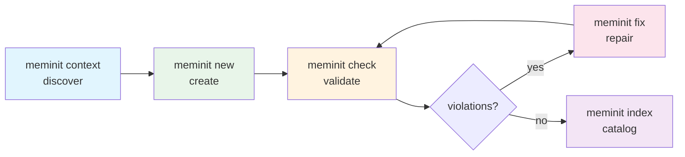

<!-- MEMINIT_METADATA_BLOCK -->

> **Document ID:** MEMINIT-PRD-003
> **Owner:** GitCmurf
> **Status:** In Review
> **Version:** 1.4
> **Last Updated:** 2026-02-24
> **Type:** PRD
> **Area:** Agentic Integration

# PRD: Agent Interface v1

---

## Table of Contents

1. [Executive Summary](#1-executive-summary)
2. [Glossary](#2-glossary)
3. [Plain-English Overview](#3-plain-english-overview)
4. [Problem Statement](#4-problem-statement)
5. [Value Proposition](#5-value-proposition-how-meminit-facilitates-better-agentic-building)
6. [Goals and Non-Goals](#6-goals-and-non-goals)
7. [Target Users](#7-target-users)
8. [Scope](#8-scope)
9. [Success Metrics](#9-success-metrics)
10. [Delivery Status](#10-delivery-status-phased-rollout)
11. [Key Agent Workflows](#11-key-agent-workflows-production)
12. [Functional Requirements](#12-functional-requirements-fr)
13. [CLI Contract](#13-cli-contract-agent-interface-rules)
14. [Output Contract](#14-output-contract-v2-normative)
15. [Command Output Profiles](#15-command-output-profiles)
16. [Determinism and Idempotency](#16-determinism-and-idempotency)
17. [meminit context Command](#17-meminit-context-detailed-requirements)
18. [Error Codes and Exit Codes](#18-error-codes-and-exit-codes)
19. [Security and Privacy](#19-security-and-privacy)
20. [Decisions Made](#20-decisions-made-resolved-clarifications)
21. [Resolved Questions](#21-resolved-questions-productengineering)
22. [Implementation Details](#22-implementation-details)
23. [Rollout Plan](#23-rollout-plan)
24. [Acceptance Criteria](#24-acceptance-criteria-ship-ready-definition)
25. [Risks and Mitigations](#25-risks-and-mitigations)
26. [Related Documents](#26-related-documents)
27. [Appendix A: Test Scenarios](#27-appendix-a-test-scenarios)
28. [Appendix B: Migration Checklist](#28-appendix-b-migration-checklist)
29. [Appendix C: Ambiguities and Gaps](#29-appendix-c-ambiguities-and-gaps)
30. [Pre-Handover Action Items](#30-pre-handover-action-items)

---

## 1. Executive Summary

### 1.1 Purpose and Scope

Meminit is a DocOps compliance tool designed to be used by humans and agents
inside real development repositories (including monorepos). For agents to
reliably build, maintain, and evolve governed documentation, Meminit must
present a **deterministic, machine-parseable interface** with uniform semantics
across all CLI commands.

This PRD defines **Agent Interface v1**: a unified CLI contract (flags,
stdout/stderr behavior, exit code semantics) and a versioned JSON output
contract (single-line envelopes, structured errors, deterministic ordering)
that allows agent orchestrators to integrate Meminit safely, with low friction
and without brittle command-specific parsing.

### 1.2 Why This Matters — The Agentic Documentation Gap

Agentic AI systems are transforming how code is written, reviewed, and shipped.
But documentation — the knowledge layer that makes code maintainable — is
being left behind. Three forces make this gap urgent:

1. **Velocity mismatch.** Agents generate code changes at speeds that can
   overwhelm human documentation workflows (estimates suggest 10× or more
   acceleration in code-generation velocity). Without tooling that keeps pace,
   docs drift within hours of a code change.
2. **Trust deficit.** Agents that cannot discover repo conventions produce
   documents with wrong IDs, wrong directories, and wrong metadata — eroding
   trust in both the agent and the documentation system.
3. **Scaling wall.** A monorepo with four namespaces and ~200 governed docs
   cannot rely on agents hardcoding paths. Without a programmatic discovery
   mechanism, every new namespace or type-directory mapping becomes a manual
   coordination tax.

Meminit's agent interface turns documentation governance into an
**orchestration primitive**: a single, predictable tool that agents can rely on
the same way they rely on a compiler or linter. Instead of documentation being
an afterthought, it becomes a **first-class engineering artifact** that agents
create, validate, and maintain as part of every code change.

Without this interface, every agent integration is bespoke. With it, **any
agent** — Claude, Codex, Gemini, or a custom orchestrator — can:

1. **Discover** repo DocOps constraints via `meminit context` (namespaces,
   docs roots, schema paths, templates, type-directory mappings).
2. **Create** governed docs using `meminit new --format json`, receiving the
   stable `document_id` and path back in a machine-parseable envelope.
3. **Validate** compliance with `meminit check --format json`, getting
   structured findings that distinguish operational errors from compliance
   violations.
4. **Remediate** via `meminit fix --format json` (dry-run preview, then
   apply) or targeted edits guided by structured violation data.
5. **Maintain** traceability through stable `document_id` references,
   schema-valid metadata, and deterministic outputs suitable for CI gating,
   PR feedback, and long-running maintenance automation.

### 1.3 Design Center Alignment

Per [MEMINIT-STRAT-001](../02-strategy/strat-001-project-meminit-vision.md) §6.2, Meminit's **design center** is **agent orchestrators**.
This means:

- The agent interface is not a secondary feature; it is the primary product surface.
- Human-readable output remains important but is secondary to machine-parseable contracts.
- Every CLI change must consider agent impact first.

### 1.4 Current Rollout Status (as of 2026-02-24; see §10 for authoritative state)

Delivery is phased. `meminit check` is migrated to output schema v2
(normative definitions live in [MEMINIT-SPEC-004](../20-specs/spec-004-agent-output-contract.md)). Non-migrated commands
currently fall into three buckets:

1. **V2 schema outputs (partially conforming):** `check --format json` emits
   `output_schema_version: "2.0"` but deviates from the unified envelope:
   - Missing required fields: `command`, `root`, `data`, `advice`
   - `run_id` is not yet UUIDv4 format (see Decision 20.5)
   - A run log line is printed to **STDOUT** before the JSON object
   - These gaps are tracked in §10.2 and must be resolved before handover
2. **Pre-contract JSON outputs** (non-conforming): commands that already
   support `--format json` but emit ad-hoc JSON shapes (typically
   `{"status":"ok","report":...}`) without the unified envelope fields
   (`success`, `command`, `root`, `warnings`, `violations`, `advice`).
   As of 2026-02-24: `scan`, `doctor`, `index`, `migrate-ids`, `org`
   subcommands, and `new` (non-enveloped payload).
3. **Text-only commands:** commands without `--format json` support.
   As of 2026-02-24: `fix`, `init`, `install-precommit`, `identify`,
   `resolve`, `link`, plus compatibility aliases (for example `adr new`).

This PRD defines how to migrate buckets (2) and (3) into a single,
versioned, deterministic contract suitable for production orchestrators.

---

## 2. Glossary

These terms are used throughout this PRD with specific meaning. See also
the vocabulary section in [MEMINIT-STRAT-001](../02-strategy/strat-001-project-meminit-vision.md) §6.0.

| Term                      | Definition                                                                                                                                                                                                                                                                                        |
| ------------------------- | ------------------------------------------------------------------------------------------------------------------------------------------------------------------------------------------------------------------------------------------------------------------------------------------------- |
| **Agent**                 | An automated tool (AI coding assistant, CI script, or orchestrator) that invokes Meminit programmatically and parses its output.                                                                                                                                                                  |
| **DocOps**                | The practice of treating documentation as a governed, toolable engineering artifact — analogous to DevOps for infrastructure.                                                                                                                                                                     |
| **Envelope**              | The top-level JSON object emitted by the CLI when `--format json` is used. All envelopes share a common base shape.                                                                                                                                                                               |
| **Operational success**   | The command executed without fatal error. `success: true` does NOT imply zero findings; it means the command completed its work and returned results (which may still include `warnings`/`advice`). For `check`, violations are gating failures and result in `success: false` (with no `error`). |
| **Operational error**     | A failure that prevents the command from executing (invalid args, missing config, path escape). Produces a top-level `error` object.                                                                                                                                                              |
| **Compliance finding**    | A validation result (violation or warning) from a successfully executed command. Does NOT produce a top-level `error` object.                                                                                                                                                                     |
| **run_id**                | A UUIDv4 string that uniquely identifies a single CLI invocation. Agents MUST treat it as opaque and never branch on its format.                                                                                                                                                                  |
| **Issue object**          | A structured object with `code`, `message`, `path`, and optional `line`/`severity` fields, used in `warnings` and `violations` arrays.                                                                                                                                                            |
| **Grouped violations**    | A violation container that groups per-file compliance findings under a `path` key, with an inner `violations` array. Used by `check`.                                                                                                                                                             |
| **Determinism**           | Given identical inputs and repo state, the CLI produces byte-identical JSON output (modulo explicitly time-based fields).                                                                                                                                                                         |
| **Namespace**             | A governed subtree within a monorepo, each with its own docs root, prefix, and type-directory mappings, defined in `docops.config.yaml`.                                                                                                                                                          |
| **Output schema version** | The version of the JSON envelope contract. Current versions: `"1.0"` (legacy baseline), `"2.0"` (normative for migrated commands).                                                                                                                                                                |
| **Design center**         | The primary user the product is optimized for. Per [MEMINIT-STRAT-001](../02-strategy/strat-001-project-meminit-vision.md) §6.2: **agent orchestrators**.                                                                                                                                         |
| **Deep mode**             | An opt-in flag (`--deep`) that causes a command to perform additional filesystem work (e.g., counting documents). Off by default for speed and privacy.                                                                                                                                           |
| **Governed document**     | A Markdown file under a `docs_root` that Meminit validates and enforces (has an ID, frontmatter, and is not excluded by prefix or path).                                                                                                                                                          |
| **Non-governed document** | A file explicitly excluded from compliance (e.g., `WIP-` prefix). Meminit MUST ignore these for validation purposes.                                                                                                                                                                              |

---

## 3. Plain-English Overview

Agents need to treat Meminit like a deterministic library: same inputs, same
outputs, no surprises. Today, output shapes vary across commands and error
paths, which forces orchestration code to special-case behavior. That
brittleness is unacceptable in production — especially in CI and in agent
loops where correctness and stability matter more than pretty text output.

Agent Interface v1 makes Meminit predictable:

- Every command supports `--format json` (once migrated).
- JSON output is a single object on one line using a stable envelope.
- Operational errors are structured (stable codes, consistent fields).
- Validation findings are represented consistently (so agents can decide
  to fix vs abort).
- `meminit context` returns repo DocOps configuration deterministically,
  so an agent does not guess directory layouts, prefixes, or schema paths.

---

## 4. Problem Statement

Meminit's purpose is to keep governed documentation consistent,
schema-valid, and low-friction over time. In an agentic SDLC, Meminit
is invoked programmatically and repeatedly (local loops, CI, and
orchestrators). Without a deterministic interface:

- **Agent integrations become fragile and expensive to maintain.**
  Each command returns a different shape or no JSON at all, forcing
  per-command parsing hacks that break on every release.
- **Agents misinterpret failures** (operational vs compliance findings),
  causing unsafe automated actions — for example, an agent might retry
  indefinitely on a validation failure it mistakes for a transient error.
- **CI reporting is inconsistent**, reducing trust in gating. Teams cannot
  reliably block PRs on DocOps violations if the exit codes and output
  shapes are unpredictable.
- **Namespace ignorance causes cross-contamination.** In monorepos, agents
  that do not discover namespace boundaries create documents with the wrong
  prefix, in the wrong docs root, breaking ID uniqueness and compliance
  invariants that are expensive to untangle. For example, an agent might
  create `MEMINIT-GOV-015` in `docs/00-governance/` when the correct ID should
  be `ORG-GOV-015` in `docs/00-governance/org/`.
- **Humans lose time** diagnosing parse issues instead of fixing real
  documentation problems.

This PRD treats the agent interface as a **first-class product surface**:
stable contracts, versioned schemas, and strict determinism rules.

---

## 5. Value Proposition: How Meminit Facilitates Better Agentic Building

> This section explicitly answers: _What value is meminit adding in
> production use within a project dev repo or monorepo? How is it
> facilitating better agentic building, development, and maintenance?_

### 5.1 The Core Loop: Scaffold → Author → Check → Fix → Index

Meminit establishes a **closed-loop DocOps workflow** that agents can
execute autonomously and humans can trust:



**Key insight:** The agent caches `meminit context` output at session start,
eliminating guesswork about repo structure. The check-fix loop continues
until compliance is achieved.

> [!NOTE]
> The check-fix loop (C→E→C) may iterate multiple times. Agents SHOULD implement
> a maximum iteration limit (recommended: 10 iterations) to prevent infinite
> loops when violations cannot be automatically fixed.

### 5.2 Value Dimensions

| Dimension          | What Meminit Provides                                                                                                  | Why It Matters for Agents                                                                                                   |
| ------------------ | ---------------------------------------------------------------------------------------------------------------------- | --------------------------------------------------------------------------------------------------------------------------- |
| **Consistency**    | Schema-valid frontmatter, stable `document_id` references, enforced naming conventions                                 | Agents can parse any governed doc without heuristics. Cross-references remain valid across renames and refactors.           |
| **Predictability** | Deterministic machine-readable output, versioned JSON envelopes, stable exit codes                                     | Agent loops and CI gates produce identical results on identical inputs. No flaky failures from output drift.                |
| **Low friction**   | `meminit context` bootstraps all repo constraints; `meminit new` creates docs in the right place with correct metadata | Agents stop guessing repo structure, stop hardcoding paths, and stop producing docs that fail compliance checks.            |
| **Safety**         | Structured errors, safe-path validation, dry-run defaults, no deletions without explicit flags                         | Agents cannot accidentally write outside governed directories, overwrite existing docs, or produce silent partial failures. |
| **Traceability**   | Stable IDs + deterministic formatting + `run_id` correlation                                                           | Long-running maintenance (status changes, supersession, ownership updates) is auditable and automatable.                    |
| **Portability**    | Same CLI contract works across repos and monorepos; namespace-aware by design                                          | An agent orchestrator built for one repo works identically in another, with no repo-specific parsing code.                  |

### 5.3 Concrete Production Scenarios

#### Scenario A: Agent creates an ADR alongside a code change

**Without Meminit:** The agent guesses directory structure, invents an ID,
writes ad-hoc frontmatter, and hopes a human reviewer catches errors.

**With Meminit:** The agent runs `meminit context`, then
`meminit new ADR "Title" --format json`, receives a valid `document_id`
and path, makes content edits, and runs `meminit check --format json` to
confirm compliance — all in under 2 seconds and fully automatable in CI.

**Value delivered:** Zero-friction compliance, no human review needed for structure.

#### Scenario B: CI gate on a monorepo PR

**Without Meminit:** The CI system greps for YAML frontmatter with fragile
regexes, misses half the violations, and produces false positives that
erode team trust.

**With Meminit:** `meminit check --format json` returns a
stable envelope with typed violations, per-file grouping, and
deterministic exit codes. The CI system posts a structured summary to the
PR, and the team trusts the gate because it is consistent.

**Value delivered:** Reliable CI gating, structured PR feedback.

#### Scenario C: Brownfield migration with agent assistance

**Without Meminit:** An agent cannot safely bulk-migrate 200 docs because
it has no way to know which files need what changes.

**With Meminit:** `meminit scan --format json` (PRD-004) produces per-file recommendations,
the agent reviews and applies via `meminit fix --format json`, and the
check loop confirms compliance iteratively.

**Value delivered:** Systematic, auditable migration path.

### 5.4 The Agentic SDLC Advantage

When Meminit is integrated into an agentic SDLC, it provides:

1. **Documentation as Code**: Documentation becomes a first-class
   engineering artifact that agents create, validate, and maintain
   alongside code changes. The atomic unit of work becomes
   _code + docs + tests_ (see [AGENTS.md](../../AGENTS.md)).

2. **Deterministic Orchestration**: Agents can rely on stable contracts
   the same way they rely on compilers and linters — no special-case
   parsing, no output drift. An agent that works today works tomorrow.

3. **Portable Workflows**: An agent orchestrator built for one
   Meminit-enabled repo works identically in another, with no
   repo-specific configuration. The `context` command is the portability
   primitive.

4. **Audit and Traceability**: Every document has a stable `document_id`,
   every operation has a `run_id`, and outputs are deterministic for
   reliable diffing. This makes long-running maintenance (status changes,
   supersession, ownership updates) auditable and automatable.

5. **CI/CD Integration**: Structured JSON outputs enable reliable CI
   gating, PR feedback, and automated remediation loops. A single CI
   step can parse the envelope, post a structured PR comment, and gate
   the merge — no custom scripting required.

6. **Incremental Adoption**: Meminit does not require a big-bang
   migration. Teams can start with `meminit check` in CI, then add
   `meminit context` for agent bootstrap, then adopt `meminit new` for
   document creation — each step adding value without disrupting
   existing workflows.

### 5.5 Anti-Patterns This Interface Prevents

> [!WARNING]
> These anti-patterns are common in unstructured agent-doc interactions.
> Meminit's agent interface is specifically designed to make them
> impossible or immediately detectable.

| Anti-Pattern                    | What Happens Without Meminit                                                                                               | How Meminit Prevents It                                                                                                |
| ------------------------------- | -------------------------------------------------------------------------------------------------------------------------- | ---------------------------------------------------------------------------------------------------------------------- |
| **Hardcoded paths**             | Agent writes to `docs/adr/` in a repo whose ADRs live at `docs/45-adr/`. File is created but never validated.              | `meminit context` returns `type_directories` per namespace; `meminit new` writes to the correct directory.             |
| **Invented IDs**                | Agent generates `ADR-001` instead of `MEMINIT-ADR-047`. ID collision or wrong prefix breaks cross-references.              | `meminit new --format json` returns the sequentially correct, prefix-qualified `document_id`.                          |
| **Silent compliance failure**   | Agent creates a doc with missing `owner` field. No check runs. Human discovers the gap weeks later during review.          | `meminit check --format json` catches the violation immediately; CI gate blocks the merge.                             |
| **Wrong namespace**             | Agent creates an org governance doc under the repo-level namespace, giving it a `MEMINIT-GOV-*` ID instead of `ORG-GOV-*`. | `meminit context` enumerates namespaces; `meminit new --namespace org` enforces the correct prefix.                    |
| **Retry on compliance failure** | Agent treats a validation failure as a transient error and retries the same command indefinitely.                          | Structured envelope distinguishes `error` (operational) from `violations` (compliance). Agent knows to fix, not retry. |
| **Partial output parsing**      | Agent parses STDOUT that mixes JSON with log lines, causing intermittent parse failures.                                   | STDOUT contains exactly one JSON envelope; all logs go to STDERR.                                                      |
| **Schema drift between runs**   | Agent’s parser breaks because a field was renamed or removed without notice.                                               | `output_schema_version` in every envelope; breaking changes require a version bump.                                    |

### 5.6 Agent Skills Protocol Files (AGENTS.md, Codex Skills, and Beyond)

Agentic work in real repos almost always uses a second layer of guidance
in addition to tool contracts: **protocol files** that teach agents how to
operate safely in that repo.

These protocol files are valuable, but they are also prone to **staleness**.
The purpose of Agent Interface v1 is to ensure that even when those files
lag behind, Meminit remains machine-safe and predictable (stable JSON
envelopes, stable error semantics, stable determinism rules).

#### 5.6.1 What “Agent Skills” Are (and Aren’t)

Agent skills / protocol files are repo-local documents that encode:

- the recommended _workflow_ (what to run, in what order),
- safety constraints (dry-run first, never write outside docs roots),
- and repo-specific conventions (namespaces, prefixes, templates).

They are **not** the source of truth for Meminit’s machine contract. The
source of truth is the CLI contract + JSON schemas defined by this PRD and
its linked specs.

#### 5.6.2 Recommended Surfaces

This repo currently uses (or may use) multiple protocol surfaces:

| Surface                                                                                                    | Primary audience   | Role                                                                            |
| ---------------------------------------------------------------------------------------------------------- | ------------------ | ------------------------------------------------------------------------------- |
| [`AGENTS.md`](../../AGENTS.md)                                                                             | Any agent + humans | Repo-wide operating rules; safety, governance, "how to work here".              |
| `.codex/skills/*/SKILL.md` (e.g., [example skill](../../.codex/skills/meminit-docops/SKILL.md) if present) | Codex CLI          | Host-specific step-by-step playbooks that can be selected/invoked as a “skill”. |
| Tool-specific folders (e.g., `.claude/`, `.vscode/`)                                                       | Tool-specific      | Convenience configuration; not normative for Meminit.                           |

> [!IMPORTANT]
> **Staleness is expected.** Protocol files should be treated like other
> documentation: versioned, reviewed, and updated when contracts change.
> This PRD explicitly does not assume the repo’s existing skill files are
> up to date.

#### 5.6.3 How Agent Interface v1 Enables Better Skills

Skills are most reliable when they can be written as a small number of
simple, deterministic steps:

1. Call `meminit context --format json` and cache constraints.
2. Create docs via `meminit new --format json` (never hand-roll IDs).
3. Validate via `meminit check --format json`.
4. Remediate via `meminit fix` (dry-run then apply) or targeted edits
   guided by structured violation codes.

This PRD’s envelope contract makes skills durable because it eliminates:

- parsing brittleness (JSON-only STDOUT),
- semantic ambiguity (operational `error` vs compliance `violations`),
- and output drift (deterministic ordering + schema versioning).

#### 5.6.4 Guidance to Skill Authors (Practical Rules)

To minimize staleness risk, skills SHOULD:

- Avoid embedding full JSON output examples as parsing dependencies; instead, depend on the schema (`output_schema_version`) and field presence rules in §14.
- Treat `run_id` as opaque (never branch on its format).
- Prefer `meminit context` over hardcoded paths/prefixes/namespaces.
- Treat `success: false` + `violations` as a fixable compliance result, not a retryable operational error.

Future improvement ideas (out of scope for v1) are captured in [MEMINIT-PRD-005](../10-prd/prd-005-agent-interface-v2.md).

---

## 6. Goals and Non-Goals

### 6.1 Goals

1. Provide a single, documented JSON output envelope for every CLI
   command (migrated commands).
2. Guarantee structured, machine-parseable operational errors with
   stable error codes.
3. Publish and maintain versioned JSON Schemas for agent outputs; keep
   them in sync with implementation via tests.
4. Add `meminit context` for deterministic agent bootstrap in repos and
   monorepos (namespaces, docs roots, schema path, templates).
5. Ensure determinism (ordering, normalization, stable semantics) so
   agent orchestration can be tested, diffed, and trusted.
6. Preserve human workflows: existing text output remains the default
   and stays stable.

### 6.2 Non-Goals

1. Building a remote API or service.
2. Streaming logs or telemetry in real time.
3. Replacing human-readable text output.
4. Implementing semantic search or RAG in this epic.
5. Changing DocOps rules or governance policy (owned by
   `docs/00-governance/` and [MEMINIT-STRAT-001](../02-strategy/strat-001-project-meminit-vision.md)).
6. Implementing the `MeminitClient` programmatic facade (aspirational;
   see [MEMINIT-PRD-002](../10-prd/prd-002-new-file-function.md) §5.1).
7. Implementing brownfield scan/fix improvements (owned by
   [MEMINIT-PRD-004](../10-prd/prd-004-brownfield-adoption-hardening.md)).

---

## 7. Target Users

| User                                                                     | Needs From This PRD                                                                                                |
| ------------------------------------------------------------------------ | ------------------------------------------------------------------------------------------------------------------ |
| **Agent orchestrators** (Architext-class, Claude, Codex, Gemini, custom) | Reliable machine-readable output, structured errors, deterministic behavior, `meminit context` for repo bootstrap. |
| **CI systems** (GitHub Actions, GitLab CI, Jenkins)                      | Parseable output for reporting and gating, stable exit codes, JSON artifacts for PR summaries.                     |
| **Human developers**                                                     | Plain-English error messages, predictable flags, unchanged default text output.                                    |
| **Monorepo maintainers**                                                 | Namespace-aware DocOps enforcement, `docops.config.yaml` namespace discovery via `meminit context`.                |

---

## 8. Scope

### 8.1 In Scope

- CLI-wide machine interface rules: stdout/stderr contract, exit code
  semantics, consistent `--format` handling.
- JSON output envelopes and schema versioning rules.
- Structured operational error responses for all commands, including
  argument validation and initialization checks.
- `meminit context` command for agent bootstrap and monorepo namespace
  discovery.
- Deterministic output ordering, stable field names, stable semantics.

### 8.2 Out of Scope

- New repo scanning heuristics (covered by [MEMINIT-PRD-004](../10-prd/prd-004-brownfield-adoption-hardening.md)).
- UI, dashboards, or IDE integrations.
- Programmatic Python API / `MeminitClient` facade (future PRD).
- Changes to governance rules or metadata schema.

---

## 9. Success Metrics

| Metric                      | Target                                                                                                              | How Measured                                   |
| --------------------------- | ------------------------------------------------------------------------------------------------------------------- | ---------------------------------------------- |
| **Command coverage**        | 100% of CLI commands support `--format json` and emit a conforming envelope.                                        | CI test suite validates every command.         |
| **Error hygiene**           | 100% of operational error paths emit a structured `error` object with stable codes.                                 | Integration tests for all error paths.         |
| **Determinism**             | Repeated invocations with identical inputs yield byte-identical JSON (excluding `run_id` and optional `timestamp`). | Regression test suite diffs outputs.           |
| **Schema discipline**       | Output schema version is declared and validated by tests for migrated commands.                                     | Schema validation tests in CI.                 |
| **Orchestration usability** | An agent can implement a generic runner that depends only on the shared envelope, not per-command parsing.          | Build a reference agent runner test.           |
| **Context completeness**    | `meminit context` returns all fields needed for agent bootstrap in monorepo and single-repo scenarios.              | Integration tests with multi-namespace config. |

---

## 10. Delivery Status (Phased Rollout)

### 10.1 Current State

- **Partially migrated to output schema v2 (current):**
  - `check --format json` emits `output_schema_version: "2.0"` and is the
    closest existing command to the target contract.
  - However, as of **2026-02-24**, `check --format json` still deviates from
    the Agent Interface v1 envelope and determinism requirements:
    - Missing required envelope fields per this PRD (`command`, `root`,
      `data`, `advice`).
    - `run_id` is not UUIDv4 yet (see Decision 20.5).
    - A run log line is printed to **STDOUT** before the JSON object (must
      be moved to **STDERR** in JSON mode).
  - Normative v2 definitions and schema live in:
    - [MEMINIT-SPEC-004](../20-specs/spec-004-agent-output-contract.md)
    - [`docs/20-specs/agent-output.schema.v2.json`](../20-specs/agent-output.schema.v2.json)

- **Pre-contract JSON outputs (present, non-conforming):**
  - Commands that already accept `--format json` but do NOT emit the
    unified envelope described in §14, and typically use ad-hoc shapes
    like `{"status":"ok","report":...}`. As of 2026-02-24, this includes
    (at minimum): `scan`, `doctor`, `index`, `migrate-ids`, and `org`
    subcommands (`install`, `status`, `vendor`). `new` also supports
    `--format json` but currently emits a non-enveloped payload.

- **Text-only commands (no `--format json` yet):**
  - `fix`, `init`, `install-precommit`, `identify`, `resolve`, `link`, `adr new` (compatibility alias)
    (plus any other subcommands without a `--format` option).

- **Not yet implemented:**
  - `context` (agent bootstrap contract is defined in §17).

- **As-of snapshot (command inventory, 2026-02-24):**

| Bucket                                         | Commands                                                                                   | Count | Notes                                                                                                         |
| ---------------------------------------------- | ------------------------------------------------------------------------------------------ | ----- | ------------------------------------------------------------------------------------------------------------- |
| **V2 schema outputs (partially conforming)**   | `check`                                                                                    | 1     | Emits `output_schema_version: "2.0"` but not yet fully aligned with the unified envelope (see above + §10.2). |
| **Pre-contract JSON outputs (non-conforming)** | `doctor`, `scan`, `index`, `migrate-ids`, `org install`, `org status`, `org vendor`, `new` | 8     | Emit ad-hoc JSON without unified envelope.                                                                    |
| **Text-only commands (no `--format json`)**    | `fix`, `init`, `install-precommit`, `identify`, `resolve`, `link`, `adr new`               | 7     | No JSON support yet.                                                                                          |
| **Not yet implemented**                        | `context`                                                                                  | 1     | New command defined by §17 (not a migration).                                                                 |

- **Contract sources of truth:**
  - **v2 contract (target for all commands):**
    - Schema: [`docs/20-specs/agent-output.schema.v2.json`](../20-specs/agent-output.schema.v2.json)
    - Spec: [`docs/20-specs/spec-004-agent-output-contract.md`](../20-specs/spec-004-agent-output-contract.md)
  - **Legacy v1 schema (transitional only):**
    - [`docs/20-specs/agent-output.schema.v1.json`](../20-specs/agent-output.schema.v1.json)
    - Note: v1 exists only to describe legacy/pre-contract JSON outputs during rollout; per Decision 20.10, migrations should target v2 directly.
  - Pre-contract JSON outputs are intentionally not treated as stable contracts; this PRD standardizes and replaces them.

### 10.2 Compatibility Matrix (Current vs Target)

This matrix helps reviewers and implementers understand what an agent
can rely on today and what changes as migration proceeds.

| Command                     | Today (2026-02-24)                                                                                                                                        | Conforms to this PRD today?                   | Remaining Work for Full Conformance                                                                                                | Target (post-migration)                                                                   |
| --------------------------- | --------------------------------------------------------------------------------------------------------------------------------------------------------- | --------------------------------------------- | ---------------------------------------------------------------------------------------------------------------------------------- | ----------------------------------------------------------------------------------------- |
| `check`                     | `--format json` emits v2-ish JSON but is not yet a clean envelope (STDOUT log prelude; missing `command`/`root`/`data`/`advice`; `run_id` not UUIDv4 yet) | Partially (schema v2 only; not full envelope) | Move log prelude from STDOUT → STDERR; add required envelope fields; switch `run_id` to UUIDv4; enforce tail ordering/determinism. | v2 envelope per §14 + updated SPEC-004/schema                                             |
| `doctor`                    | `--format json` pre-contract JSON (`status`/`issues`/`report`)                                                                                            | No                                            | Migrate to v2 envelope; normalize issues into envelope warnings/violations per §15.1; remove legacy `status`.                      | v2 envelope                                                                               |
| `scan`                      | `--format json` pre-contract JSON (`status`/`report`)                                                                                                     | No                                            | Migrate to v2 envelope; align payload with [PRD-004](../10-prd/prd-004-brownfield-adoption-hardening.md); remove legacy `status`.  | v2 envelope (align with [PRD-004](../10-prd/prd-004-brownfield-adoption-hardening.md))    |
| `index`                     | `--format json` pre-contract JSON (`status`/`report`)                                                                                                     | No                                            | Migrate to v2 envelope; nest report under `data`; remove legacy `status`.                                                          | v2 envelope                                                                               |
| `migrate-ids`               | `--format json` pre-contract JSON (`status`/`report`)                                                                                                     | No                                            | Migrate to v2 envelope; nest report under `data`; remove legacy `status`.                                                          | v2 envelope                                                                               |
| `org install/status/vendor` | `--format json` pre-contract JSON (`status`/`report`)                                                                                                     | No                                            | Migrate to v2 envelope for all org subcommands; normalize payloads under `data`; remove legacy `status`.                           | v2 envelope                                                                               |
| `new`                       | `--format json` non-enveloped creation payload                                                                                                            | No                                            | Wrap creation payload under v2 envelope (`data`); add required envelope fields; ensure error paths use structured `error`.         | v2 envelope ([PRD-002](../10-prd/prd-002-new-file-function.md) shape nested under `data`) |
| `adr new`                   | text output only (compatibility alias for `meminit new ADR`)                                                                                               | No                                            | Add `--format json` + shared flags and route through the canonical `new ADR` implementation so the alias emits the same v2 envelope. | v2 envelope (alias of `new ADR`)                                                         |
| `fix`                       | text output only                                                                                                                                          | No                                            | Add `--format json` + shared flags; emit v2 envelope; ensure dry-run vs apply is machine-distinguishable.                          | v2 envelope                                                                               |
| `init`                      | text output only                                                                                                                                          | No                                            | Add `--format json` + shared flags; emit v2 envelope.                                                                              | v2 envelope                                                                               |
| `install-precommit`         | text output only                                                                                                                                          | No                                            | Add `--format json` + shared flags; emit v2 envelope.                                                                              | v2 envelope                                                                               |
| `identify/resolve/link`     | text output only                                                                                                                                          | No                                            | Add `--format json` + shared flags; emit v2 envelope; keep outputs deterministic.                                                  | v2 envelope                                                                               |
| `context`                   | **NEW COMMAND** — not yet implemented                                                                                                                     | N/A (new)                                     | Implement command per §17; emit v2 envelope; enforce determinism + deep-mode partial results behavior.                             | v2 envelope per §17                                                                       |

> [!IMPORTANT]
> **Migration order recommendation:** Prioritize `context` (agent
> bootstrap), then `new` (agent creation loop), then `fix` (remediation
> loop). These three commands complete the core agent workflow. The
> remaining commands can follow in any order.

> [!NOTE]
> This matrix separates "supports `--format json`" from "conforms to the
> Agent Interface v1 envelope". The existence of JSON output alone is
> not sufficient for robust agent orchestration; the unified envelope
> is what enables generic parsers, schema validation, and stable CI
> reporting.

> [!TIP]
> **Why this order?** `context` enables portable agent bootstrap (eliminates
> hardcoded paths). `new` is the primary document creation command. `fix`
> closes the remediation loop. Together, these three complete the core
> agent workflow: discover → create → validate → remediate.

---

## 11. Key Agent Workflows (Production)

These workflows explain how this interface enables high-quality,
low-friction DocOps in real repos. Each workflow is described
end-to-end with the commands, expected outputs, and outcomes.

### 11.1 Workflow A: Agent Bootstrap (Repo or Monorepo)

**Purpose:** An agent starting work in a new or unfamiliar repo needs to
understand the DocOps constraints before it can safely create or modify
governed documentation.

**Steps:**

1. Agent runs `meminit context --format json`.
2. Agent receives a deterministic payload containing:
   - `repo_prefix` (e.g., `MEMINIT`)
   - `docops_version` (e.g., `"2.0"`)
   - `docs_root` (e.g., `docs/`)
   - `namespaces` (array of `{name, docs_root, repo_prefix,
type_directories}`)
   - `schema_path` (e.g., `docs/00-governance/metadata.schema.json`)
   - `templates` (type → template path mapping)
3. Agent caches this context for the session and uses it to decide
   where to create docs and how to validate.

**Outcome:** Agents stop guessing repo structure and stop hardcoding
paths. Orchestration becomes portable across repos.

**Builder note:** The `context` command MUST derive all data from
`docops.config.yaml` and already-loaded config models. It MUST NOT scan
the filesystem by default (see FR-6).

### 11.2 Workflow B: Agent Creates a New Governed Doc

**Purpose:** An agent needs to create a governed document (e.g., an ADR
when changing architecture) that is immediately compliant.

**Steps:**

1. Agent runs `meminit new <TYPE> <TITLE> --format json
[--owner <owner>] [--area <area>]` (flags per [MEMINIT-PRD-002](../10-prd/prd-002-new-file-function.md)).
2. Agent receives:
   ```json
   {
     "output_schema_version": "2.0",
     "success": true,
     "command": "new",
     "run_id": "f47ac10b-58cc-4372-a567-0e02b2c3d479",
     "root": "/path/to/repo",
     "data": {
       "document_id": "MEMINIT-ADR-042",
       "path": "docs/45-adr/adr-042-use-redis-cache.md",
       "type": "ADR",
       "title": "Use Redis as Cache"
     },
     "warnings": [],
     "violations": [],
     "advice": []
   }
   ```
   > [!NOTE]
   > This is the **target** Agent Interface v1 envelope shape for
   > `meminit new`. The current implementation of `meminit new --format json`
   > emits a non-enveloped payload and may also emit logs alongside JSON.
   > This PRD requires migrating `new` to the unified envelope and routing
   > all logs to STDERR in JSON mode.
3. Agent makes content edits inside that file only, preserving the
   metadata contract (frontmatter + visible metadata block).
4. Agent runs `meminit check --format json` (or targeted
   `meminit check <path> --format json` per [PRD-002](../10-prd/prd-002-new-file-function.md) §F10) to verify
   compliance before proposing a PR.

**Outcome:** New docs are created with correct IDs, correct metadata,
correct location, and are validated consistently. The agent never guesses
filenames or directory structure.

### 11.3 Workflow C: CI Gating and PR Feedback

**Purpose:** A CI system enforces DocOps compliance on every PR and
provides structured feedback to the author.

**Steps:**

1. CI runs `meminit check --format json` (full-repo or targeted mode).
2. CI parses the stable output contract:
   - `success: true` → gate passes.
   - `success: false` + `violations` → structured compliance failures.
   - `success: false` + `error` → operational failure (config missing,
     etc.).
3. CI summarizes violations/warnings in a PR comment using the stable
   `code`, `message`, and `path` fields.
4. Optional: CI uses `run_id` to correlate logs and artifacts.

**Outcome:** DocOps becomes a reliable gate. The whole team trusts that
failures mean real violations, not parse flakiness.

### 11.4 Workflow D: Remediation Loop (Human or Agent)

**Purpose:** A developer or agent needs to fix compliance violations
iteratively until the repo is green.

**Steps:**

1. Developer or agent runs `meminit check --format json`.
2. If `success: false` with populated `violations` (no operational
   `error`), the loop proceeds:
   - Agent reads the structured violations (with `code`, `message`,
     `path`, and optional `line`).
   - Agent either edits docs directly (guided by violation codes) or
     invokes `meminit fix --format json --dry-run` to preview fixes.
   - Agent applies fixes via `meminit fix --no-dry-run --format json`.
3. Re-run `meminit check --format json` until `success: true`.

**Outcome:** A stable, deterministic compliance loop suitable for both
human iteration and automated agent remediation.

### 11.5 Workflow E: Brownfield Migration (Guided by Scan Plan)

**Purpose:** An agent or human needs to bring an existing repo into
DocOps compliance.

**Steps:**

1. Agent runs `meminit scan --format json` (enhanced per [PRD-004](../10-prd/prd-004-brownfield-adoption-hardening.md)) to get
   per-file recommendations.
2. Agent runs `meminit scan --plan migration-plan.json` to produce a
   deterministic migration plan artifact.
3. Agent reviews the plan, then applies it via
   `meminit fix --plan migration-plan.json --format json`.
4. Agent verifies via `meminit check --format json`.

**Outcome:** Brownfield adoption is systematic and auditable. The agent
does not guess what to do — the scan plan tells it.

**Cross-reference:** This workflow depends on [PRD-004](../10-prd/prd-004-brownfield-adoption-hardening.md). The agent
interface contract defined in _this_ PRD ensures the scan/fix outputs
use the same stable envelope.

### 11.6 Workflow F: Lifecycle Management (Status / Supersession)

**Purpose:** An agent or human needs to update the status of an existing
document (e.g., `Draft` → `Approved`, or `Approved` → `Superseded`) while
maintaining governance invariants.

**Steps:**

1. Agent runs `meminit context --format json` to discover valid document
   statuses and governance rules.
2. Agent locates the target document by `document_id` (using index data
   from `meminit context --deep` or `meminit check --format json` output).
3. Agent edits the `status` field in the document frontmatter.
4. If superseding, agent also updates `related_ids` to reference the
   successor document.
5. Agent runs `meminit check --format json` to confirm the status
   transition is valid and cross-references are correct.

**Outcome:** Agents can manage the full document lifecycle — create,
validate, update, supersede — with deterministic feedback at every step.
No governance invariants are broken because `check` catches invalid
transitions.

> [!NOTE]
> Status transitions are currently performed via direct frontmatter edits
> validated by `meminit check`. A dedicated lifecycle command (for example
> `meminit set-status` / `meminit supersede`) is a candidate for Agent
> Interface v2; see [MEMINIT-PRD-005](../10-prd/prd-005-agent-interface-v2.md).

> [!NOTE]
> Valid status values are defined in the metadata schema
> (`docs/00-governance/metadata.schema.json`). Agents SHOULD validate status
> values against the schema before editing. Invalid status edits will be
> caught by `meminit check`.

---

## 12. Functional Requirements (FR)

> [!NOTE]
> The checkbox lists in this section are acceptance criteria for the **target
> implementation**, not a statement of current implementation status.

### FR-1: Unified Output Envelope

**Requirement:** All commands MUST emit a JSON output envelope when
`--format json` is used. The envelope MUST include the fields listed in
the Output Contract section (§14) and MUST be a single JSON object on
one line.

**Plain English:** No matter which command an agent runs, it will always
get the same base shape back.

**Builder notes:**

- Centralize JSON emission in a single formatter module
  (`src/meminit/core/services/output_formatter.py`) so all commands
  use the same logic.
- Avoid per-command JSON assembly in CLI handlers.
- The formatter MUST enforce deterministic key ordering (§16).
- The formatter MUST validate the output against the appropriate
  schema version before emitting (defense in depth).

**Acceptance criteria:**

- [ ] All commands with `--format json` emit a single-line JSON object
- [ ] All envelopes contain required fields per §14
- [ ] Schema validation passes for all outputs
- [ ] Test: Run each command with `--format json` and validate against schema

**Test specification:**

```gherkin
Feature: Unified Output Envelope

Scenario: Check command emits valid envelope
  Given a repository with docops.config.yaml
  When I run "meminit check --format json"
  Then the output is valid JSON on a single line
  And the output contains "output_schema_version": "2.0"
  And the output contains "success" field
  And the output contains "run_id" field
  And the output contains "command" field
  And the output contains "root" field
  And the output validates against agent-output.schema.v2.json

Scenario: STDOUT contains only JSON in JSON mode
  Given a repository with docops.config.yaml
  When I run "meminit check --format json"
  Then STDOUT contains exactly one JSON object
  And STDOUT contains no log lines or non-JSON text
  And all log output is on STDERR
```

### FR-2: Structured Errors

**Requirement:** All errors MUST be returned using the structured error
envelope, including argument validation errors before any use case
executes. Each error MUST include a stable `code` (from the CLI-wide
`ErrorCode` enum defined in [PRD-002](../10-prd/prd-002-new-file-function.md) §5.4 and implemented in
[`src/meminit/core/services/error_codes.py`](../../src/meminit/core/services/error_codes.py)) and a human-readable
`message`. Optional `details` MAY be included for structured context.

**Plain English:** Even when something fails early, the agent still gets
a consistent JSON error to parse.

**Builder notes:**

- Replace ad-hoc `click.echo` error JSON with a shared error formatter.
- Ensure `validate_root_path` and `validate_initialized` use the same
  envelope.
- ALL error paths must be covered by integration tests emitting
  valid JSON.

**Acceptance criteria:**

- [ ] All error paths emit structured `error` object
- [ ] All error codes are from the `ErrorCode` enum
- [ ] Error messages are human-readable
- [ ] Test: Trigger each error condition and verify envelope structure

**Test specification:**

```gherkin
Feature: Structured Errors

Scenario Outline: Error paths emit structured error object
  Given a repository
  When I run "<command>" with invalid arguments
  Then the output contains an "error" object
  And error.code is a valid ErrorCode enum value
  And error.message is a non-empty string

Scenario: Operational errors have empty compliance arrays
  Given a repository
  When I run "meminit new INVALID \"Title\" --format json"
  Then the output contains an "error" object
  And warnings is []
  And violations is []
  And advice is []

  Examples:
    | command                 | invalid_args                              |
    | meminit new             | INVALID "Title"                           |
    | meminit new ADR "Title" | --namespace nonexistent                   |
    | meminit new ADR "Title" | --status "WIP"                            |
    | meminit new ADR "Title" | --related-id "NOT-AN-ID"                  |
    | meminit check           | --root /nonexistent                       |
```

### FR-3: Output Schema and Versioning

**Requirement:** A JSON Schema file MUST be published in the repo to
define the output envelope. The top-level field `output_schema_version`
MUST be present in all JSON outputs. Any breaking change MUST bump the
schema version.

**Plain English:** We publish the exact shape of outputs so agents can
validate, and we only change it with version bumps.

**Builder notes:**

- v2 normative contract: [`docs/20-specs/spec-004-agent-output-contract.md`](../20-specs/spec-004-agent-output-contract.md)
  and [`docs/20-specs/agent-output.schema.v2.json`](../20-specs/agent-output.schema.v2.json).
- During phased rollout, the implementation MUST declare the correct
  `output_schema_version` per command and MUST be test-verified.
- Breaking change = removing a field, changing a field type, or changing
  the semantic meaning of an existing field. Adding a new optional field
  is NOT breaking.

**Acceptance criteria:**

- [ ] `output_schema_version` present in all JSON outputs
- [ ] Schema files validate against JSON Schema draft-07
- [ ] Tests verify schema version matches implementation
- [ ] Test: Each command's output validates against declared schema version

**Test specification:**

```gherkin
Feature: Output Schema and Versioning

Scenario: Schema version is declared in all JSON outputs
  Given any meminit command with --format json
  When the command executes
  Then the output contains "output_schema_version": "2.0"

Scenario: Schema files are valid JSON Schema
  Given the schema files in docs/20-specs/
  When I validate them against JSON Schema draft-07
  Then all schemas are valid
```

### FR-4: Command Coverage

**Requirement:** Every CLI command MUST support `--format json` and
return the standard envelope. This includes `meminit fix`,
`meminit init`, `meminit install-precommit`, and org profile commands.

**Plain English:** Agents should not need special-case logic for any
command.

**Builder notes:**

- Add `--format` option where missing and route through the shared
  output function.
- For simple commands (e.g., `install-precommit`), the `data` payload
  may be minimal (e.g., `{"installed": true}`).

**Acceptance criteria:**

- [ ] All CLI commands accept `--format json`
- [ ] All commands emit conforming envelope
- [ ] Test: Enumerate all commands and verify `--format json` support

**Test specification:**

```gherkin
Feature: Command Coverage

Scenario Outline: All commands support --format json
  Given a repository
  When I run "<command> --format json"
  Then the output is valid JSON
  And the output conforms to the v2 envelope

  Examples:
    | command              |
    | meminit check        |
    | meminit context      |
    | meminit new ADR Test |
    | meminit fix          |
    | meminit init         |
    | meminit doctor       |
    | meminit scan         |
    | meminit index        |
```

### FR-5: Determinism Rules

**Requirement:** All JSON outputs MUST be deterministic. Lists MUST be
consistently ordered. Fields MUST use stable key names. Timestamps MUST
be ISO 8601 in UTC when present.

**Plain English:** Running the same command twice should produce
identical output except for fields that are explicitly time-based.

**Builder notes:**

- Sort lists by stable keys (see §16 for sort specifications).
- Omit `timestamp` by default (see Decision 20.3).
- Use `run_id` to correlate logs without altering content ordering.
- Determinism MUST be validated by tests that run commands twice and
  diff the output (excluding `run_id`).

**Acceptance criteria:**

- [ ] Repeated runs produce identical JSON (excluding `run_id`)
- [ ] Lists are sorted per §16 specifications
- [ ] Field ordering is consistent
- [ ] Test: Run each command twice and diff outputs

**Test specification:**

```gherkin
Feature: Determinism Rules

Scenario: Repeated runs produce identical output
  Given a repository with governed documents
  When I run "meminit check --format json" twice
  Then the outputs are identical except for run_id

Scenario: Lists are sorted deterministically
  Given a repository with multiple violations
  When I run "meminit check --format json"
  Then violations are sorted by path, then code, then line, then message
  And warnings are sorted by path, then line, then code, then message
```

### FR-6: `meminit context` Command

**Requirement:** Add a `meminit context` command that returns repo
configuration, namespaces, docs root, schema path, and index location
using the standard envelope.

**Plain English:** Agents can ask Meminit "what does this repo look
like?" without guessing.

**Builder notes:**

- Use existing config loaders and namespace models
  (`docops.config.yaml` parsing).
- Do NOT scan the entire repo by default.
- Provide a `--deep` flag if a full scan is needed (§17).
- New use case: `src/meminit/core/use_cases/context_repository.py`.
- New CLI registration in `src/meminit/cli/main.py`.

**Acceptance criteria:**

- [ ] `meminit context --format json` returns valid envelope
- [ ] Output includes all required fields per §17
- [ ] Works correctly in multi-namespace configs
- [ ] Test: Run in single-namespace and multi-namespace repos

**Test specification:**

```gherkin
Feature: meminit context Command

Scenario: Context returns required fields
  Given a repository with docops.config.yaml
  When I run "meminit context --format json"
  Then the output contains data.repo_prefix
  And the output contains data.docops_version
  And the output contains data.schema_path
  And the output contains data.namespaces array
  And the output contains data.templates object
  And the output contains data.allowed_types array

Scenario: Context works with multi-namespace config
  Given a monorepo with multiple namespaces
  When I run "meminit context --format json"
  Then data.namespaces contains all configured namespaces
  And each namespace has name, docs_root, repo_prefix, type_directories
```

### FR-7: Backward Compatible Text Output

**Requirement:** Existing text output MUST remain intact unless it
conflicts with JSON requirements. New JSON support MUST NOT break
current human workflows.

**Plain English:** Humans should not notice any changes unless they ask
for JSON output.

**Builder notes:**

- Keep current `text` and `md` outputs for existing commands.
- The `--format` flag defaults to `text` for all commands.

**Acceptance criteria:**

- [ ] Default output format is `text`
- [ ] Text output unchanged from pre-migration behavior
- [ ] `--format json` produces valid envelope
- [ ] Test: Compare text output before/after migration

**Test specification:**

```gherkin
Feature: Backward Compatible Text Output

Scenario: Default output is text
  Given a repository
  When I run "meminit check" without --format
  Then the output is human-readable text
  And the output is unchanged from pre-migration behavior

Scenario: JSON output is opt-in
  Given a repository
  When I run "meminit check --format json"
  Then the output is valid JSON
```

---

## 13. CLI Contract (Agent Interface Rules)

This section defines behavior that is independent of the JSON envelope
shape. These rules apply to ALL commands when `--format json` is used.

### 13.1 STDOUT / STDERR Separation

| Stream     | Content when `--format json` is active                                       |
| ---------- | ---------------------------------------------------------------------------- |
| **STDOUT** | Exactly one JSON envelope. No additional text.                               |
| **STDERR** | Human-readable logs, debug output, tracebacks, verbose output (`--verbose`). |

**Rationale:** Agent parsers MUST be able to treat STDOUT as JSON
without heuristics. Any non-JSON text on STDOUT is a contract violation.

**Builder note:** This means `click.echo()` calls in JSON mode MUST be
routed to STDERR (or suppressed). The only STDOUT write should be the
final `json.dumps()` call from the shared output formatter.

### 13.2 Exit Codes

| Code | Meaning                                       | When Used                                                              | JSON `success` Value |
| ---- | --------------------------------------------- | ---------------------------------------------------------------------- | -------------------- |
| `0`  | Operational success; no gating failures       | Command completed and (where applicable) no compliance gating failures | `true`               |
| `1`  | Compliance failure (validation findings)      | `meminit check` found violations; `success: false` with no `error`     | `false`              |
| `64` | `EX_USAGE` — invalid command/argument         | Bad flags, invalid flag combinations, unknown commands/subcommands     | `false`              |
| `65` | `EX_DATAERR` — input data error               | Invalid document type, bad metadata, invalid IDs/status/related_ids    | `false`              |
| `66` | `EX_NOINPUT` — input file not found           | Missing config, missing target paths                                   | `false`              |
| `73` | `EX_CANTCREAT` — cannot create output         | Filesystem write failure                                               | `false`              |
| `77` | `EX_NOPERM` — permission denied / path escape | Symlink escape, permission error                                       | `false`              |

> [!IMPORTANT]
> Exit code `1` is ONLY for `check` compliance failures (violations with no
> operational error). Other commands encountering invalid input MUST return
> the appropriate `EX_USAGE`/`EX_DATAERR`/etc code and include a top-level
> `error` object in JSON mode.

**Key distinction:** For `meminit check`, `success: false` with non-zero
exit is a valid outcome when compliance violations exist — this is NOT
an operational error. [MEMINIT-SPEC-004](../20-specs/spec-004-agent-output-contract.md) defines the v2 behavior for
distinguishing these cases.

**Builder note:** Exit code mapping should be centralized alongside the
output formatter, not scattered across CLI handlers.

### 13.3 Flag Normalization (CLI-Wide)

| Flag                  | Behavior                                                                                                                                          |
| --------------------- | ------------------------------------------------------------------------------------------------------------------------------------------------- |
| `--format`            | MUST accept at least: `text` (default), `json`, `md` (where markdown output exists for the command).                                              |
| `--no-color`          | MUST suppress ANSI formatting in text output. MUST be a no-op for `json`.                                                                         |
| `--verbose`           | When present, MUST route verbose output (internal state, timing, debug info) to STDERR. MUST NOT alter the STDOUT JSON envelope shape or content. |
| `--output <path>`     | MUST be supported CLI-wide. MUST write the exact bytes that would be emitted to STDOUT (including newline behavior).                              |
| `--include-timestamp` | When present with `--format json`, MUST include `timestamp` (ISO 8601 UTC) in the envelope. MUST be a no-op for non-JSON formats.                 |

**Builder note:** These flags should be defined as shared Click options
(decorators) that all commands inherit, not re-implemented per command.

### 13.4 Reference Agent Runner Behavior (Orchestrator Guidance)

This PRD is not only an implementation target for Meminit, but also a
contract target for **agent orchestrators** and CI systems that consume
Meminit.

An orchestrator that wants to use Meminit safely and portably SHOULD
follow these rules:

1. Prefer canonical commands (for example `meminit new ADR "..."`) over
   compatibility aliases (for example `meminit adr new "..."`). Alias
   commands exist for human convenience and may lag in contract support
   during migration.
1. Always call `meminit context --format json` at the start of a session
   (once implemented) and treat its output as the source of truth for:
   namespaces, docs roots, schema paths, templates, and type-directory
   mappings.
2. Always request JSON mode (`--format json`) and treat STDOUT as the
   single parseable artifact. Treat STDERR as human logs only.
3. Treat `output_schema_version` as the contract selector:
   - If missing: treat as non-conforming output (migration gap) and
     surface to a human.
   - If unknown: treat as a hard failure (do not guess).
4. Determine outcome using a generic rule set:
   - If top-level `error` exists: operational error (retry/fail).
   - Else if `success: true`: operational success.
   - Else if `success: false` and `violations` exists: compliance
     failure (fixable findings).
5. Treat `run_id` as an opaque correlation token; never branch on its
   format.

**Reference pseudocode:**

```text
stdout = run("meminit <cmd> ... --format json")
envelope = json_parse(stdout)

assert envelope.output_schema_version in supported_versions

if "error" in envelope:
  return OPERATIONAL_ERROR(envelope.error.code, envelope.error.message)

if envelope.success is true:
  return SUCCESS(envelope)

if envelope.success is false and "violations" in envelope:
  return COMPLIANCE_FAILURE(envelope.violations)

return CONTRACT_VIOLATION("Unexpected envelope shape")
```

**Builder note:** Until all commands conform to §14, orchestrators may
need temporary compatibility shims for pre-contract JSON outputs. Those
shims should be removed as soon as the unified envelope contract is
implemented.

---

## 14. Output Contract (v2 Normative)

This PRD defines the **product requirement**; the normative v2 contract
lives in [MEMINIT-SPEC-004](../20-specs/spec-004-agent-output-contract.md). This section summarizes the v2 envelope for
human reviewers and agent builders.

> [!IMPORTANT]
> **All migrated commands MUST emit `output_schema_version: "2.0"`.**
> The v1 baseline is deprecated; new migrations should target v2 directly.

> [!NOTE]
> JSON examples in this PRD are formatted across multiple lines for human
> readability. In `--format json` mode, Meminit MUST emit exactly one JSON
> object on STDOUT with no internal newlines (newline at end optional).

### 14.1 JSON Envelope (v2)

All v2 JSON outputs MUST include the following:

**Required fields:**

| Field                   | Type    | Semantics                                                                                                  |
| ----------------------- | ------- | ---------------------------------------------------------------------------------------------------------- |
| `output_schema_version` | string  | Contract version: `"2.0"`.                                                                                 |
| `success`               | boolean | `true` if the command completed without fatal error and without gating failures.                           |
| `command`               | string  | Canonical command path (Decision 20.1). For subcommands, use space-separated names (e.g., `"org status"`). |
| `run_id`                | string  | UUIDv4 for correlating output and logs within a single invocation.                                         |
| `root`                  | string  | Absolute path to the repository root (Decision 20.2).                                                      |
| `data`                  | object  | Command-specific payload. MUST be `{}` when empty (Decision 20.9 + Appendix C 29.3).                       |
| `warnings`              | array   | Non-fatal findings. MUST be `[]` when empty (Decision 20.8).                                               |
| `violations`            | array   | Compliance failures. MUST be `[]` when empty (Decision 20.8).                                              |
| `advice`                | array   | Non-binding recommendations. MUST be `[]` when empty (Decision 20.8).                                      |

**Optional fields:**

| Field       | Type   | Semantics                                                                                                             |
| ----------- | ------ | --------------------------------------------------------------------------------------------------------------------- |
| `timestamp` | string | ISO 8601 UTC. MUST be omitted by default; included only with `--include-timestamp` (Decision 20.3 + Appendix C 29.6). |
| `error`     | object | Present for operational failures only (see §14.2).                                                                    |

**Success/error relationship (normative):**

- If `error` is present, `success` MUST be `false`.
- For all commands **except** `check`, `success: false` MUST ONLY occur when an
  operational error occurred (meaning a top-level `error` object is present).
- For `check`, `success: false` MAY occur without `error` when compliance
  findings represent gating failures (for example, violations, or warnings in
  strict mode).

**Command-specific top-level fields:**

- For `command: "check"`, counters and findings fields defined by
  [MEMINIT-SPEC-004](../20-specs/spec-004-agent-output-contract.md) remain at
  the top level (not nested under `data`).
- **IMPORTANT:** `data` is REQUIRED for ALL commands including `check`.
  For `check`, `data` MUST be `{}` (empty object). This maintains envelope
  consistency for generic parsers (Decision 20.9 + Appendix C 29.3).

#### Issue Objects (Warnings and Violations)

Unless otherwise specified for a command, `warnings` and `violations` MUST contain **Issue** objects:

| Field      | Type    | Required | Semantics                                                                                                                       |
| ---------- | ------- | -------- | ------------------------------------------------------------------------------------------------------------------------------- |
| `code`     | string  | Yes      | Stable machine code (command-defined).                                                                                          |
| `message`  | string  | Yes      | Human-readable explanation.                                                                                                     |
| `path`     | string  | Yes      | Repo-relative path (forward slashes).                                                                                           |
| `line`     | integer | No       | 1-based line number when applicable.                                                                                            |
| `severity` | string  | No       | Optional severity label. Valid values: `warning`, `error`, `info`. Default: `error` for `violations`, `warning` for `warnings`. |

For `check`, `violations` MAY also include **grouped violations** objects of the shape:

- `path` (string, required)
- `document_id` (string, optional)
- `violations` (array of `{code, message, line?}` objects, required)

#### Advice Objects

Advice objects MUST be deterministic and machine-actionable:

| Field     | Type   | Required | Semantics                             |
| --------- | ------ | -------- | ------------------------------------- |
| `code`    | string | Yes      | Stable advice code (Appendix C 29.2). |
| `message` | string | Yes      | Human-readable recommendation.        |
| `details` | object | No       | Structured context for automation.    |

### 14.2 Error Envelope

When an operational error occurs, the envelope MUST include an `error` object:

```json
{
  "output_schema_version": "2.0",
  "success": false,
  "command": "new",
  "run_id": "f47ac10b-58cc-4372-a567-0e02b2c3d479",
  "root": "/path/to/repo",
  "data": {},
  "warnings": [],
  "violations": [],
  "advice": [],
  "error": {
    "code": "UNKNOWN_TYPE",
    "message": "Unknown document type: XYZ",
    "details": {
      "valid_types": ["ADR", "FDD", "PRD"]
    }
  }
}
```

**Error object fields:**

| Field     | Type   | Required | Semantics                                                                                                  |
| --------- | ------ | -------- | ---------------------------------------------------------------------------------------------------------- |
| `code`    | string | Yes      | Stable error code from CLI-wide `ErrorCode` enum ([PRD-002](../10-prd/prd-002-new-file-function.md) §5.4). |
| `message` | string | Yes      | Human-readable explanation.                                                                                |
| `details` | object | No       | Structured context for machine consumption.                                                                |

> [!NOTE]
> The `details` object MUST be JSON-serializable and MUST NOT contain
> secrets, environment variable values, or sensitive file contents.
> See §19 (Security and Privacy) for constraints.

### 14.3 Example v2 `check` Outputs (Normative Reference)

These examples are provided to make v2 semantics concrete. The normative
definition remains [MEMINIT-SPEC-004](../20-specs/spec-004-agent-output-contract.md) + [`docs/20-specs/agent-output.schema.v2.json`](../20-specs/agent-output.schema.v2.json).

#### 14.3.1 Success (No Findings)

```json
{
  "output_schema_version": "2.0",
  "success": true,
  "command": "check",
  "run_id": "f47ac10b-58cc-4372-a567-0e02b2c3d479",
  "root": "/path/to/repo",
  "files_checked": 47,
  "files_passed": 47,
  "files_failed": 0,
  "missing_paths_count": 0,
  "schema_failures_count": 0,
  "warnings_count": 0,
  "violations_count": 0,
  "files_with_warnings": 0,
  "files_outside_docs_root_count": 0,
  "checked_paths_count": 1,
  "checked_paths": ["docs"],
  "data": {},
  "warnings": [],
  "violations": [],
  "advice": []
}
```

#### 14.3.2 Validation Failure (Violations Present, No Operational Error)

Key property: `success: false` and non-zero exit are expected; there is
no `error` object because the command executed successfully and returned
compliance findings.

```json
{
  "output_schema_version": "2.0",
  "success": false,
  "command": "check",
  "run_id": "f47ac10b-58cc-4372-a567-0e02b2c3d479",
  "root": "/path/to/repo",
  "files_checked": 47,
  "files_passed": 46,
  "files_failed": 1,
  "missing_paths_count": 0,
  "schema_failures_count": 0,
  "warnings_count": 0,
  "violations_count": 2,
  "files_with_warnings": 0,
  "files_outside_docs_root_count": 0,
  "checked_paths_count": 1,
  "checked_paths": ["docs"],
  "data": {},
  "warnings": [],
  "violations": [
    {
      "path": "docs/10-prd/prd-999-example.md",
      "document_id": "MEMINIT-PRD-999",
      "violations": [
        {
          "code": "MISSING_FIELD",
          "message": "Missing required frontmatter field: owner"
        },
        {
          "code": "INVALID_FIELD",
          "message": "Invalid frontmatter value for status: \"WIP\" (allowed: Draft|In Review|Approved|Superseded)"
        }
      ]
    }
  ],
  "advice": []
}
```

#### 14.3.3 Operational Error (Cannot Execute)

Key property: a top-level `error` object is present. Counters and
findings fields are NOT required when an operational error prevents
command execution.

**Builder note:** For `command: "check"`, when `error` is present, counter
fields MAY be omitted. The shared formatter SHOULD still emit them with
zero values for maximum envelope consistency, but this is not required.

```json
{
  "output_schema_version": "2.0",
  "success": false,
  "command": "check",
  "run_id": "f47ac10b-58cc-4372-a567-0e02b2c3d479",
  "root": "/path/to/repo",
  "data": {},
  "warnings": [],
  "violations": [],
  "advice": [],
  "error": {
    "code": "CONFIG_MISSING",
    "message": "docops.config.yaml not found at root",
    "details": {
      "expected_path": "docops.config.yaml"
    }
  }
}
```

---

## 15. Command Output Profiles

Each command MUST map its internal result to the standard envelope. The
following payloads define the **minimum required `data` fields** per
command.

| Command             | Required `data` fields                                                                                             | Notes                                                                                                                                                                                                                                                                              |
| ------------------- | ------------------------------------------------------------------------------------------------------------------ | ---------------------------------------------------------------------------------------------------------------------------------------------------------------------------------------------------------------------------------------------------------------------------------- |
| `check`             | Top-level counters per [MEMINIT-SPEC-004](../20-specs/spec-004-agent-output-contract.md) (not nested under `data`) | v2 is current normative for `check`                                                                                                                                                                                                                                                |
| `context`           | `repo_prefix`, `docops_version`, `schema_path`, `namespaces`, `templates`                                          | See §17; bootstrap contract for agents                                                                                                                                                                                                                                             |
| `new`               | `document_id`, `path`, `type`, `title`                                                                             | Per [PRD-002](../10-prd/prd-002-new-file-function.md), success includes `status`, `version`, `owner`, etc.                                                                                                                                                                         |
| `fix`               | `fixed`, `remaining`, `dry_run`                                                                                    | `dry_run: true` when `--dry-run` is active                                                                                                                                                                                                                                         |
| `init`              | `created_paths`, `skipped_paths`                                                                                   | Initialize repo structure; no destructive actions                                                                                                                                                                                                                                  |
| `install-precommit` | `installed`, `hook_path`, `already_present`                                                                        | Pre-commit hook installation result                                                                                                                                                                                                                                                |
| `scan`              | `report` (object)                                                                                                  | Enhanced per [PRD-004](../10-prd/prd-004-brownfield-adoption-hardening.md); stable plan/report under `data.report`                                                                                                                                                                 |
| `index`             | `index_path`, `document_count`                                                                                     |                                                                                                                                                                                                                                                                                    |
| `resolve`           | `document_id`, `path`                                                                                              |                                                                                                                                                                                                                                                                                    |
| `identify`          | `path`, `document_id`                                                                                              |                                                                                                                                                                                                                                                                                    |
| `link`              | `document_id`, `link`                                                                                              |                                                                                                                                                                                                                                                                                    |
| `doctor`            | `strict`, `issues`                                                                                                 | `issues` MUST also be normalized into envelope `warnings`/`violations`. **Mapping rule:** `issues[].severity == "error"` → `violations`; all other severities → `warnings`. Both arrays MUST be populated in addition to the `issues` array for backward compatibility. See §15.1. |
| `migrate-ids`       | `report` (object)                                                                                                  | Report includes `dry_run`, `actions`, `skipped_files`, `rewrite_references`                                                                                                                                                                                                        |
| `org install`       | `profile_name`, `dry_run`, `installed`                                                                             | XDG install result for org profile                                                                                                                                                                                                                                                 |
| `org status`        | `profile_name`, `global_installed`, `repo_lock_present`                                                            | Drift visibility for repo pinning                                                                                                                                                                                                                                                  |
| `org vendor`        | `profile_name`, `dry_run`, `vendored`, `repo_lock_path`                                                            | Vendoring result; `vendored` may be list or summary                                                                                                                                                                                                                                |

**Plain English:** Each command has a minimum set of fields an agent can
rely on without guessing.

---

### 15.1 `doctor` Issue Mapping (Normative)

When `meminit doctor --format json` executes, the `issues` array in `data`
MUST be normalized into the envelope-level `warnings` and `violations`
arrays for uniform orchestration semantics.

The original `data.issues` array MUST remain intact for backward compatibility.

| `data.issues[].severity` | Envelope Placement | Entry Shape (envelope `warnings`/`violations`)      |
| ------------------------ | ------------------ | --------------------------------------------------- |
| `"error"`                | `violations`       | `{code, message, path, line?, severity: "error"}`   |
| `"warning"`              | `warnings`         | `{code, message, path, line?, severity: "warning"}` |
| `"info"` or absent       | `warnings`         | `{code, message, path, line?, severity: "info"}`    |

**Builder note:** The mapping above is a normalization rule only. It MUST NOT
remove, rewrite, or reclassify `data.issues` entries; it only mirrors them into
the envelope-level arrays so generic parsers do not have to special-case
`doctor`.

---

## 16. Determinism and Idempotency

### 16.1 Ordering Rules

- **Top-level JSON keys:** MUST be stable.
  - **Base envelope order (all commands):**
    `output_schema_version`, `success`, `command`, `run_id`, `timestamp` (if present), `root`
  - **Command-specific top-level fields (if any):**
    MUST appear next in a documented fixed order for the command.
    - For `command: "check"`, use this order:
      `files_checked`, `files_passed`, `files_failed`, `missing_paths_count`, `schema_failures_count`,
      `warnings_count`, `violations_count`, `files_with_warnings`, `files_outside_docs_root_count`,
      `checked_paths_count`, `checked_paths`
  - **Tail envelope order (all commands):**
    `data`, `warnings`, `violations`, `advice`, `error`
- **`warnings` array:** sorted by `path` → `line` → `code` → `message`.
  - If `line` is missing, treat it as `null` and sort `null` values last.
- **`violations` array:** sorted by `path` then:
  - for Issue objects: `code` → `line` → `message`
    - If `line` is missing, treat it as `null` and sort `null` values last.
  - for grouped violations: sort the outer array by `path`, and sort the inner `violations` by `code` → `line` → `message`
    - If `line` is missing, treat it as `null` and sort `null` values last.
- **`advice` array:** sorted by `code` → `message` (Appendix C 29.2 requires `code`).
- **`data` object keys:** sorted alphabetically.
  - **RECURSIVE SORTING:** This rule applies recursively. Any nested JSON
    objects anywhere in the envelope (including objects under `data`, and
    objects under `error.details`) MUST also have keys sorted alphabetically.
    This ensures deterministic output at every nesting level.

### 16.2 Normalization Rules

- Fields MUST use consistent `snake_case` naming across all commands.
- Paths MUST be normalized with forward slashes and be relative to
  `root` unless explicitly documented otherwise.
- Boolean values MUST be JSON `true`/`false` (not strings).
- Empty arrays MUST be `[]`, not omitted.
- Empty objects MUST be `{}`, not omitted.

### 16.3 Idempotency

- For operations that can be re-run (e.g., `check`, `doctor`, `context`,
  `index`), the JSON output MUST be consistent if inputs do not change.
- `meminit new` without `--id` is intentionally non-idempotent (it
  allocates the next sequence). This is documented in [PRD-002](../10-prd/prd-002-new-file-function.md) §N6.4.

---

## 17. `meminit context` (Detailed Requirements)

`meminit context` exists to eliminate agent guesswork. In a monorepo
especially, hardcoding `docs/` and a single prefix leads to incorrect
behavior.

### 17.1 Minimal Payload (Non-Deep)

The minimal context MUST be derived from `docops.config.yaml` and MUST
include:

| Field                        | Type        | Source        | Description                                                                                               |
| ---------------------------- | ----------- | ------------- | --------------------------------------------------------------------------------------------------------- |
| `docops_version`             | string      | config        | The DocOps Constitution version in use.                                                                   |
| `project_name`               | string/null | config        | The project name, if configured.                                                                          |
| `repo_prefix`                | string      | config        | Top-level default ID prefix (e.g., `MEMINIT`).                                                            |
| `schema_path`                | string      | config        | Relative path to `metadata.schema.json`.                                                                  |
| `config_path`                | string      | derived       | Relative path to `docops.config.yaml` from repo root.                                                     |
| `namespaces`                 | array       | config        | Each namespace: `{name, docs_root, repo_prefix, type_directories}`.                                       |
| `templates`                  | object      | config        | Type → template relative path mapping.                                                                    |
| `allowed_types`              | array       | config/schema | List of valid document types for this repo.                                                               |
| `default_owner`              | string/null | config        | Default `owner` field value, if configured (see [PRD-002](../10-prd/prd-002-new-file-function.md) §F2.8). |
| `excluded_filename_prefixes` | array       | config        | Filename prefixes (e.g., `WIP-`, `DRAFT-`) that mark non-governed docs.                                   |

**Example output (single namespace):**

```json
{
  "output_schema_version": "2.0",
  "success": true,
  "command": "context",
  "run_id": "f47ac10b-58cc-4372-a567-0e02b2c3d479",
  "root": "/path/to/repo",
  "warnings": [],
  "violations": [],
  "advice": [],
  "data": {
    "config_path": "docops.config.yaml",
    "default_owner": null,
    "docops_version": "2.0",
    "excluded_filename_prefixes": ["WIP-", "DRAFT-"],
    "project_name": "Meminit",
    "repo_prefix": "MEMINIT",
    "schema_path": "docs/00-governance/metadata.schema.json",
    "namespaces": [
      {
        "docs_root": "docs",
        "name": "default",
        "repo_prefix": "MEMINIT",
        "type_directories": {
          "ADR": "45-adr",
          "FDD": "50-fdd",
          "PRD": "10-prd"
        }
      }
    ],
    "templates": {
      "ADR": "docs/00-governance/templates/template-001-adr.md",
      "FDD": "docs/00-governance/templates/template-001-fdd.md",
      "PRD": "docs/00-governance/templates/template-001-prd.md"
    },
    "allowed_types": ["ADR", "FDD", "GOV", "PLAN", "PRD", "SPEC", "STRAT"]
  }
}
```

> [!NOTE]
> JSON keys within the `data` object are sorted alphabetically to satisfy
> the determinism requirement (§16.1). Agent parsers SHOULD NOT rely on key
> order, but may assert it in snapshot tests.

> [!NOTE]
> Namespace object keys within the `namespaces` array are sorted
> alphabetically (`docs_root`, `name`, `repo_prefix`, `type_directories`)
> per the recursive sorting rule in §16.1.

**Example output (monorepo / multi-namespace):**

This example mirrors the Meminit repository's own `docops.config.yaml`
shape, showing a repo-local namespace and an org-level namespace.

```json
{
  "output_schema_version": "2.0",
  "success": true,
  "command": "context",
  "run_id": "f47ac10b-58cc-4372-a567-0e02b2c3d479",
  "root": "/path/to/repo",
  "warnings": [],
  "violations": [],
  "advice": [],
  "data": {
    "allowed_types": ["ADR", "FDD", "GOV", "PLAN", "PRD", "SPEC", "STRAT"],
    "config_path": "docops.config.yaml",
    "default_owner": null,
    "docops_version": "2.0",
    "excluded_filename_prefixes": ["WIP-", "DRAFT-"],
    "namespaces": [
      {
        "docs_root": "docs",
        "name": "meminit",
        "repo_prefix": "MEMINIT",
        "type_directories": {
          "ADR": "45-adr",
          "FDD": "50-fdd",
          "PRD": "10-prd"
        }
      },
      {
        "docs_root": "docs/00-governance/org",
        "name": "org",
        "repo_prefix": "ORG",
        "type_directories": {
          "GOV": "."
        }
      }
    ],
    "project_name": "Meminit",
    "repo_prefix": "MEMINIT",
    "schema_path": "docs/00-governance/metadata.schema.json",
    "templates": {
      "ADR": "docs/00-governance/templates/template-001-adr.md",
      "FDD": "docs/00-governance/templates/template-001-fdd.md",
      "PRD": "docs/00-governance/templates/template-001-prd.md"
    }
  }
}
```

**Builder note:** `docops.config.yaml` may use convenience keys
(for example `templates.adr`) but `meminit context` output SHOULD
normalize to canonical type codes (for example `ADR`) to avoid
case/alias ambiguity in agent orchestration.

### 17.2 Optional Derived Fields

If inexpensive and deterministic, context MAY also include:

- `root` — computed absolute repo root path (REQUIRED per Decision 20.2).
- Resolved absolute paths for schema/templates (in addition to relative
  paths).
- `initialized` — boolean indicating whether required baseline files
  exist.

### 17.3 Deep Mode (`--deep`)

Deep mode MAY add:

- Index presence and `index_path` (if index feature exists).
- Document counts per namespace (if computable without full content
  parsing).
- List of excluded paths/prefixes.

**Performance budget and partial results (Appendix C 29.4):**

- `meminit context --deep` SHOULD target the PRD-004 performance budget
  (10 seconds for repos with ≤200 governed docs) for repos in the declared
  size class.
- If deep collection exceeds the budget, `context` MUST return **partial results** rather than timing out or erroring.
  - It MUST set `data.deep_incomplete: true`.
  - It MUST emit a warning Issue object (in the envelope `warnings` array) with:
    - `code: "DEEP_BUDGET_EXCEEDED"`
    - `message` explaining which deep fields may be incomplete
    - `path: "."` (repo-level warning sentinel)

**Recommendation:** Default to non-deep and keep `--deep` explicit to
avoid surprising cost and inadvertent enumeration of sensitive paths.

---

## 18. Error Codes and Exit Codes

Error codes MUST use the shared `ErrorCode` enum
(see [PRD-002](../10-prd/prd-002-new-file-function.md) §5.4 for the full enum definition and
[`src/meminit/core/services/error_codes.py`](../../src/meminit/core/services/error_codes.py) for implementation).
Exit codes MUST be deterministic and documented (see §13.2 for the complete table).

**Key contract:** An agent can rely on the error `code` for branching
logic and still trust the process exit code for overall pass/fail
semantics.

**Builder note:** Error codes are CLI-wide, not per-command. New
commands that introduce new error conditions MUST add codes to the
shared enum, not invent ad-hoc strings.

**Common error codes (subset):**

| Code                | When Used                                     |
| ------------------- | --------------------------------------------- |
| `CONFIG_MISSING`    | `docops.config.yaml` not found                |
| `UNKNOWN_TYPE`      | Document type not in `allowed_types`          |
| `UNKNOWN_NAMESPACE` | Namespace not defined in `docops.config.yaml` |
| `PATH_ESCAPE`       | Path traversal outside governed directories   |
| `FILE_NOT_FOUND`    | Target file does not exist                    |
| `SCHEMA_INVALID`    | YAML frontmatter/schema validation failure    |

See [PRD-002](../10-prd/prd-002-new-file-function.md) §5.4 for the complete enum.

---

## 19. Security and Privacy

- No outputs should include secrets or full file contents.
- Paths MUST be relative where possible, except when absolute paths are
  explicitly requested.
- `meminit context` MUST avoid leaking excluded paths or ungoverned
  files unless `--deep` is set.
- `--format json` output MUST NOT include environment variable values,
  even if they were used for owner resolution or other config.

**Plain English:** The output gives agents what they need without
leaking sensitive data.

---

## 20. Decisions Made (Resolved Clarifications)

This section documents decisions that were previously open questions and
are now resolved. These are **normative** for implementation.

### 20.1 `command` Field: REQUIRED in All JSON Envelopes

**Decision:** The `command` field is REQUIRED for all commands across v2.

**Rationale:** This maximizes clarity and tooling simplicity — an agent never
has to infer which command produced the output. Even if the schema temporarily
allows omission, producers should consistently provide `command`.

**Implementation note:** Update [MEMINIT-SPEC-004](../20-specs/spec-004-agent-output-contract.md) to make `command` required.

### 20.2 `root` Field: REQUIRED and Always Absolute

**Decision:** The `root` field is REQUIRED and MUST be absolute in JSON mode.

**Rationale:** Agents frequently need to compute safe relative paths, and having
the root available avoids a second filesystem call. If CI log privacy is a
concern, add `--redact-paths` (or equivalent) instead of removing `root` entirely.

**Implementation note:** All commands must include absolute `root` in JSON output.

### 20.3 `timestamp` Field: OMIT by Default

**Decision:** Omit `timestamp` by default; include only with `--include-timestamp`.

**Rationale:** Timestamps break determinism and make output-diffing harder for
both agents and tests. Rely on `run_id` for correlation and use STDERR logs
for time-based audit trails.

**Implementation note:** Add `--include-timestamp` flag if timestamp is needed.

### 20.4 `--output` Flag: STANDARDIZED Across All Commands

**Decision:** Standardize `--output` across the CLI. Same bytes as STDOUT,
written to a file.

**Rationale:** Enables consistent CI artifacting. Inconsistency would confuse
agent implementations.

**Implementation note:** Add `--output` flag to all commands, writing the same
bytes that would be emitted to STDOUT.

### 20.5 `run_id` Format: UUIDv4

**Decision:** Use UUIDv4 for `run_id`.

**Rationale:** Standard, collision-resistant, well-supported in every language.
Agents MUST treat `run_id` as an opaque string and never branch on its format.

**Implementation note:** Use Python's `uuid.uuid4()` for generation.

### 20.6 v1 Deprecation Timeline: Overlap Policy

**Decision:** Declare a deprecation policy once ≥80% of commands are migrated
to v2. Give consumers at least one minor version of overlap.

**Rationale:** A written deprecation policy reduces risk and avoids surprising
downstream users (including CI scripts and future orchestrators).

**Implementation note:** v1 remains supported until (1) all commands are
migrated to v2 and (2) one minor release has shipped with full v2 coverage.

### 20.7 Legacy `status` Field: REMOVED from Unified Envelope

**Decision:** Do not include `status` in the unified envelope. Use `success`
(boolean) and `error` (object) instead.

**Rationale:** The legacy `status: "ok"|"error"` is redundant with `success` and
conflicts with the unified envelope.

**Implementation note:** Remove `status` from all JSON outputs. If migration
needs a bridging period, place it under `data` with a deprecation note.

### 20.8 `warnings`, `violations`, `advice`: ALWAYS Present

**Decision:** Always include `warnings`, `violations`, and `advice` as arrays
(possibly empty) for all commands in JSON mode.

**Rationale:** Enables simple generic parsers. Size is not a meaningful concern
for Meminit outputs, but parser reliability is.

**Implementation note:** All JSON outputs must include these arrays, even if empty.

### 20.9 Command Payloads: NESTED Under `data`

**Decision:** Yes for all commands; `check` MAY also emit top-level
counters/findings (v2) but should still include `data: {}`.

**Rationale:** Nest command-specific payload under `data` for all commands.
Reserve top-level fields for the envelope and for explicitly standardized
v2 `check` counters.

**Implementation note:** All commands must nest command-specific data under `data`.

### 20.10 Output Schema Version: MIGRATE DIRECTLY to v2

**Decision:** Skip v1 baseline entirely; migrate all commands directly to v2
and expand [MEMINIT-SPEC-004](../20-specs/spec-004-agent-output-contract.md) to cover non-`check` commands.

**Rationale:** Removes ambiguity and reduces long-term maintenance. The v1
baseline would only exist during migration, creating confusion.

**Implementation note:** All newly migrated commands emit `output_schema_version: "2.0"`.

---

## 21. Resolved Questions (Product/Engineering)

The following questions arose during the design of Agent Interface v1. All
have been resolved; their decisions are recorded here for traceability.
See also Decisions §20 and Appendix C for the full resolution context.

> [!NOTE]
> If a new question arises during implementation, add it to Appendix C
> with `Status: OPEN` and reference it from the relevant requirement.

### 21.1 Should `meminit context` include index data by default or require `--deep`?

**Decision:** Require `--deep`. Default `context` output MUST remain fast and
MUST NOT perform filesystem enumeration by default.

**Options:**

- **Option A:** Include index data by default. Faster for agents but may be
  unexpected cost for large repos.
- **Option B (Recommended):** Require `--deep` flag. Keeps default fast and
  predictable.

**Status:** RESOLVED — Option B (per §17.3).

### 21.2 For `check`, should "warning-only" results return `success: true` by default?

**Decision:** Yes. Warning-only results MUST return `success: true` by default.
Strictness MUST be configurable via a flag (for example `--strict`) that
makes warnings fail.

**Options:**

- **Option A (Recommended):** `success: true` for warning-only results by default,
  with opt-in strict mode that makes warnings fail.
- **Option B:** `success: false` for any warnings. Risk: noisy CI in early adoption.

**Status:** RESOLVED — Option A.

### 21.3 Should `meminit context` expose `excluded_filename_prefixes`?

**Decision:** Yes. `meminit context` MUST include `excluded_filename_prefixes`.

**Options:**

- **Option A (Recommended):** Include `excluded_filename_prefixes` in context output.
  Prefix patterns (e.g., `WIP-`) are governance rules, not secrets.
- **Option B:** Omit for privacy. Risk: agents may process files that should be
  skipped.

**Status:** RESOLVED — Option A.

### 21.4 Should `meminit context --deep` include per-namespace document counts?

**Decision:** Yes. `meminit context --deep` MUST include per-namespace document
counts, subject to the performance budget and partial-results behavior defined
in §17.3 and Appendix C 29.4.

**Options:**

- **Option A (Recommended):** Include document counts in `--deep` mode, enforcing
  the 10-second budget from [PRD-004](../10-prd/prd-004-brownfield-adoption-hardening.md) FR-8.
- **Option B:** Omit counts. Risk: agents lack visibility into repo size.

**Status:** RESOLVED — Option A.

---

## 22. Implementation Details

### 22.1 Code Changes

| Change                     | Location                                                                   | Notes                                                                                                                                                                                                   |
| -------------------------- | -------------------------------------------------------------------------- | ------------------------------------------------------------------------------------------------------------------------------------------------------------------------------------------------------- |
| Shared output formatter    | `src/meminit/core/services/output_formatter.py`                            | Builds v2 envelope, enforces key ordering, emits arrays/`data` even when empty, adds `timestamp` only with `--include-timestamp`, validates against schema.                                             |
| Shared agent flags         | `src/meminit/cli/shared_flags.py` (new)                                    | Centralized Click options for `--format`, `--output`, `--include-timestamp`, `--verbose`, `--no-color`, and other agent-interface-wide flags. Reduces per-command flag duplication and inconsistencies. |
| Refactor CLI commands      | `src/meminit/cli/main.py`                                                  | Route all JSON output through the shared formatter; ensure JSON-only STDOUT and route logs to STDERR in JSON mode.                                                                                      |
| Output contracts module    | `src/meminit/core/services/output_contracts.py`                            | Schema constants, version assertions.                                                                                                                                                                   |
| `meminit context` use case | `src/meminit/core/use_cases/context_repository.py`                         | Reads `docops.config.yaml`, returns structured context.                                                                                                                                                 |
| `meminit context` CLI      | `src/meminit/cli/main.py`                                                  | Register new command with shared agent flags: `--format`, `--output`, `--include-timestamp`, and `--deep`.                                                                                              |
| `meminit fix` JSON support | `src/meminit/cli/main.py` + `src/meminit/core/use_cases/fix_repository.py` | Add `--format json` + shared agent flags; route through formatter.                                                                                                                                      |

**Builder note (non-normative API sketch):** The shared formatter should expose
one main "build and serialize" function that returns a single-line JSON string.
For example:

```python
def format_envelope(
    *,
    output_schema_version: str,
    success: bool,
    command: str,
    run_id: str,
    root: str,
    data: dict,
    warnings: list,
    violations: list,
    advice: list,
    error: dict | None = None,
    timestamp: str | None = None,
    extra_top_level_fields: dict | None = None,
) -> str:
    ...
```

The exact signature is not normative; the behavioral requirements in §14 and
§16 are.

### 22.2 Documentation Changes

- Update [`docs/20-specs/spec-004-agent-output-contract.md`](../20-specs/spec-004-agent-output-contract.md) to describe
  the expanded contract and error taxonomy.
- Maintain [`docs/20-specs/agent-output.schema.v2.json`](../20-specs/agent-output.schema.v2.json) in sync with code.
- Update runbooks that describe agent usage to reference the new
  output contract.
- Update [`AGENTS.md`](../../AGENTS.md) to document the JSON output mode and `context`
  command for agents.
- Update repo-scoped agent protocol files (for example Codex skills under
  `.codex/skills/`) to rely on the v2 envelope contract rather than
  pre-contract JSON shapes, and to document the new/standardized flags
  (notably `--output` and `--include-timestamp`).
  - Concrete targets in this repo:
    - [`docs/60-runbooks/runbook-006-codex-skills-setup.md`](../60-runbooks/runbook-006-codex-skills-setup.md)
    - `.codex/skills/meminit-docops/SKILL.md` (non-governed, but treated as operational protocol for agents)

### 22.3 Testing Requirements

| Test Category               | What to Test                                                                                 |
| --------------------------- | -------------------------------------------------------------------------------------------- |
| **Unit tests**              | Output formatter (envelope construction, deterministic ordering, schema validation).         |
| **CLI integration tests**   | Every command with `--format json` produces valid JSON conforming to v2 schema.              |
| **Schema validation tests** | Outputs conform to [`agent-output.schema.v2.json`](../20-specs/agent-output.schema.v2.json). |
| **Error path tests**        | All operational error paths emit structured errors with valid `ErrorCode` values.            |
| **Determinism tests**       | Run each command twice with identical inputs; diff outputs (excluding `run_id`).             |
| **Context tests**           | `meminit context` in single-namespace and multi-namespace configs returns correct data.      |
| **Regression tests**        | Error paths that previously emitted ad-hoc JSON now emit the standard envelope.              |

---

## 23. Rollout Plan

| Phase                     | Actions                                                                         | Exit Criteria                                                                                                                |
| ------------------------- | ------------------------------------------------------------------------------- | ---------------------------------------------------------------------------------------------------------------------------- |
| **1. Shared formatter**   | Implement `output_formatter.py`, migrate `check` to use it (already v2).        | `check --format json` output unchanged; formatter tests green.                                                               |
| **2. Context command**    | Implement `meminit context` with `--format json`.                               | Integration tests pass for single-repo and multi-namespace configs.                                                          |
| **3. New command**        | Migrate `meminit new --format json` to v2 envelope.                             | [PRD-002](../10-prd/prd-002-new-file-function.md) Phase 1 requirements met; `new` JSON validates against v2 schema.          |
| **4. Fix command**        | Migrate `meminit fix --format json` to v2 envelope.                             | Remediation loop (Workflow D) works end-to-end.                                                                              |
| **5. Remaining commands** | Migrate `scan`, `index`, `resolve`, `identify`, `link`, `doctor`, org commands. | 100% command coverage; all schema validation tests green.                                                                    |
| **6. Deprecation notice** | Announce v1 deprecation policy.                                                 | Documentation updated; users notified via README/CHANGELOG entry; deprecation timeline published (≥1 minor version overlap). |

---

## 24. Acceptance Criteria (Ship-Ready Definition)

This PRD is considered implemented when:

1. **Command coverage:** Every CLI command accepts `--format json` and emits a single-line
   JSON envelope on STDOUT, with no extra STDOUT noise.
2. **Error hygiene:** Every operational failure emits a structured `error` object with
   stable `code` and `message` in JSON mode.
3. **Schema compliance:** All migrated commands validate their outputs against the v2
   schema ([`docs/20-specs/agent-output.schema.v2.json`](../20-specs/agent-output.schema.v2.json)).
4. **Context command:** `meminit context` exists and returns a deterministic payload derived
   from `docops.config.yaml` including namespaces (monorepo support).
5. **Generic runner:** A single generic agent runner can interpret Meminit results using
   only the shared envelope and schema version.
6. **Determinism:** Determinism tests confirm identical outputs for identical inputs
   across all migrated commands (excluding `run_id`).
7. **Timestamp flag:** `--include-timestamp` is implemented and produces
   ISO 8601 UTC timestamps in the envelope; without the flag, `timestamp`
   is omitted (Decision 20.3).
8. **Output flag:** `--output <path>` writes the same bytes that would be
   emitted to STDOUT (Decision 20.4).

---

## 25. Risks and Mitigations

| Risk                                                                       | Impact | Likelihood | Mitigation                                                                                                                     |
| -------------------------------------------------------------------------- | ------ | ---------- | ------------------------------------------------------------------------------------------------------------------------------ |
| Mixed STDOUT output breaks parsers                                         | High   | Medium     | Enforce "JSON on STDOUT only" in integration tests for every command and every error path.                                     |
| Schema drift between docs and implementation                               | High   | Medium     | Schema validation tests in CI; treat schema files as contract artifacts with code-review requirements.                         |
| Monorepo complexity encourages agents to bypass Meminit and hardcode paths | Medium | High       | Ship `meminit context` early, make it cheap (non-deep default), and document it prominently in [`AGENTS.md`](../../AGENTS.md). |
| v1→v2 migration breaks existing agent integrations                         | High   | Low        | Phased rollout with `output_schema_version` declaration; deprecation policy with overlap window.                               |
| `meminit context` exposes sensitive repo structure                         | Low    | Low        | Non-deep default; `--deep` is opt-in; excluded paths not shown unless requested.                                               |

---

## 26. Related Documents

| Document ID                                                             | Title                                     | Relationship                                                                                         |
| ----------------------------------------------------------------------- | ----------------------------------------- | ---------------------------------------------------------------------------------------------------- |
| [MEMINIT-STRAT-001](../02-strategy/strat-001-project-meminit-vision.md) | Project Meminit Vision                    | Strategic context; defines design center and constraints.                                            |
| [MEMINIT-PLAN-003](../05-planning/plan-003-roadmap.md)                  | Project Roadmap                           | Sequencing source of truth; Agent Interface is Phase 1 consolidated work.                            |
| [MEMINIT-PRD-002](../10-prd/prd-002-new-file-function.md)               | Enhanced Document Factory (`meminit new`) | Defines `--format json` for `new`, metadata flags, error codes, exit codes. Shared `ErrorCode` enum. |
| [MEMINIT-PRD-004](../10-prd/prd-004-brownfield-adoption-hardening.md)   | Brownfield Adoption Hardening             | Defines `scan`/`fix` improvements that depend on this agent interface contract.                      |
| [MEMINIT-PRD-005](../10-prd/prd-005-agent-interface-v2.md)              | Agent Interface v2                        | Draft backlog of next-step improvements explicitly out of scope for Agent Interface v1.              |
| [MEMINIT-SPEC-004](../20-specs/spec-004-agent-output-contract.md)       | Agent Output Contract                     | Normative v2 JSON contract for migrated commands (currently `check`).                                |
| [MEMINIT-RUNBOOK-006](../60-runbooks/runbook-006-codex-skills-setup.md) | Codex Skills Setup for Meminit            | Operational guidance for repo-scoped agent skills that consume this interface.                       |
| [MEMINIT-GOV-001](../00-governance/gov-001-document-standards.md)       | Repository Document Standards             | Governance rules this interface helps enforce.                                                       |
| [ORG-GOV-001](../00-governance/org/org-gov-001-constitution.md)         | DocOps Constitution                       | Defines the org-level invariants (IDs, schema, taxonomy) that agents must obey via this interface.   |
| [MEMINIT-GOV-003](../00-governance/gov-003-security-practices.md)       | Security Practices                        | Security/privacy constraints for outputs (no secrets/PII; safe paths; redaction guidance).           |

---

## 27. Appendix A: Test Scenarios

This appendix provides concrete test scenarios for validating the agent interface.

### 27.1 Envelope Structure Tests

| Test ID | Description                                     | Expected Result                                                                       |
| ------- | ----------------------------------------------- | ------------------------------------------------------------------------------------- |
| ENV-001 | `check --format json` emits single-line JSON    | Valid JSON, exactly one JSON object on STDOUT (logs on STDERR; newline optional)      |
| ENV-002 | All required fields present in success envelope | `output_schema_version`, `success`, `run_id`, `command`, `root` present               |
| ENV-003 | Empty arrays are `[]`, not omitted              | `warnings: []`, `violations: []`, `advice: []`                                        |
| ENV-004 | Error envelope includes `error` object          | `error.code` and `error.message` present                                              |
| ENV-005 | `run_id` is valid UUIDv4 format                 | Matches regex `^[0-9a-f]{8}-[0-9a-f]{4}-4[0-9a-f]{3}-[89ab][0-9a-f]{3}-[0-9a-f]{12}$` |

### 27.2 Determinism Tests

| Test ID | Description                              | Expected Result                    |
| ------- | ---------------------------------------- | ---------------------------------- |
| DET-001 | Repeated `check` produces identical JSON | Diff is empty (excluding `run_id`) |
| DET-002 | Violations sorted by path, then code     | Stable ordering across runs        |
| DET-003 | Keys in consistent order                 | Matches §16.1 specification        |

### 27.3 Error Path Tests

| Test ID | Description                             | Expected Result                        | Expected Error Code |
| ------- | --------------------------------------- | -------------------------------------- | ------------------- |
| ERR-001 | Invalid type returns `UNKNOWN_TYPE`     | Error code in envelope                 | `UNKNOWN_TYPE`      |
| ERR-002 | Missing config returns `CONFIG_MISSING` | Error code in envelope                 | `CONFIG_MISSING`    |
| ERR-003 | Path escape returns `PATH_ESCAPE`       | Error code in envelope                 | `PATH_ESCAPE`       |
| ERR-004 | All errors go to STDERR in JSON mode    | STDOUT contains only JSON              | N/A (verify stream) |
| ERR-005 | All error codes are from ErrorCode enum | No ad-hoc error code strings in output | N/A                 |

### 27.4 Context Command Tests

| Test ID | Description                                   | Expected Result                         |
| ------- | --------------------------------------------- | --------------------------------------- |
| CTX-001 | Single-namespace config returns correct data  | `namespaces` array has one entry        |
| CTX-002 | Multi-namespace config returns all namespaces | `namespaces` array has multiple entries |
| CTX-003 | Templates mapped to canonical type codes      | `ADR` not `adr`                         |

---

## 28. Appendix B: Migration Checklist

Use this checklist when migrating a command to the v2 envelope.

### 28.1 Pre-Migration

- [ ] Identify current JSON output shape (if any)
- [ ] Document any existing consumers of the output
- [ ] Map current fields to v2 envelope fields

### 28.2 Implementation

- [ ] Add `--format json` flag (if not present)
- [ ] Add shared agent flags: `--output`, `--include-timestamp`, `--verbose`
- [ ] Route output through shared formatter
- [ ] Ensure STDOUT contains only JSON
- [ ] Route all logs to STDERR
- [ ] Add `command`, `root`, `run_id` fields
- [ ] Add `warnings`, `violations`, `advice` arrays
- [ ] Nest command-specific data under `data`
- [ ] Verify key ordering matches §16.1

### 28.3 Testing

- [ ] Unit tests for output formatter
- [ ] Integration tests for JSON output
- [ ] Schema validation tests
- [ ] Determinism tests
- [ ] Error path tests

### 28.4 Documentation

- [ ] Update command documentation
- [ ] Update [MEMINIT-SPEC-004](../20-specs/spec-004-agent-output-contract.md) if needed
- [ ] Update [`AGENTS.md`](../../AGENTS.md) if needed

---

## 29. Appendix C: Ambiguities and Gaps

This appendix documents ambiguities and gaps identified during review, along with options, trade-offs, and recommendations.

### 29.0 Summary of Decisions

| Issue ID | Topic                                   | Decision                                                                                     | Status   | Action Required                                               |
| -------- | --------------------------------------- | -------------------------------------------------------------------------------------------- | -------- | ------------------------------------------------------------- |
| 29.1     | SPEC-004 vs PRD-003 field requirements  | Update SPEC-004 to make `command` and `root` required (and align `data`/arrays requirements) | DECIDED  | Update SPEC-004 before implementation; create tracking issue. |
| 29.2     | `advice` array field requirements       | Make `advice[].code` required                                                                | DECIDED  | Update SPEC-004 + schema + tests.                             |
| 29.3     | `check` counters vs `data` nesting      | Require `data: {}` for `check`                                                               | DECIDED  | Implement in formatter + tests.                               |
| 29.4     | Performance budget for `context --deep` | Return partial results with warning                                                          | DECIDED  | Implement timeout budget + partial-results signaling.         |
| 29.5     | Error code extensibility                | Document process; create dedicated ErrorCode spec                                            | DECIDED  | Create `spec-006` and update references.                      |
| 29.6     | `--include-timestamp` flag              | Standardize flag behavior                                                                    | DECIDED  | Implement shared flag + tests.                                |
| 29.7     | Multi-command transaction support       | Use external correlation                                                                     | RESOLVED | Document in agent-protocol guidance.                          |

### 29.1 SPEC-004 vs PRD-003 Field Requirements Conflict

> [!WARNING]
> **PRE-HANDOVER ACTION REQUIRED:** Update SPEC-004 to align with
> this PRD's decisions **before implementation begins**. Until both
> documents agree, implementers MUST follow this PRD as authoritative.
> A tracking issue MUST be created for this alignment task.

**Issue:** [MEMINIT-SPEC-004](../20-specs/spec-004-agent-output-contract.md) §4.2 states that `command`, `root`, `data`, and `advice` are optional ("MAY be present"), while this PRD §14.1 states they are "conditionally required" with `command` and `root` "Always (Decision 20.1/20.2)".

**Options:**

1. **Option A (Recommended):** Update SPEC-004 to make `command` and `root` required in v2. This aligns the spec with the PRD decisions and provides maximum clarity for agent implementers.
   - Trade-off: Requires spec update and coordination.
   - Benefit: Eliminates ambiguity; agents can always rely on these fields.

2. **Option B:** Keep SPEC-004 as-is and update PRD-003 to match. Make `command` and `root` optional but recommended.
   - Trade-off: Agents cannot rely on these fields always being present.
   - Benefit: No spec update needed.

3. **Option C:** Add a transition period where `command` and `root` are optional in v2.0 but will be required in v2.1.
   - Trade-off: Creates version complexity.
   - Benefit: Allows gradual adoption.

**Recommendation:** Option A. Update SPEC-004 to align with PRD-003 decisions. The decisions in §20 were made to maximize clarity for agent implementers, and the spec should reflect that.

**Decision:** Option A: `spec-004` is an early draft. It needs to be re-aligned with _this PRD_.

**Status:** DECIDED.

### 29.2 `advice` Array Field Requirements

> [!IMPORTANT]
> **Action required before implementation:** Align producers and contract
> artifacts so `advice[].code` is REQUIRED. Update the following artifacts:
>
> - [MEMINIT-SPEC-004](../20-specs/spec-004-agent-output-contract.md) §7
> - [`docs/20-specs/agent-output.schema.v2.json`](../20-specs/agent-output.schema.v2.json)
> - tests that validate advice sorting and field presence
> - this PRD's Advice Objects table in §14.1 (ensure `code` is marked required and examples reflect it)

**Issue:** SPEC-004 §7 defines `advice` array objects as requiring only `message` (string), with optional `code` and `details`. However, the examples in PRD-003 show `advice: []` as an empty array. The sorting rule in §16.1 says `advice` is sorted by `code` → `message`, but `code` is optional.

**Options:**

1. **Option A (Recommended):** Make `code` required for `advice` objects. This enables deterministic sorting and gives agents a stable key for programmatic handling.
   - Trade-off: Slightly more verbose advice objects.
   - Benefit: Deterministic sorting; agents can branch on advice codes.

2. **Option B:** Keep `code` optional and sort by `message` when `code` is absent.
   - Trade-off: Sorting is less predictable.
   - Benefit: Simpler advice objects for simple messages.

3. **Option C:** Sort by `message` only, ignoring `code`.
   - Trade-off: Loses the benefit of having `code` for sorting.
   - Benefit: Consistent sorting regardless of `code` presence.

**Recommendation:** Option A. Making `code` required aligns with the determinism goals of this PRD and enables agents to programmatically handle advice.

**Decision:** Option A. Make `code` required for `advice` objects.

**Status:** DECIDED.

### 29.3 `check` Counters vs `data` Nesting

**Issue:** SPEC-004 §8 states that `check` counters are emitted at the top level (not nested under `data`), while Decision 20.9 says `check` MAY also emit top-level counters but should still include `data: {}`. This creates ambiguity about whether `data` is required for `check`.

**Options:**

1. **Option A (Recommended):** Require `data: {}` (empty object) for `check` to maintain envelope consistency. Counters remain at top level per SPEC-004.
   - Trade-off: Slightly redundant empty object.
   - Benefit: All commands have the same envelope structure; generic parsers work uniformly.

2. **Option B:** Make `data` optional for `check` since counters are at top level.
   - Trade-off: Breaks the "all commands have `data`" pattern.
   - Benefit: Slightly cleaner output for `check`.

3. **Option C:** Move `check` counters under `data` for consistency with other commands.
   - Trade-off: Breaking change for existing `check` consumers.
   - Benefit: Maximum consistency.

**Recommendation:** Option A. Require `data: {}` for `check` to maintain envelope consistency. This allows generic parsers to always expect a `data` field.

**Decision:** Option A. Require `data: {}` for `check` to maintain envelope consistency.

**Status:** DECIDED.

### 29.4 Performance Budget for `context --deep`

**Issue:** Decision 21.4 mentions a "10-second budget from PRD-004 FR-8" for `context --deep`, but this PRD does not define what happens if the budget is exceeded.

**Options:**

1. **Option A (Recommended):** Return partial results with a warning if the budget is exceeded. Include a `data.deep_incomplete: true` flag.
   - Trade-off: Agents may get incomplete data.
   - Benefit: Command always returns within reasonable time.

2. **Option B:** Return an error if the budget is exceeded.
   - Trade-off: Agent cannot get any deep data on large repos.
   - Benefit: Clear failure mode.

3. **Option C:** Allow the command to run indefinitely but log a warning after 10 seconds.
   - Trade-off: Unpredictable execution time.
   - Benefit: Eventually complete data.

**Recommendation:** Option A. Return partial results with a warning. This provides graceful degradation and allows agents to decide whether to proceed with partial data.

**Decision:** Option A. Return partial results with a warning.

**Status:** DECIDED.

### 29.5 Error Code Extensibility

**Issue:** The `ErrorCode` enum is defined in [PRD-002](../10-prd/prd-002-new-file-function.md) §5.4 and shared across commands. This PRD states that new commands MUST add codes to the shared enum. However, there is no process defined for adding new codes or avoiding conflicts.

**Options:**

1. **Option A (Recommended):** Document a process for adding new error codes: (1) propose in PRD, (2) add to enum with comment indicating command, (3) update PRD-002 §5.4.
   - Trade-off: Process overhead.
   - Benefit: Clear ownership and avoids conflicts.

2. **Option B:** Reserve code ranges per command (e.g., 100-199 for `new`, 200-299 for `check`).
   - Trade-off: Limits extensibility.
   - Benefit: Clear ownership by range.

3. **Option C:** Allow ad-hoc string codes outside the enum for command-specific errors.
   - Trade-off: Breaks the "stable codes" guarantee.
   - Benefit: Maximum flexibility.

**Recommendation:** Option A. Document a clear process for adding new error codes. This maintains the stability guarantee while allowing extensibility.

**Decision:** Option A **_but with a variation_**. Document a clear process for
adding new error codes. The canonical `ErrorCode` inventory MUST live in a
dedicated specification document (not embedded in PRDs). Candidate:
`docs/20-specs/spec-006-errorcode-enum.md` (name TBD).

**Status:** DECIDED.

**Implementation note:** Create `docs/20-specs/spec-006-errorcode-enum.md`
as part of Phase 1 rollout (shared formatter implementation). This spec
becomes the canonical source of truth for all CLI error codes and replaces
PRD-002 as the long-term registry location.

### 29.6 `--include-timestamp` Flag Standardization

**Issue:** Decision 20.3 requires deterministic defaults: `timestamp` MUST be
omitted by default and included only with `--include-timestamp`. This PRD
specifies the flag in §13.3; implementers must ensure the flag exists and is
consistent across all commands that support JSON mode.

**Options:**

1. **Option A (Recommended):** Add `--include-timestamp` to §13.3 Flag Normalization and §22.1 Code Changes.
   - Trade-off: Another flag to implement.
   - Benefit: Complete specification.

2. **Option B:** Remove the decision and always omit `timestamp`. If timestamps are needed, use `run_id` correlation with STDERR logs.
   - Trade-off: No timestamp in output.
   - Benefit: Simpler implementation.

3. **Option C:** Always include `timestamp` but make it deterministic (e.g., start of command execution).
   - Trade-off: Breaks determinism tests.
   - Benefit: Always available.

**Recommendation:** Option A. Add the flag specification to complete the implementation requirements.

**Decision:** Option A. Add the flag specification to complete the implementation requirements.

**Status:** DECIDED.

### 29.7 Multi-Command Transaction Support

**Issue:** This PRD defines individual command outputs but does not address multi-command transactions (e.g., `meminit new` followed by `meminit check`). Agents may need to correlate outputs across commands.

**Options:**

1. **Option A:** Add a `--correlation-id` flag that allows agents to pass a custom ID that will be included in the output envelope alongside `run_id`.
   - Trade-off: Additional flag complexity.
   - Benefit: Agents can correlate multi-command workflows.

2. **Option B (Recommended):** Document that agents should use `run_id` from each command and maintain their own correlation mapping externally.
   - Trade-off: Agents must maintain external state.
   - Benefit: Simpler CLI; no new flags.

3. **Option C:** Add a session mode where multiple commands share a `session_id`.
   - Trade-off: Significant implementation complexity.
   - Benefit: Built-in correlation.

**Recommendation:** Option B. Keep the CLI simple and let agents manage correlation externally. This aligns with the design principle of stateless CLI commands.

**User addendum:** Consider how to give guidance on this usage in documentation and/or `agent skills` protocol files.

**Status:** RESOLVED — Use external correlation.

---

## 30. Pre-Handover Action Items

The following items MUST be completed before this PRD is handed to
implementation:

- [ ] **SPEC-004 alignment:** Update [MEMINIT-SPEC-004](../20-specs/spec-004-agent-output-contract.md)
      to make `command` and `root` required in v2 (per Decisions 20.1/20.2) and
      to match this PRD's envelope requirements.
- [ ] **Advice code requirement:** Update SPEC-004 §7 and
      [`docs/20-specs/agent-output.schema.v2.json`](../20-specs/agent-output.schema.v2.json) to make
      `advice[].code` required (per Appendix C 29.2).
- [ ] **Error code spec:** Create `docs/20-specs/spec-006-errorcode-enum.md`
      as the canonical ErrorCode inventory (per Appendix C 29.5).
- [ ] **Schema validation:** Verify [`docs/20-specs/agent-output.schema.v2.json`](../20-specs/agent-output.schema.v2.json)
      validates all example outputs in this PRD (or adjust examples/schema to match).

Once these items are complete, update this PRD status to `Approved` and
proceed to implementation.

## Document History

| Version | Date       | Author    | Changes                                                                                                                                                                                                                                                                                                                                                                                                                                                                                                                                                                                                      |
| ------- | ---------- | --------- | ------------------------------------------------------------------------------------------------------------------------------------------------------------------------------------------------------------------------------------------------------------------------------------------------------------------------------------------------------------------------------------------------------------------------------------------------------------------------------------------------------------------------------------------------------------------------------------------------------------ |
| 0.1     | 2026-02-18 | Initial   | Initial draft with core requirements and clarifications.                                                                                                                                                                                                                                                                                                                                                                                                                                                                                                                                                     |
| 0.2     | 2026-02-19 | Review    | Added compatibility matrix, workflows, and implementation details.                                                                                                                                                                                                                                                                                                                                                                                                                                                                                                                                           |
| 0.3     | 2026-02-20 | Review    | Expanded clarifications section with options and recommendations.                                                                                                                                                                                                                                                                                                                                                                                                                                                                                                                                            |
| 0.4     | 2026-02-21 | Review    | Added test scenarios and migration checklist.                                                                                                                                                                                                                                                                                                                                                                                                                                                                                                                                                                |
| 0.5     | 2026-02-22 | Review    | Aligned with [PRD-002](../10-prd/prd-002-new-file-function.md) ErrorCode enum and [PRD-004](../10-prd/prd-004-brownfield-adoption-hardening.md) dependencies.                                                                                                                                                                                                                                                                                                                                                                                                                                                |
| 0.6     | 2026-02-23 | Architect | Comprehensive revision: added TOC, resolved clarifications as decisions, improved structure, added Mermaid diagram, strengthened value proposition, added test scenarios and migration checklist.                                                                                                                                                                                                                                                                                                                                                                                                            |
| 0.7     | 2026-02-23 | Architect | Review revision: added clickable links to cross-references, added Gherkin test specifications to FRs, added Appendix C ambiguities/gaps with options and recommendations, improved value proposition clarity, added §5.4 Agentic SDLC Advantage section.                                                                                                                                                                                                                                                                                                                                                     |
| 0.8     | 2026-02-23 | Architect | Major revision: rewrote exec summary with why-now framing (§1.2), expanded glossary (+5 terms), added namespace ignorance to problem statement, added §5.5 anti-patterns table, expanded §5.4 with six numbered advantages, added Workflow F (lifecycle management), expanded context payload, restructured §21 from Open → Resolved Questions, added action-required alerts to Appendix C, updated example JSON with determinism-sorted keys.                                                                                                                                                               |
| 0.9     | 2026-02-23 | User      | Minor revision: added decisions to Appendix C, including addendum to consider how best to provide guidance to agents using Meminit through `agent skills` protocol files.                                                                                                                                                                                                                                                                                                                                                                                                                                    |
| 1.0     | 2026-02-23 | Architect | Ship-candidate polish: corrected TOC anchor for §21; clarified current `check --format json` deviations (STDOUT log prelude, non-UUID `run_id`, missing fields); tightened envelope requirements and Appendix C action items; and opened draft follow-on [MEMINIT-PRD-005](../10-prd/prd-005-agent-interface-v2.md) for out-of-scope v2 improvements.                                                                                                                                                                                                                                                        |
| 1.1     | 2026-02-23 | Architect | Reviewer-1 precision pass: fixed multi-namespace `context` example to satisfy determinism (recursive key sorting, added missing fields, sorted `allowed_types` and nested maps); reconciled determinism Gherkin with §16.1 sorting rules; clarified `check` error envelopes re counters; standardized error-field ordering to match §16.1; documented `--verbose` flag normalization; added explicit mapping for `doctor` issue severities; and clarified lifecycle workflow status transitions as direct edits with v2 candidate command.                                                                   |
| 1.2     | 2026-02-23 | Architect | Reviewer-2 implementation-hardening pass: clarified rollout buckets and command inventory; expanded compatibility matrix with explicit remaining-work; strengthened FR Gherkin tests (STDOUT JSON-only + operational error arrays); clarified exit-code semantics; strengthened output-contract emphasis (`check` still requires `data: {}`) and security for `error.details`; made determinism rules more prominent; expanded `doctor` mapping into a normative subsection; added test scenarios for UUIDv4 and enum-only error codes; added pre-handover action checklist and Appendix C decision summary. |
| 1.3     | 2026-02-24 | Architect | Final handover polish for agentic implementation: updated metadata date; removed remaining ambiguity around `--output` (now explicitly CLI-wide); tightened determinism sorting (null `line` ordering + warning tie-breaker); clarified normative `success`/`error` relationship (non-`check` cannot be `success:false` without `error`); improved FR-2 invalid-args examples to match actual CLI shapes; and aligned remaining sections to reduce orchestrator guesswork. |
| 1.4     | 2026-02-24 | Architect | Final pass on sub-optimalities: updated remaining as-of dates to match `last_updated`; added `adr new` alias visibility and guidance; clarified recursive sorting applies across the whole envelope (including `error.details`); added an explicit note that examples are pretty-printed but real JSON output must be single-line; and ensured all sections remain internally consistent for agentic implementers. |
