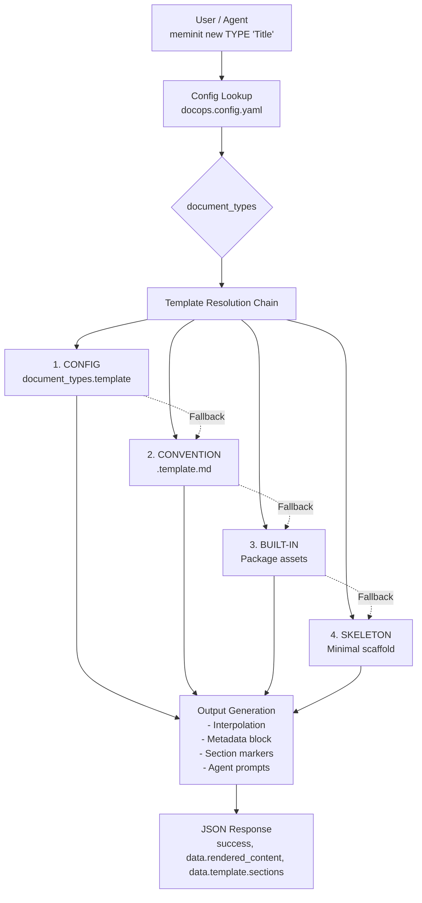
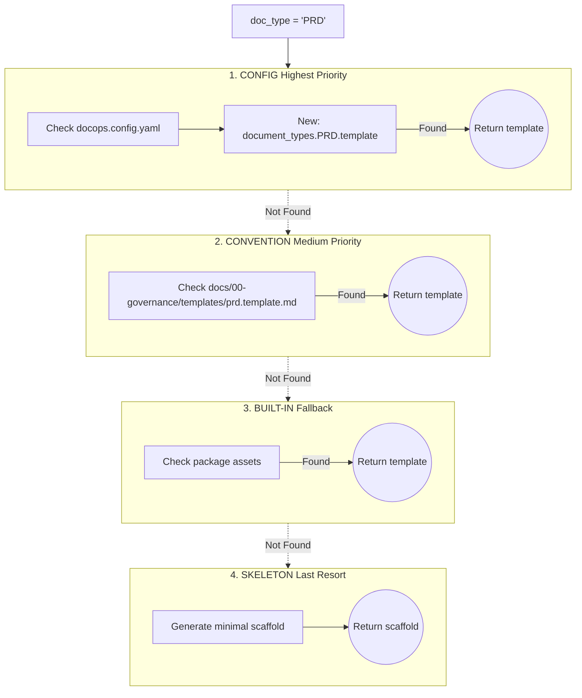
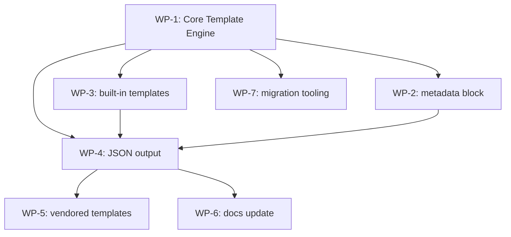
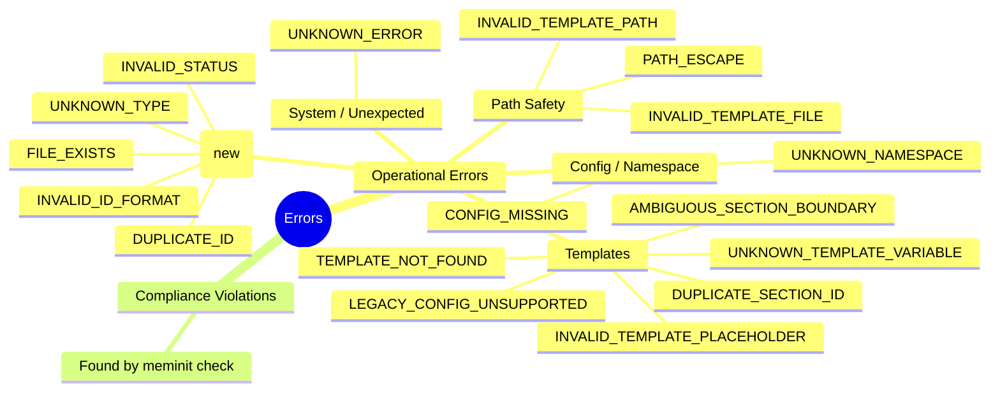
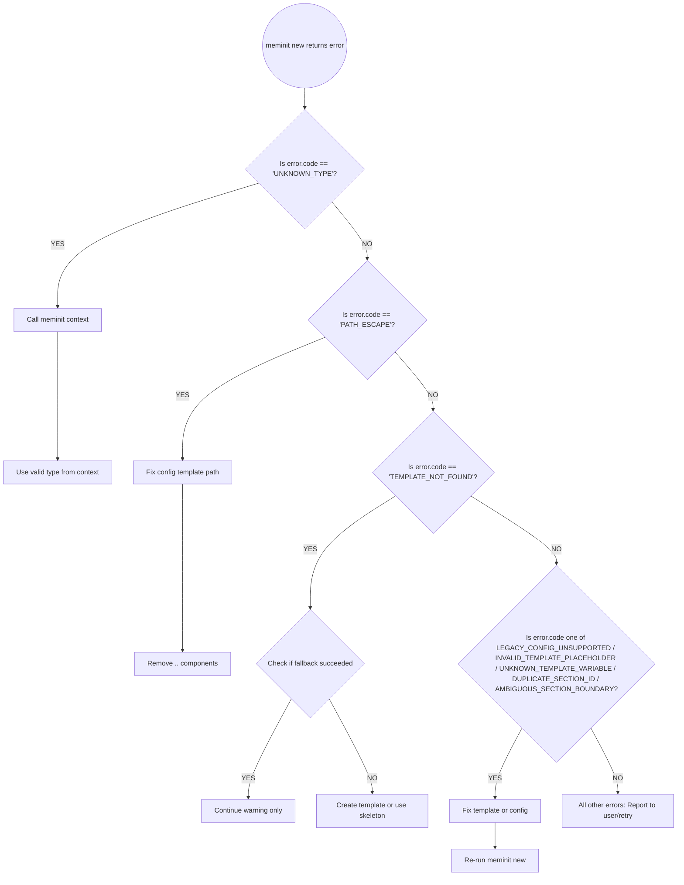

<!-- MEMINIT_METADATA_BLOCK -->

> **Document ID:** MEMINIT-PRD-006
> **Owner:** GitCmurf
> **Status:** In Review
> **Version:** 1.3
> **Last Updated:** 2026-03-04
> **Type:** PRD
> **Area:** DOCS

<!-- MEMINIT_SECTION: metadata_block -->

<!-- AGENT: This metadata block follows the standard Meminit format. Preserve this structure in all generated documents. -->

---

# PRD: Document Templates v2 — Content Archetypes for Human & Machine Authoring

<!-- MEMINIT_SECTION: title -->

<!-- AGENT: The title follows the format "PRD: <Feature> — <Tagline>". The tagline should communicate the core value proposition in under 10 words. -->

---

## Table of Contents

<!-- MEMINIT_SECTION: toc -->

<!-- AGENT: Generate a table of contents with anchor links to all numbered sections. Ensure all level-2 headings (##) are included. -->

1. [Executive Summary](#1-executive-summary)
   1.1 [TL;DR](#11-tldr)
   1.2 [Before vs After](#12-before-vs-after)
   1.3 [Key Deliverables](#13-key-deliverables)
   1.4 [Value Proposition](#14-value-proposition)
   1.5 [Success Definition](#15-success-definition)
   1.6 [Visual Architecture Diagram](#16-visual-architecture-diagram)
   1.7 [Quick-Start Guide](#17-quick-start-guide)
2. [Changelog](#2-changelog)
3. [Current State Analysis](#3-current-state-analysis)
4. [Problem Statement](#4-problem-statement)
5. [Goals, Non-Goals, and Success Metrics](#5-goals-non-goals-and-success-metrics)
   5.1 [Goals](#51-goals)
   5.2 [Non-Goals](#52-nongoals)
   5.3 [Success Metrics](#53-success-metrics)
   5.4 [Key Architectural Decisions](#54-key-architectural-decisions)
6. [Personas and Primary Use Cases](#6-personas-and-primary-use-cases)
7. [Proposed Solution](#7-proposed-solution)
8. [Requirements](#8-requirements)
9. [Template Contract (Markdown Spec)](#9-template-contract-markdown-spec)
10. [Configuration Spec (docops.config.yaml)](#10-configuration-spec-docopsconfigyaml)
11. [Agent Orchestrator Integration Guide](#11-agent-orchestrator-integration-guide)
12. [Deliverable Implementation Plan (Agent-Executable)](#12-deliverable-implementation-plan-agent-executable)
13. [Acceptance Criteria](#13-acceptance-criteria)
14. [Test Plan](#14-test-plan)
15. [Rollout and Migration](#15-rollout-and-migration)
16. [Security and Safety](#16-security-and-safety)
17. [Risks and Mitigations](#17-risks-and-mitigations)
18. [Resolved Design Questions](#18-resolved-design-questions)
19. [Future Scope (Deferred)](#19-future-scope-deferred)
20. [Related Documents](#20-related-documents)
21. [Appendix A: Canonical Content Inventory (Archetypes)](#21-appendix-a-canonical-content-inventory-archetypes)
22. [Appendix B: Requirements Traceability Matrix](#22-appendix-b-requirements-traceability-matrix)
23. [Appendix C: Error Scenarios and Recovery](#23-appendix-c-error-scenarios-and-recovery)
24. [Appendix D: Test Fixtures Specification](#24-appendix-d-test-fixtures-specification)

---

> **EXECUTIVE SUMMARY**
>
> **Decision:** Approve Templates v2 implementation
>
> **What:** Template system evolution from v1 to v2
>
> - Adds stable section IDs for agent orchestration
> - Unifies config under `document_types` as single source of truth
> - Standardises on `{{variable}}` interpolation syntax (legacy runtime syntax removed; optional migration helper)
> - Ships built-in fallback templates (ADR/PRD/FDD)
> - Uses marker-to-marker section spans (code-fence-aware; headings are informational only)
>
> **Impact:**
>
> - Agent error rate: 15-20% → <2% (90%+ reduction)
> - Config reduction: 100% (two keys → one schema; legacy keys rejected at runtime)
> - No-config repos: Generic skeleton → meaningful scaffold
> - Orchestrator extra file reads: eliminated (`data.rendered_content` + section spans in JSON)
>
> **Investment:** 6 consolidated work packages + migration tooling, phased rollout
> **Risk:** Low - pre-alpha with minimal users; backward compatibility relaxed
>
> **Recommendation: APPROVE**

---

## 1. Executive Summary

<!-- MEMINIT_SECTION: executive_summary -->

<!-- AGENT: Write a 2-3 sentence summary. What is being built, for whom, and why now? Include quantified impact if possible. -->

### 1.1 TL;DR

**What's changing:** Meminit's template system evolves from a simple placeholder-replacement mechanism (v1) to a deterministic, agent-friendly contract (v2) with stable section identifiers (`<!-- MEMINIT_SECTION: id -->`), unified `document_types` configuration (single source of truth), a single `{{variable}}` interpolation syntax, embedded agent guidance prompts, and built-in fallback templates — shipped across 6 consolidated work packages plus migration tooling.

**Why now:** Agentic orchestrators need predictable, parseable document scaffolds to reliably generate governed documentation. Today, agents must parse headings with regex, producing an estimated ~15-20% structural error rate (based on manual review of agent-generated documents across early adopter repos). Templates v2 eliminates this class of failure entirely.

**Backward compatibility note:** The project is in pre-alpha with minimal users. Backward compatibility is NOT a hard constraint. Templates v2 removes mixed-mode runtime support: `document_types` and `{{variable}}` are the only supported runtime contract. Legacy configs and templates must be migrated before use; `meminit migrate-templates` is a pre-upgrade helper, not a compatibility layer.

**Impact on key personas:**

- **Human Authors**: Get pre-structured scaffolds with guidance prompts, reducing blank-page syndrome and structural drift (~30 min saved per document)
- **Agent Orchestrators**: Receive stable section IDs and `initial_content` via JSON output, eliminating regex heuristics and file I/O; estimated error rate from ~15-20% to <2% (projected 90%+ reduction)
- **Repo Owners**: Configure document types with a single `document_types` block (single source of truth), achieving 100% config reduction from two keys to one schema

### 1.2 Before vs After

<!-- MEMINIT_SECTION: before_vs_after -->

| Aspect                     | Before (Templates v1)                                   | After (Templates v2)                                                                                                                                |
| -------------------------- | ------------------------------------------------------- | --------------------------------------------------------------------------------------------------------------------------------------------------- |
| **Section Identification** | Agents parse headings (brittle)                         | Stable `<!-- MEMINIT_SECTION: id -->` markers                                                                                                       |
| **Template Discovery**     | Config-only or generic skeleton                         | Config → Convention → Built-in → Skeleton                                                                                                           |
| **Configuration**          | Split: `type_directories` + `templates`                 | Unified: `document_types` (single source of truth); legacy keys rejected by v2 runtime                                                              |
| **Agent Guidance**         | None                                                    | Embedded `<!-- AGENT: ... -->` prompts                                                                                                              |
| **JSON Output**            | V2 envelope exists, but no template provenance/sections | Includes `data.rendered_content`, `data.content_sha256`, `data.template.sections` (with spans + `initial_content`), `data.template.content_preview` |
| **No-Config Experience**   | Generic skeleton                                        | Type-specific built-in templates                                                                                                                    |
| **Interpolation Syntax**   | `{title}`, `<REPO>` (inconsistent)                      | `{{variable}}` only; legacy syntax rejected by v2 runtime                                                                                           |
| **Section Parsing**        | N/A                                                     | Code-fence-aware; whitespace-tolerant heading detection                                                                                             |

### 1.3 Key Deliverables

<!-- MEMINIT_SECTION: key_deliverables -->

1. **Template Contract Spec:** Formal definition of section markers, placeholders, and agent guidance blocks
2. **`document_types` Config Schema:** Optional unified configuration (backward compatible)
3. **Template Resolver Service:** Deterministic precedence chain (config → convention → built-in → skeleton)
4. **Built-in Templates:** ADR, PRD, FDD templates with section markers and agent guidance
5. **Enhanced JSON Output:** Orchestrator-friendly response with template provenance and section inventory

### 1.4 Value Proposition

<!-- MEMINIT_SECTION: value_proposition -->

<!-- AGENT: Quantify the value for each persona. Use concrete numbers where possible. -->

| Persona                | Before Templates v2                              | After Templates v2                                     | Time Saved                                     |
| ---------------------- | ------------------------------------------------ | ------------------------------------------------------ | ---------------------------------------------- |
| **Human Author**       | Copy/paste from old docs, structural drift       | Pre-structured scaffold with guidance                  | ~30 min per document (est.)                    |
| **Agent Orchestrator** | Heading regex parsing, ~15-20% error rate (est.) | Stable section IDs, <2% error rate (proj.)             | ~80% reduction in format review cycles (proj.) |
| **Repo Owner**         | Two config keys to maintain per type             | Single `document_types` block (single source of truth) | 100% config reduction (legacy keys removed)    |
| **Tool Integrator**    | Fragile DOM parsing, section boundary errors     | Marker-based parsing, reliable boundaries              | ~90% reduction in parsing errors (proj.)       |

### 1.5 Success Definition

<!-- MEMINIT_SECTION: success_definition -->

Templates v2 succeeds when:

- An orchestrator can generate a PRD scaffold without repo config and receive meaningful structure (AC-8)
- An orchestrator can parse section boundaries without heading heuristics (AC-1)
- An orchestrator can act on JSON output alone without an additional file read (`data.rendered_content`, `data.content_sha256`, and explicit section spans)
- Legacy repos can migrate using `meminit migrate-templates` (AC-17)
- Unit + integration tests cover all resolution paths and the single `{{variable}}` interpolation syntax (100% coverage target)

### 1.6 Visual Architecture Diagram



### 1.7 Quick-Start Guide

#### For Human Authors

```bash
# Create a PRD with full scaffolding
meminit new PRD "My Feature" --owner "Platform Team"

# Create an ADR
meminit new ADR "Use PostgreSQL for persistence"
```

#### For Agent Orchestrators

```python
# Generate scaffold with full structure
result = subprocess.run(
    ["meminit", "new", "PRD", "Widget Platform", "--format", "json"],
    capture_output=True, text=True
)
env = json.loads(result.stdout)

# Sections are now in JSON!
sections = env.get("data", {}).get("template", {}).get("sections", [])
for section in sections:
    print(f"Section: {section['id']} at line {section['line']}")
```

#### For Repo Owners (Optional Migration)

Add to docops.config.yaml:

```yaml
document_types:
  PRD:
    directory: "10-prd"
    template: "docs/00-governance/templates/prd.template.md"
    description: "Product Requirements Document"
  ADR:
    directory: "45-adr"
    template: "docs/00-governance/templates/adr.template.md"
    description: "Architecture Decision Record"
```

---

## 2. Changelog

<!-- MEMINIT_SECTION: changelog -->

<!-- AGENT: Maintain a chronological changelog with version, date, and description of changes. Include migration notes for breaking changes. -->

| Version | Date       | Changes                                                                                                                                                                                                                                                                                                                                                                                                                                                                                                                                                              | Migration Required                                                               |
| ------- | ---------- | -------------------------------------------------------------------------------------------------------------------------------------------------------------------------------------------------------------------------------------------------------------------------------------------------------------------------------------------------------------------------------------------------------------------------------------------------------------------------------------------------------------------------------------------------------------------- | -------------------------------------------------------------------------------- |
| **1.3** | 2026-03-04 | Engineering-readiness review: rewrote `_extract_sections()` to use marker-to-marker boundaries (FR-15) and emit all `SectionMarker` fields; fixed code fence tracking for nested fences (FR-12); added FR-16 (`check`/`fix` must use `document_types`) with AC-22/AC-23; added FR-17 (`INVALID_TEMPLATE_FILE`) with AC-24 and E-8 error scenario; loosened FR-10 config-path constraint to repo root; removed contradictory `type_directories` fallback; added `encoding="utf-8"` to `read_text()` calls; fixed WP verification comment numbering; fixed version mismatch. | None |
| **1.2** | 2026-03-04 | Critical architecture and security review: removed mixed-mode runtime compatibility (`document_types` + `{{variable}}` are now the only supported runtime contract); strengthened FR-10 with template-root allowlisting, regular-file/extension checks, and size caps; expanded FR-7 with `data.rendered_content`, `data.content_sha256`, and explicit section span metadata; replaced heading-based fill guidance with marker-to-marker span replacement; added explicit errors for duplicate section IDs, invalid/unknown placeholders, and stale/ambiguous section contracts. | Legacy repos must migrate config and templates before adopting Templates v2 |
| **1.1** | 2026-03-04 | Architectural simplification: `document_types` as single source of truth (legacy keys deprecated); single `{{variable}}` interpolation syntax (legacy deprecated with warnings); code-fence-aware section parsing (FR-12); duplicate section ID detection (FR-13); missing required sections warning (FR-14); `initial_content` in JSON section output; consolidated WP-1/2/3 into Core Template Engine; added WP-7 migration tooling (`meminit migrate-templates`); security note on no code execution in templates; updated rollout strategy for pre-alpha status. | Run `meminit migrate-templates` to convert legacy configs and placeholder syntax |
| **1.0** | 2026-03-02 | Critical review pass: Fixed `fill_sections()` document corruption bug; corrected FR-3 tokenization (independent `<REPO>`/`<SEQ>` substitution); improved `_extract_sections()` heading detection; extracted inline ADR template body to reference; added cross-WP integration test (AC-16); retitled "Open Questions" to "Resolved Design Questions"; marked soft metrics as estimates; corrected parallelization claims; added per-WP rollback guidance.                                                                                                            | None                                                                             |
| **0.9** | 2026-03-02 | PRD enhancements: Replaced ASCII diagrams with native Mermaid.js visualizations for better orchestrator parsing and display; added Pydantic schemas for Agentic WPs; refined executive summary styling; strengthened error recovery workflows.                                                                                                                                                                                                                                                                                                                       | None                                                                             |
| **0.8** | 2026-03-02 | PRD enhancements: added Executive Summary box, Visual Architecture Diagram, Quick-Start Guide, Key Architectural Decisions section; added verification commands to all WPs; added cross-reference links between FRs/ACs/WPs; enhanced test fixtures table; updated status to "In Review"                                                                                                                                                                                                                                                                             | None                                                                             |
| **0.7** | 2026-03-02 | Fixed factual inaccuracies against codebase; corrected FR-3 interpolation table; fixed TemplateInterpolator and get_template_for_type code samples; added edge-case tests; added orchestrator operational guidance (11.4); strengthened Executive Summary; consistency pass                                                                                                                                                                                                                                                                                          | None                                                                             |
| **0.6** | 2026-03-02 | Added section markers throughout; enhanced AGENT guidance; added Error Scenarios appendix; improved visual diagrams                                                                                                                                                                                                                                                                                                                                                                                                                                                  | None                                                                             |
| **0.5** | 2026-03-01 | Initial comprehensive draft with work packages                                                                                                                                                                                                                                                                                                                                                                                                                                                                                                                       | None                                                                             |
| **0.1** | 2026-02-20 | Concept document created                                                                                                                                                                                                                                                                                                                                                                                                                                                                                                                                             | None                                                                             |

**Notes for Future Versions:**

- Status will move to "Approved" when implementation is complete
- v2.0 will include structural linting (deferred feature)

---

## 3. Current State Analysis

<!-- MEMINIT_SECTION: current_state_analysis -->

<!-- AGENT: Describe the current implementation state. Include code snippets from actual implementation files. -->

### 3.1 What Exists Today

`meminit new` currently performs these steps (from `src/meminit/core/use_cases/new_document.py`):

```python
# Simplified flow from new_document.py
1. Load config from docops.config.yaml
2. Resolve directory from type_directories (or DEFAULT_TYPE_DIRECTORIES)
3. Load template from templates.<type> if configured
4. Apply string substitutions: {title}, {owner}, <REPO>, <SEQ>, <YYYY-MM-DD>
5. Generate YAML frontmatter
6. Write the document
```

**Key implementation anchors:**

| Component        | File Path                                                                           | Current Behavior                                                                              |
| ---------------- | ----------------------------------------------------------------------------------- | --------------------------------------------------------------------------------------------- |
| Config parsing   | `src/meminit/core/services/repo_config.py`                                          | Reads `type_directories` and `templates` separately                                           |
| Template loading | `src/meminit/core/use_cases/new_document.py:_load_template()`                       | Reads file if configured; returns None otherwise                                              |
| Interpolation    | `src/meminit/core/use_cases/new_document.py:_apply_common_template_substitutions()` | String replace of `{}` and `<>` patterns                                                      |
| Metadata block   | `src/meminit/core/use_cases/new_document.py`                                        | `<!-- MEMINIT_METADATA_BLOCK -->` replaced inline via `str.replace()`; no deduplication logic |
| JSON output      | `src/meminit/core/services/output_contracts.py`                                     | Basic envelope; no template info or sections                                                  |

### 3.2 Current Template Examples

**Existing ADR template** (`docs/00-governance/templates/template-001-adr.md`):

```markdown
---
document_id: <REPO>-ADR-<SEQ>
type: ADR
title: <Decision Title>
status: Draft
template_type: adr-standard
template_version: 1.1
---

<!-- MEMINIT_METADATA_BLOCK -->

> **Document ID:** <REPO>-ADR-<SEQ>
> **Owner:** <Team or Person>
> ...

# <REPO>-ADR-<SEQ>: <Decision Title>

## 1. Context & Problem Statement

Describe the motivating problem, constraints, and forces.
...
```

**Existing PRD template** (`docs/00-governance/templates/template-001-prd.md`):

```markdown
# PRD: {title}

## Problem Statement

...
```

> **Note:** This is the _entire_ PRD template — only 6 lines. Compare with the ADR template above. This asymmetry is a primary motivator for built-in templates with full section scaffolding.

**Observed gaps:**

- No section markers (e.g., `<!-- MEMINIT_SECTION: context -->`)
- No agent guidance blocks
- Inconsistent placeholder syntax (`<REPO>` vs `{title}`)
- PRD template is minimal (most sections not defined)

### 3.3 What Works Well

<!-- MEMINIT_SECTION: current_strengths -->

| Strength                      | Description                                                     |
| ----------------------------- | --------------------------------------------------------------- |
| **Repo-controlled structure** | Repositories define templates and directory mappings            |
| **Safe by default**           | No code execution; pure string substitution                     |
| **Frontmatter merging**       | Template frontmatter can define template metadata               |
| **JSON envelope**             | All commands emit consistent v2 envelope (per MEMINIT-SPEC-004) |

### 3.4 Gaps for Agent-Orchestrated DocOps

<!-- MEMINIT_SECTION: current_gaps -->

| Gap                          | Impact                                         | Example Failure                                                                    |
| ---------------------------- | ---------------------------------------------- | ---------------------------------------------------------------------------------- |
| **No stable section IDs**    | Agents must infer structure from headings      | Agent generates "Problem Statement" but template expects "## 2. Problem Statement" |
| **Config-only discovery**    | No-config repos get generic skeleton           | New repo runs `meminit new ADR "X"` and gets minimal template                      |
| **Underspecified syntax**    | Placeholder vocabulary not documented          | Agent doesn't know about `{status}` or `<YYYY-MM-DD>`                              |
| **Ambiguous metadata block** | May duplicate if template includes placeholder | Final document has two metadata blocks                                             |
| **Split-brain config**       | `type_directories` + `templates` are separate  | Orchestrator must query two keys to understand a type                              |

---

## 4. Problem Statement

<!-- MEMINIT_SECTION: problem_statement -->

<!-- AGENT: Quantify the problem with data. State who is impacted and how. What is the current gap? -->

### 4.1 The Core Problem

Meminit provides excellent _envelope governance_ (document IDs, schema validation, directory structure) but lacks _body contract_ stability. Without a stable body contract:

> **Humans** copy/paste from old documents, causing structural drift over time.
>
> **Agents** hallucinate sections and headings, producing documents that fail review for format before content is evaluated.
>
> **Tooling** cannot rely on consistent section boundaries for parsing or validation.

### 4.2 Concrete Agentic Failure Scenario

```
AGENT: Generate an ADR for "Use Redis for caching"

# Current behavior (Templates v1):
1. Agent calls: meminit new ADR "Use Redis for caching" --format json
2. Agent receives path and basic metadata
3. Agent must read the file to understand structure
4. Agent parses headings with regex: r'^##\s+(\d+\.)?\s*(.+)$'
5. Agent generates content for each section
6. PROBLEM: Agent misinterprets "Context & Problem Statement" as two sections
7. PROBLEM: Agent doesn't know which sections are required vs optional
8. PROBLEM: If template has no sections (generic skeleton), agent invents structure

# Desired behavior (Templates v2):
1. Agent calls: meminit new ADR "Use Redis for caching" --format json
2. Agent receives JSON with section inventory (v2 envelope):
   {"data": {"template": {"sections": [
     {"id": "context", "heading": "## 1. Context & Problem Statement", "required": true},
     {"id": "decision_drivers", "heading": "## 2. Decision Drivers", "required": true}
   ]}}}
3. Agent fills each section by ID
4. Agent validates with meminit check --format json
5. Document passes format review on first attempt
```

### 4.3 Why This Matters Now

<!-- MEMINIT_SECTION: problem_urgency -->

As agentic orchestrators become primary authors of governed documentation, the template system must evolve from a human convenience to a machine contract. The Meminit roadmap (MEMINIT-STRAT-001) positions agent-first authoring as a near-term priority; Templates v2 is the prerequisite for every downstream agentic feature (structural linting, auto-fill, review bots). Without this investment, agentic workflows will:

- Produce higher review friction (format comments before content evaluation)
- Require more human intervention (manual fixes to hallucinated structure)
- Fail at scale (each agent re-implements brittle heading heuristics)
- Block downstream features that depend on stable section semantics

---

## 5. Goals, Non-Goals, and Success Metrics

<!-- MEMINIT_SECTION: goals_nongoals -->

### 5.1 Goals

<!-- MEMINIT_SECTION: goals -->

| ID      | Goal                                                                   | Measurable Outcome                                                          |
| ------- | ---------------------------------------------------------------------- | --------------------------------------------------------------------------- |
| **G-1** | Define a stable template contract for human and agent authoring        | Template spec with formal syntax for sections, placeholders, markers        |
| **G-2** | Make template resolution deterministic with a clear precedence chain   | Resolution always follows: config → convention → built-in → skeleton        |
| **G-3** | Provide stable section IDs for orchestrators                           | `<!-- MEMINIT_SECTION: <id> -->` markers in all built-in templates          |
| **G-4** | Unify type configuration under `document_types` schema                 | Optional `document_types` block with `directory`, `template`, `description` |
| **G-5** | Ship built-in fallback templates for common types                      | ADR, PRD, FDD templates included in package                                 |
| **G-6** | Ensure safe, non-executable template application                       | No code execution; path validation; string-only interpolation               |
| **G-7** | Provide orchestrator-friendly JSON output                              | `data.rendered_content`, `data.content_sha256`, and explicit section spans  |
| **G-8** | Provide pre-upgrade migration tooling for legacy configs and templates | `meminit migrate-templates` rewrites legacy syntax and config before v2 use |

### 5.2 Non-Goals

<!-- MEMINIT_SECTION: nongoals -->

| ID       | Non-Goal                                                      | Rationale                                                                         |
| -------- | ------------------------------------------------------------- | --------------------------------------------------------------------------------- |
| **NG-1** | Structural linting in `meminit check`                         | Valuable future feature; separate complexity (validate sections exist, not empty) |
| **NG-2** | Full template language (conditionals, loops, includes)        | Keep engine simple; complexity doesn't justify cost                               |
| **NG-3** | LLM/tool calls during template application                    | Templates are static scaffolding; generation is orchestrator's job                |
| **NG-4** | Automatic Architext sync                                      | Repos can align manually; auto-sync is separate project                           |
| **NG-5** | Template inheritance or composition                           | Keep templates flat; repo can copy/modify as needed                               |
| **NG-6** | Runtime support for legacy config keys and placeholder syntax | Pre-alpha status allows a clean cutover; migration is handled before runtime      |
| **NG-7** | Template versioning/rollback                                  | Repos manage templates; version control handles history                           |

### 5.3 Success Metrics

<!-- MEMINIT_SECTION: success_metrics -->

| Metric                              | Target                                                                 | Measurement                                                 |
| ----------------------------------- | ---------------------------------------------------------------------- | ----------------------------------------------------------- |
| **Agent success rate**              | >95% of scaffold fills succeed without heading heuristics              | Orchestrator test suite generates 10 docs, measures success |
| **Review friction**                 | <10% of new docs have format-related review comments                   | Sample of 20 PRs before/after rollout                       |
| **No-config adoption**              | 100% of common types (ADR/PRD/FDD) get meaningful scaffold             | Fresh repo with no config runs `meminit new ADR/PRD/FDD`    |
| **Migration success**               | 100% of legacy configs migrate cleanly via `meminit migrate-templates` | Migration test suite with 5 legacy repo configs             |
| **JSON output usability**           | Orchestrator can resolve template and sections in one call             | Integration test with mock orchestrator                     |
| **Template resolution performance** | <100ms for typical repos                                               | Benchmark test                                              |

### 5.4 Key Architectural Decisions

| Decision                                               | Rationale                                                                                                                                                                                                                                                                                    |
| ------------------------------------------------------ | -------------------------------------------------------------------------------------------------------------------------------------------------------------------------------------------------------------------------------------------------------------------------------------------- |
| **Why HTML comments for section markers**              | HTML comments (`<!-- -->`) are invisible in rendered Markdown, preserving visual cleanliness while providing machine-parseable identifiers. They don't interfere with Markdown processors or GitHub's preview.                                                                               |
| **Why four-tier resolution precedence**                | The chain (config → convention → built-in → skeleton) ensures: (1) repos retain full control via explicit config, (2) organic template discovery works without config, (3) meaningful defaults exist for common types, (4) the system never fails - skeleton is always available.            |
| **Why `document_types` is the single source of truth** | Pre-alpha status means backward compatibility is relaxed. A single configuration schema eliminates "split-brain" ambiguity. Legacy `type_directories` and `templates` keys are rejected by the v2 runtime. Any migration happens before execution, not inside the hot path.                  |
| **Why single `{{variable}}` syntax**                   | Multiple placeholder syntaxes (`{title}`, `<REPO>`, `{{title}}`) created ambiguity and implementation complexity. Standardising on `{{variable}}` only simplifies the interpolation engine and template authoring. Legacy syntax is migrated ahead of time rather than supported at runtime. |

---

## 6. Personas and Primary Use Cases

<!-- MEMINIT_SECTION: personas -->

<!-- AGENT: Define primary users, their needs, pain points, and how this feature helps them. -->

### 6.1 Personas

| Persona                  | Primary Need                                  | Pain Point Today                             | Templates v2 Benefit                           |
| ------------------------ | --------------------------------------------- | -------------------------------------------- | ---------------------------------------------- |
| **Human Author**         | Avoid blank-page syndrome; follow house style | What sections go in a PRD?                   | Pre-structured outline with section guidance   |
| **Agent Orchestrator**   | Deterministically populate required sections  | Heading parsing is error-prone               | Stable section IDs + embedded prompts          |
| **Repo Owner/Architect** | Encode local governance and repo "shape"      | How do I add a custom doc type?              | `document_types` schema + convention discovery |
| **Tool Integrator**      | Parse consistent document structures          | Where does the "Decision" section start/end? | Section markers for reliable parsing           |

### 6.2 Primary Use Cases

<!-- MEMINIT_SECTION: use_cases -->

#### UC-1: Human Author Creates ADR

```bash
# User runs:
meminit new ADR "Use Redis for Caching" --owner "Platform Team"

# Meminit generates:
docs/45-adr/REPO-ADR-001-use-redis-for-caching.md
# With:
# - Stable sections (Context, Options, Decision, Consequences)
# - Section markers (<!-- MEMINIT_SECTION: context -->)
# - Agent guidance (<!-- AGENT: ... -->)
# - Interpolated placeholders ({{title}}, {{document_id}}, etc.)
```

#### UC-2: Agent Orchestrator Generates PRD

```python
# Orchestrator workflow:
result = subprocess.run(
    ["meminit", "new", "PRD", "Widget Platform", "--format", "json"],
    capture_output=True,
    text=True
)
data = json.loads(result.stdout)

# Orchestrator uses the JSON contract directly:
doc_path = Path(data["root"]) / data["data"]["path"]
document = data["data"]["rendered_content"]
sections = data.get("data", {}).get("template", {}).get("sections", [])
for section in sections:
    section_id = section["id"]
    content = generate_content(section_id, section["agent_prompt"])
    document = replace_declared_span(document, section, content)

doc_path.write_text(document, encoding="utf-8")

# Orchestrator validates:
check_result = subprocess.run(
    ["meminit", "check", str(doc_path), "--format", "json"],
    capture_output=True,
    text=True,
)
check_env = json.loads(check_result.stdout)
assert check_env["success"]
```

#### UC-3: Repo Owner Adds Custom Type

```yaml
# docops.config.yaml
document_types:
  MIGRATION:
    directory: "25-migrations"
    template: "docs/00-governance/templates/migration.template.md"
    description: "Database and data migration plan"
```

```bash
# Now users can run:
meminit new MIGRATION "User data to new schema"
# And agents discover it via:
meminit context --format json
```

---

## 7. Proposed Solution

<!-- MEMINIT_SECTION: proposed_solution -->

### 7.1 Core Concepts

<!-- MEMINIT_SECTION: core_concepts -->

| Term                  | Definition                                                                                                                       |
| --------------------- | -------------------------------------------------------------------------------------------------------------------------------- |
| **Content Archetype** | A reusable documentation concern (e.g., `problem_statement`, `risks`) with a stable ID and recommended defaults. See Appendix A. |
| **Document Type**     | The `type:` frontmatter value (e.g., `ADR`, `PRD`, `SPEC`), mapped to a directory and template.                                  |
| **Template Contract** | A Markdown body scaffold with stable headings/markers, placeholders, and optional agent guidance blocks.                         |
| **Template Source**   | Where a template was resolved from: `config`, `convention`, `builtin`, or `none` (skeleton).                                     |
| **Section Marker**    | `<!-- MEMINIT_SECTION: <archetype_id> -->` - stable identifier for a section.                                                    |
| **Agent Guidance**    | `<!-- AGENT: <prompt> -->` - embedded instruction for agentic authors.                                                           |

### 7.2 Content Archetype Model

<!-- MEMINIT_SECTION: archetype_model -->

```mermaid
graph TD
    subgraph "Content Archetypes (Stable IDs)"
        A1[problem_statement]
        A2[requirements_func]
        A3[risks]
        A4[acceptance_criteria]
    end

    subgraph "Document Types (Repo-defined composition)"
        D1[PRD = {problem_statement, requirements_func, risks, acceptance_criteria, ...}]
        D2[ADR = {context, options, decision, consequences, ...}]
    end

    subgraph "Repo Structure"
        R1[docs/10-prd/]
        R2[docs/45-adr/]
    end

    A1 --> D1
    A2 --> D1
    A3 --> D1
    A4 --> D1

    D1 --> R1
    D2 --> R2
```

### 7.3 Deterministic Template Resolution

<!-- MEMINIT_SECTION: template_resolution -->



### 7.4 Architext Compatibility (Informational)

<!-- MEMINIT_SECTION: architext_compat -->

When Meminit and Architext co-exist in a repo:

- **Section IDs SHOULD align:** Architext schemas and Meminit templates should use the same `archetype_id` values
- **Headings MAY drift:** Section IDs are stable; headings can change without breaking tools
- **Manual alignment:** Repos are responsible for keeping IDs in sync; no auto-sync in this PRD

---

## 8. Requirements

<!-- MEMINIT_SECTION: requirements -->

<!-- AGENT: List testable behaviors. Each requirement should be verifiable and have a unique ID. -->

### 8.1 Functional Requirements

#### FR-1: Template Resolution Precedence

Meminit MUST resolve template content for `meminit new` using the precedence chain in [Section 7.3](#73-deterministic-template-resolution) (config → convention → built-in → skeleton).

**Rationale:** Ensures deterministic behavior; allows repo overrides while providing useful defaults.

**Verification:** Unit test `test_template_resolution_precedence()` in `tests/core/services/test_template_resolution.py`.

#### FR-2: Deterministic, Safe Template Application

When applying a template, Meminit MUST:

1. Read the template as UTF-8.
2. Apply interpolation (FR-3).
3. Emit: **frontmatter → visible metadata block → template body**.

Template application MUST NOT execute code, import modules, or evaluate expressions.

**Rationale:** Security; reproducibility; cross-platform compatibility.

**Verification:** Unit test `test_template_application_no_code_execution()`.

#### FR-3: Interpolation Vocabulary

Meminit MUST support the following interpolation variables using **`{{variable}}` syntax only**:

| Variable    | Syntax            | Description                         |
| ----------- | ----------------- | ----------------------------------- |
| Title       | `{{title}}`       | Document title                      |
| Document ID | `{{document_id}}` | Full document ID                    |
| Owner       | `{{owner}}`       | Document owner                      |
| Status      | `{{status}}`      | Document status                     |
| Date        | `{{date}}`        | Current date (ISO 8601)             |
| Repo prefix | `{{repo_prefix}}` | Repository prefix                   |
| Sequence    | `{{seq}}`         | Document sequence number            |
| Type        | `{{type}}`        | Document type                       |
| Area        | `{{area}}`        | Document area                       |
| Description | `{{description}}` | Document description (optional)     |
| Keywords    | `{{keywords}}`    | Comma-separated keywords (optional) |
| Related IDs | `{{related_ids}}` | Comma-separated IDs (optional)      |

> **CHANGE FROM v1:** Legacy syntaxes (`{title}`, `<REPO>`, `<SEQ>`, `<YYYY-MM-DD>`, `<Decision Title>`, `<Feature Title>`, `<Team or Person>`, `<PROJECT>`) are **not supported** by the Templates v2 runtime. Encountering them is a template validation error. `meminit migrate-templates` MAY be provided as a pre-upgrade helper to rewrite them to `{{variable}}` before the runtime path is entered.

**Single syntax:** `{{variable}}` is the **only** supported runtime form.

**Legacy syntax:** Encountering legacy placeholder forms MUST raise `INVALID_TEMPLATE_PLACEHOLDER` with the offending token and line number.

**Unrecognized variables:** MUST raise `UNKNOWN_TEMPLATE_VARIABLE` with the variable name and line number. Silent pass-through is not allowed because it hides template authoring mistakes from orchestrators.

**Rationale:** Single syntax eliminates ambiguity, simplifies the interpolation engine, and reduces template authoring errors. Pre-alpha status makes this the right time to standardise.

**Verification:** Unit test `test_interpolation_preferred_syntax_only()`, `test_legacy_placeholder_syntax_rejected()`, `test_unknown_variables_raise_error()`.

#### FR-4: Agent Prompt Blocks

Templates MUST preserve `<!-- AGENT: ... -->` HTML comments verbatim in output.

**Format:** `<!-- AGENT: <instruction text> -->`

**Placement:** SHOULD appear immediately after the section marker or heading.

**Rationale:** Provides embedded guidance for agentic authors without affecting rendering.

**Verification:** Unit test `test_agent_prompt_preservation()`.

#### FR-5: Stable Section IDs

Templates MUST support stable section identifiers using HTML comments.

**Normative marker format:** `<!-- MEMINIT_SECTION: <archetype_id> -->`

**Placement:** MUST appear on their own line, with only surrounding whitespace, and SHOULD appear immediately after the section heading it applies to.

**Standalone-line rule:** Marker lines prefixed by other Markdown syntax (for example `>`, list bullets, or four-space indentation) are invalid and MUST NOT be treated as section markers.

**Archetype ID:** MUST be a valid identifier from Appendix A or a repo-defined extension.

**Example:**

```markdown
## 2. Problem Statement

<!-- MEMINIT_SECTION: problem_statement -->

<!-- AGENT: Quantify the problem with data. State who is impacted and how. -->

[Describe the problem.]
```

**Rationale:** Enables agents to identify sections without heading heuristics.

**Verification:** Unit test `test_section_marker_preservation()`.

#### FR-6: Unified `document_types` Config (Single Source of Truth)

`docops.config.yaml` MUST use `document_types` as the **single source of truth** for document type configuration:

```yaml
document_types:
  <TYPE>:
    directory: "<path>" # required
    template: "<path>" # optional
    description: "<text>" # optional
```

**Runtime behavior:** Legacy `type_directories` and `templates` keys are **invalid** in the Templates v2 runtime. When encountered, the engine MUST:

1. Raise `LEGACY_CONFIG_UNSUPPORTED`
2. Include the offending key names in `error.details`
3. Recommend running `meminit migrate-templates` before retrying

**Migration:** The `meminit migrate-templates` command (WP-7) is a pre-upgrade helper that rewrites legacy config keys to `document_types` format before v2 is enabled.

**Rationale:** Single source of truth eliminates "split-brain" configuration ambiguity. Pre-alpha status makes this the right time to consolidate.

**Verification:** Unit test `test_document_types_config_single_source()`, `test_legacy_config_rejected()`.

#### FR-7: Agent-Friendly JSON Output

When `--format json` is used with `meminit new`, the output MUST include:

```json
{
  "output_schema_version": "2.0",
  "success": true,
  "command": "new",
  "run_id": "00000000-0000-0000-0000-000000000000",
  "root": "/abs/path/to/repo",
  "data": {
    "type": "PRD",
    "title": "Widget Platform",
    "document_id": "REPO-PRD-001",
    "path": "docs/10-prd/prd-001-widget-platform.md",
    "content_sha256": "0e35f7f6d5f5e6b6d6c22ac3f03fbad2f8a6518c09a3639c4f93b4e6a4f0f5cc",
    "rendered_content": "---\\ndocument_id: REPO-PRD-001\\n...\\n",
    "template": {
      "applied": true,
      "source": "config",
      "path": "docs/00-governance/templates/prd.template.md",
      "content_preview": "# PRD: Widget Platform\\n\\n## 1. Executive Summary\\n...",
      "sections": [
        {
          "id": "executive_summary",
          "heading": "## 1. Executive Summary",
          "line": 42,
          "marker_line": 44,
          "content_start_line": 48,
          "content_end_line": 52,
          "required": true,
          "agent_prompt": "Write a 2-3 sentence summary...",
          "initial_content": "[One paragraph summary.]"
        }
      ]
    }
  },
  "warnings": [],
  "violations": [],
  "advice": []
}
```

**Full document payload:** `data.rendered_content` MUST contain the complete rendered document content exactly as written to disk. `data.content_sha256` MUST be the SHA-256 of `rendered_content`. This lets orchestrators operate on the authoritative generated content without a follow-up read.

**Section span fields:** Each section in `data.template.sections` MUST include `marker_line`, `content_start_line`, and `content_end_line` (all 1-based, inclusive). These fields define the editable span using the marker-to-marker boundary contract in FR-15.

**Section `initial_content` field:** Each section in the `sections` array MUST include an `initial_content` field containing the template's default content for that section (text in the editable span, excluding `<!-- AGENT: -->` blocks). This enables orchestrators to plan fills without reparsing the file.

**`content_preview` semantics:** `content_preview` is advisory for UX and logs only. Orchestrators MUST NOT use it as the source of truth for edits.

**Contract compatibility:** This extends the v2 envelope defined in MEMINIT-SPEC-004. The top-level envelope shape MUST remain unchanged; all template-specific details MUST be nested under `data.template`. The `warnings` array MUST contain Issue objects (`code`, `message`, `path`), not strings.

**Rationale:** Enables orchestrators to understand what was generated and act on it without reading the file.

**Verification:** Integration test `test_json_output_includes_template_info()`.

#### FR-8: Metadata Block Rule

Meminit MUST ensure the final document contains exactly one visible metadata block in blockquote form.

**Compatibility rules:**

1. **Template has marker + placeholder blockquote:**

   ```markdown
   <!-- MEMINIT_METADATA_BLOCK -->

   > **Document ID:** <REPO>-ADR-<SEQ>
   > **Owner:** <Team or Person>
   ```

   → Replace the blockquote with generated metadata; retain marker comment.

2. **Template has marker only:**

   ```markdown
   <!-- MEMINIT_METADATA_BLOCK -->
   ```

   → Insert generated metadata block immediately after marker.

3. **Template has no marker:**
   → Insert generated metadata block immediately after frontmatter.

**Rationale:** Prevents duplicate metadata blocks; supports future tooling.

**Enforcement:** The engine MUST validate that the final output contains exactly one `<!-- MEMINIT_METADATA_BLOCK -->` marker and exactly one blockquote metadata block. If a duplicate is detected, the engine MUST raise an explicit error (not silently drop the duplicate).

**Verification:** Unit test `test_metadata_block_no_duplicates()`, `test_metadata_block_duplicate_raises_error()`.

#### FR-9: Template Frontmatter Merging

When a template includes YAML frontmatter, Meminit MUST merge it with generated metadata.

**Precedence:** Generated metadata takes precedence for required fields:

- `document_id`, `type`, `title`, `status`, `owner`, `version`, `last_updated`, `docops_version`

**Template metadata fields:** Fields like `template_type` and `template_version` from template frontmatter MUST be preserved in the final document.

**Rationale:** Allows templates to define metadata without conflicting with generated values.

**Verification:** Unit test `test_frontmatter_merging()`.

#### FR-10: Path Traversal Protection

Template paths MUST be validated to ensure they cannot escape the repository root.

**Validation rules:**

- Absolute paths MUST be rejected
- Paths with `..` components MUST be normalized before validation and rejected if they escape the repo root
- **Config-specified** template paths (`document_types.<TYPE>.template`) MUST resolve under the repo root
- **Convention-discovered** template paths MUST resolve under `docs/00-governance/templates/`
- Every path component MUST be non-symlink after canonicalization
- The final target MUST be a regular `.md` file encoded as UTF-8
- Files larger than 256 KiB MUST be rejected with `INVALID_TEMPLATE_FILE`
- Device files, FIFOs, sockets, and unreadable files MUST be rejected with `INVALID_TEMPLATE_FILE`

**Rationale:** Autonomous agents amplify the blast radius of weak path checks. Config paths are constrained to the repo root (repo owners must be able to place templates anywhere in-repo); convention paths are further restricted to the governance subtree. Symlink, regular-file, extension, and size checks apply to all sources.

**Verification:** Unit test `test_path_traversal_rejected()`.

> **Security note — No code execution in templates:** The template engine performs **text substitution only**. Templates MUST NOT support any form of code execution, expression evaluation, conditional logic, or loops. The `{{variable}}` syntax is a simple find-and-replace mechanism, not a template language like Jinja2 or Handlebars. This is a deliberate security constraint: templates are user-supplied content and must never be able to execute arbitrary code. If conditional or computed content is needed in the future, it MUST be implemented as a separate, sandboxed feature with its own security review (see MEMINIT-GOV-003).

#### FR-11: Convention Discovery

When no template is configured, Meminit MUST attempt convention discovery:

1. Check `docs/00-governance/templates/<type>.template.md`

**Case sensitivity:** Type lookup MUST be case-insensitive.

Legacy `template-001-<type>.md` filenames are migration inputs, not runtime inputs. They MUST be renamed before Templates v2 is enabled.

**Rationale:** Allows zero-config template customization without keeping two filename conventions in the runtime path.

**Verification:** Unit test `test_convention_discovery()`, `test_legacy_convention_filename_rejected()`.

#### FR-12: Code Fence Protection in Section Parsing

Section marker detection (`<!-- MEMINIT_SECTION: -->`) MUST ignore markers that appear inside Markdown code fences (triple backticks or more). The parser MUST track code fence state (open/close) and skip any markers encountered while inside a fenced code block.

**Example (marker inside code fence — MUST be ignored):**

````markdown
```markdown
<!-- MEMINIT_SECTION: example -->

This is example code, not a real section marker.
```
````

**Rationale:** Templates and documents frequently contain code examples that reference section markers. Parsing these as real markers would corrupt section boundaries.

**Verification:** Unit test `test_section_markers_inside_code_fences_ignored()`.

#### FR-13: Duplicate Section ID Detection

When a template contains two or more `<!-- MEMINIT_SECTION: -->` markers with the same `id`, the engine MUST:

1. Emit an explicit error (not a warning) with the duplicate ID and line numbers
2. Reject the template (do not silently use the first occurrence)

**Rationale:** Duplicate section IDs create ambiguous section boundaries and would cause `fill_sections()` to produce unpredictable results.

**Verification:** Unit test `test_duplicate_section_id_raises_error()`.

#### FR-14: Missing Required Sections After Agent Fill

When an orchestrator fills sections via `fill_sections()`, the engine SHOULD validate that all sections marked `required: true` have non-empty content. If any required section remains empty (placeholder text only), the engine MUST emit a warning in the `warnings` array.

**Rationale:** Catches incomplete agent fills before commit, reducing review friction.

**Verification:** Unit test `test_missing_required_sections_emits_warning()`.

#### FR-15: Marker-to-Marker Section Boundary Contract

The editable span for a section is defined exclusively by explicit markers outside code fences.

**Normative boundary rule:**

1. A section begins at the first content line after its `<!-- MEMINIT_SECTION: ... -->` marker and any immediately following `<!-- AGENT: ... -->` blocks
2. A section ends at the line immediately before the next `<!-- MEMINIT_SECTION: ... -->` marker outside code fences, or EOF
3. Only standalone marker lines count; marker-like text embedded in prose, blockquotes, list items, or other comments MUST be ignored
4. Headings are descriptive only and MUST NOT be used to infer section boundaries
5. Parent/child "overlapping" editable regions are not supported; if a template depends on a parent marker owning content that also contains child markers, the template MUST be rejected with `AMBIGUOUS_SECTION_BOUNDARY`

**Rationale:** Heading-based boundary inference is brittle and can corrupt documents when nested headings, examples, or whitespace vary. Marker-to-marker spans give orchestrators a deterministic edit contract.

**Verification:** Unit test `test_section_boundaries_are_marker_to_marker()`, `test_ambiguous_section_boundary_rejected()`.

#### FR-16: `check` and `fix` MUST Use `document_types`

All commands that resolve document-type-to-directory mappings — including `meminit check` and `meminit fix` — MUST use `document_types` as their source of truth. Specifically:

1. `meminit check` MUST validate directory mappings using `expected_subdir_for_type()` (which reads `document_types`)
2. `meminit fix` MUST infer document types using `document_types` (not `type_directories`)
3. Both commands MUST trigger `LEGACY_CONFIG_UNSUPPORTED` if legacy keys are present

**Rationale:** `check` and `fix` currently use `ns.type_directories` directly. When `RepoConfig` is migrated to `document_types`, these commands would break silently without this requirement.

**Verification:** Unit tests `test_check_uses_document_types()`, `test_fix_uses_document_types()`, `test_check_rejects_legacy_config()`.

#### FR-17: Invalid Template File Characteristics

When a template file passes path validation (FR-10) but fails file-characteristic checks, the engine MUST raise `INVALID_TEMPLATE_FILE` with details about the specific failure:

- File exceeds 256 KiB size limit → include `actual_size` and `max_size` in `error.details`
- File is not a `.md` file → include `actual_extension` in `error.details`
- File is not a regular file (device, FIFO, socket) → include `file_type` in `error.details`
- File is not valid UTF-8 → include `encoding_error` in `error.details`

**Rationale:** These are distinct from path traversal errors and need actionable error messages for orchestrators.

**Verification:** Unit tests `test_oversized_template_rejected()`, `test_non_md_template_rejected()`, `test_non_regular_file_rejected()`, `test_non_utf8_template_rejected()`.

### 8.2 Non-Functional Requirements

| ID        | Requirement                                                                    | Verification                       |
| --------- | ------------------------------------------------------------------------------ | ---------------------------------- |
| **NFR-1** | **Determinism:** Same inputs + template → byte-identical output (except dates) | Unit test with template caching    |
| **NFR-2** | **Security:** Template paths cannot escape repo root                           | Unit test with malicious paths     |
| **NFR-3** | **Performance:** Template resolution < 100ms for typical repos                 | Benchmark test                     |
| **NFR-4** | **UX:** Errors are actionable and machine-parseable in JSON mode               | Integration test                   |
| **NFR-5** | **Migration:** Legacy configs migrate cleanly via `meminit migrate-templates`  | Migration test suite               |
| **NFR-6** | **Robustness:** Section parsing handles code fences and whitespace correctly   | Unit tests with edge-case fixtures |

---

## 9. Template Contract (Markdown Spec)

<!-- MEMINIT_SECTION: template_contract -->

<!-- AGENT: This section defines the formal template contract. Ensure all syntax examples are accurate and consistent. -->

### 9.1 Template File Locations

Templates are Markdown files. The following locations are supported, in order of precedence:

| Source                | Path Pattern                                      | Example                                                 |
| --------------------- | ------------------------------------------------- | ------------------------------------------------------- |
| **Config (explicit)** | `docs/00-governance/templates/<name>.template.md` | `docs/00-governance/templates/prd.template.md`          |
| **Convention (new)**  | `docs/00-governance/templates/<type>.template.md` | `prd.template.md`                                       |
| **Built-in**          | Package assets                                    | `src/meminit/core/assets/.../templates/prd.template.md` |

### 9.2 Template Structure

A template consists of three parts:

```
┌─────────────────────────────────────┐
│ 1. YAML Frontmatter (optional)      │
│    - template_type                   │
│    - template_version                │
│    - custom metadata fields          │
├─────────────────────────────────────┤
│ 2. Metadata Block Marker (optional) │
│    <!-- MEMINIT_METADATA_BLOCK -->  │
│    + optional placeholder blockquote│
├─────────────────────────────────────┤
│ 3. Document Body                    │
│    - Headings (## ... )             │
│    - Section markers                │
│    - Agent guidance blocks          │
│    - Placeholders                   │
└─────────────────────────────────────┘
```

### 9.3 Complete Canonical Template Example

```markdown
---
template_type: prd-standard
template_version: 2.0
docops_version: "2.0"
---

<!-- MEMINIT_METADATA_BLOCK -->

> **Document ID:** {{document_id}}
> **Owner:** {{owner}}
> **Status:** {{status}}
> **Version:** 0.1
> **Last Updated:** {{date}}
> **Type:** {{type}}

# PRD: {{title}}

## Table of Contents

<!-- MEMINIT_SECTION: toc -->

<!-- AGENT: Generate a table of contents with anchor links to all sections. -->

[Auto-generated or manual TOC]

---

## 1. Executive Summary

<!-- MEMINIT_SECTION: executive_summary -->

<!-- AGENT: Write a 2-3 sentence summary. What is being built, for whom, and why now? -->

[One paragraph summary.]

---

## 2. Problem Statement

<!-- MEMINIT_SECTION: problem_statement -->

<!-- AGENT: Quantify the problem with data. State who is impacted and how. What is the current gap? -->

[Describe the problem.]

### 2.1 Impact

<!-- MEMINIT_SECTION: problem_impact -->

<!-- AGENT: Who experiences this problem? How frequently? What is the cost of not solving it? -->

[Describe impact.]

---

## 3. Goals and Non-Goals

<!-- MEMINIT_SECTION: goals_nongoals -->

<!-- AGENT: List 3-5 specific, measurable goals. Explicitly state what is out of scope. -->

| ID  | Goal   | Success Metric |
| --- | ------ | -------------- |
| G-1 | [Goal] | [Metric]       |

### 3.1 Non-Goals

<!-- MEMINIT_SECTION: nongoals -->

| Non-Goal | Rationale                |
| -------- | ------------------------ |
| [X]      | [Why not doing this now] |

---

## 4. Functional Requirements

<!-- MEMINIT_SECTION: requirements_func -->

<!-- AGENT: List testable behaviors. Each requirement should be verifiable. -->

| ID   | Requirement   | Priority |
| ---- | ------------- | -------- |
| FR-1 | [Requirement] | P0/P1/P2 |

---

## 5. Acceptance Criteria

<!-- MEMINIT_SECTION: acceptance_criteria -->

<!-- AGENT: Define "done" for this feature. Each criterion must be testable. -->

| ID   | Criterion   | Verification    |
| ---- | ----------- | --------------- |
| AC-1 | [Criterion] | [How to verify] |

---

## 6. Risks and Mitigations

<!-- MEMINIT_SECTION: risks -->

<!-- AGENT: Identify technical, product, and operational risks. Include mitigations. -->

| Risk   | Impact       | Likelihood   | Mitigation   |
| ------ | ------------ | ------------ | ------------ |
| [Risk] | High/Med/Low | High/Med/Low | [Mitigation] |

---

## 7. Related Documents

<!-- MEMINIT_SECTION: related_docs -->

<!-- AGENT: Link to related specs, ADRs, PRDs by Document ID. -->

| Document ID | Title   | Relationship                          |
| ----------- | ------- | ------------------------------------- |
| [ID]        | [Title] | [Depends on/Related to/Superseded by] |
```

### 9.4 Minimal Template (Skeleton)

If no template is found, Meminit MUST fall back to a minimal skeleton body. Frontmatter is still generated normally (not interpolated from the skeleton).

```markdown
---
document_id: REPO-CUSTOM-001
type: CUSTOM
title: Custom Doc
status: Draft
version: "0.1"
last_updated: 2026-03-02
owner: __TBD__
docops_version: "2.0"
---

<!-- MEMINIT_METADATA_BLOCK -->

> **Document ID:** REPO-CUSTOM-001
> **Owner:** **TBD**
> **Status:** Draft
> **Version:** 0.1
> **Last Updated:** 2026-03-02
> **Type:** CUSTOM

# CUSTOM: Custom Doc

## Content

[Add your content here.]
```

### 9.5 Template Validation Rules

Templates MUST satisfy:

1. **Valid UTF-8 encoding**
2. **Optional YAML frontmatter** (must be valid YAML if present)
3. **Optional metadata block marker** (if present, must be `<!-- MEMINIT_METADATA_BLOCK -->`)
4. **Placeholders** use supported syntax (Section 9.3)
5. **Section markers** (if present) follow format `<!-- MEMINIT_SECTION: <id> -->`
6. **Agent guidance** (if present) follows format `<!-- AGENT: <text> -->`
7. **Legacy placeholders are forbidden** in runtime templates
8. **Unknown `{{variable}}` names are forbidden** in runtime templates

Templates SHOULD:

1. Include section markers for all major sections
2. Include agent guidance for complex sections
3. Use `{{variable}}` syntax for new templates
4. Define `template_type` and `template_version` in frontmatter

---

## 10. Configuration Spec (docops.config.yaml)

<!-- MEMINIT_SECTION: config_spec -->

### 10.1 `document_types` Schema (Single Source of Truth)

`document_types` is the **only** supported configuration schema for document type definitions. All type-related configuration (directory, template, description) MUST be specified here.

```yaml
# Full example with all document types
document_types:
  ADR:
    directory: "45-adr"
    template: "docs/00-governance/templates/adr.template.md"
    description: "Architecture Decision Record"
  PRD:
    directory: "10-prd"
    template: "docs/00-governance/templates/prd.template.md"
    description: "Product Requirements Document"
  FDD:
    directory: "50-fdd"
    template: "docs/00-governance/templates/fdd.template.md"
    description: "Functional Design Document"
  SPEC:
    directory: "20-specs"
    # template is optional - will use convention/built-in
    description: "Technical Specification"
  MIGRATION:
    directory: "25-migrations"
    template: "docs/00-governance/templates/migration.template.md"
    description: "Data migration plan"
```

### 10.2 Legacy Keys (Migration Only)

> **⚠️ NOT SUPPORTED AT RUNTIME:** The `type_directories` and `templates` keys are migration inputs only. Templates v2 rejects them during normal command execution. Use `meminit migrate-templates` before enabling v2.

When legacy keys are encountered in the v2 runtime, the engine MUST:

1. Fail fast with `LEGACY_CONFIG_UNSUPPORTED`
2. Report which keys were found
3. Avoid merging or partially applying them

```yaml
# Legacy input accepted by migration tooling only
type_directories: # → use document_types.<TYPE>.directory instead
  ADR: "45-adr"
  PRD: "10-prd"

templates: # → use document_types.<TYPE>.template instead
  adr: "docs/00-governance/templates/template-001-adr.md"
  prd: "docs/00-governance/templates/template-001-prd.md"
```

**Automatic migration:**

```bash
# Convert legacy config to document_types format
meminit migrate-templates --format json
```

### 10.3 Resolution Rules

Given a `doc_type`, template resolution follows:

```
1. document_types.<TYPE>.template (if configured)

2. Convention discovery:
   - Check docs/00-governance/templates/<type>.template.md

3. Built-in fallback:
   - Check package templates (ADR, PRD, FDD)

4. Skeleton:
   - Use minimal template

Note: If legacy `type_directories` or `templates` keys are present, resolution MUST stop with `LEGACY_CONFIG_UNSUPPORTED`. Migration happens before resolution, not during it.
```

---

## 11. Agent Orchestrator Integration Guide

<!-- MEMINIT_SECTION: orchestrator_guide -->

<!-- AGENT: This section is critical for orchestrator developers. Ensure all code examples are tested and accurate. -->

### 11.1 Recommended Orchestrator Flow

```python
import json
import subprocess
from pathlib import Path


def create_governed_document(doc_type: str, title: str, content_map: dict[str, str]) -> dict:
    """Create, fill, and validate a governed document using Meminit's JSON contract."""
    result = subprocess.run(
        ["meminit", "new", doc_type, title, "--format", "json"],
        capture_output=True,
        text=True,
        check=False,
    )
    env = json.loads(result.stdout)
    if not env.get("success", False):
        return {"success": False, "error": env.get("error"), "warnings": env.get("warnings", [])}

    data = env["data"]
    doc_path = Path(env["root"]) / data["path"]
    rendered_content = data["rendered_content"]
    content_sha256 = data["content_sha256"]
    sections = data.get("template", {}).get("sections", [])

    updated_content = fill_sections(rendered_content, sections, content_map)
    doc_path.write_text(updated_content, encoding="utf-8")

    check_result = subprocess.run(
        ["meminit", "check", str(doc_path), "--format", "json"],
        capture_output=True,
        text=True,
        check=False,
    )
    check_env = json.loads(check_result.stdout)

    return {
        "success": True,
        "path": str(doc_path),
        "content_sha256": content_sha256,
        "valid": bool(check_env.get("success", False)),
        "warnings": check_env.get("warnings", []),
        "violations": check_env.get("violations", []),
    }


def fill_sections(content: str, sections: list[dict], content_map: dict[str, str]) -> str:
    """
    Replace section content using Meminit-provided spans.

    Safety properties:
    - Uses Meminit's explicit section spans instead of reparsing headings
    - Replaces only the editable span (FR-15), preserving headings, markers,
      and AGENT comments
    - Applies replacements from bottom to top so line numbers remain stable
    """
    lines = content.splitlines()

    for section in sorted(sections, key=lambda item: item["content_start_line"], reverse=True):
        section_id = section["id"]
        if section_id not in content_map:
            continue

        start_idx = section["content_start_line"] - 1
        end_idx = section["content_end_line"]  # inclusive in contract, exclusive in slice
        replacement_lines = content_map[section_id].splitlines() or [""]
        lines[start_idx:end_idx] = replacement_lines

    return "\n".join(lines) + "\n"
```

### 11.2 Pydantic Schemas for Orchestrators

For orchestrators using Python and LLM function calling (e.g., via OpenAI or Anthropic tool use), you can define strict Pydantic models to parse the `meminit new` output and structure your agent's generation task:

```python
from pydantic import BaseModel, Field
from typing import List, Optional, Literal

class SectionMarker(BaseModel):
    id: str = Field(..., description="Stable section ID, e.g., 'executive_summary'")
    heading: str = Field(..., description="The markdown heading text")
    line: int = Field(..., description="Line number where the heading appears")
    marker_line: int = Field(..., description="Line number where the section marker appears")
    content_start_line: int = Field(..., description="First editable line for this section")
    content_end_line: int = Field(..., description="Last editable line for this section")
    required: bool = Field(True, description="Whether this section must be filled")
    agent_prompt: Optional[str] = Field(None, description="Optional agent guidance for this section")
    initial_content: Optional[str] = Field(None, description="Template default content for this section (enables orchestrators to act without file I/O)")

class Issue(BaseModel):
    code: str
    message: str
    path: str
    line: Optional[int] = None
    severity: Optional[Literal["warning", "error"]] = None

class ErrorObject(BaseModel):
    code: str
    message: str
    details: Optional[dict] = None

class TemplateInfo(BaseModel):
    applied: bool
    source: Literal["config", "convention", "builtin", "none"]
    path: Optional[str] = None
    content_preview: Optional[str] = None
    sections: List[SectionMarker] = Field(default_factory=list)

class NewData(BaseModel):
    type: str
    title: str
    document_id: str
    path: str
    content_sha256: str
    rendered_content: str
    template: Optional[TemplateInfo] = None

class MeminitNewEnvelope(BaseModel):
    output_schema_version: str
    success: bool
    command: Literal["new"]
    run_id: str
    root: str
    data: NewData
    warnings: List[Issue] = Field(default_factory=list)
    violations: List[dict] = Field(default_factory=list)
    advice: List[dict] = Field(default_factory=list)
    error: Optional[ErrorObject] = None
```

By feeding this schema to your agent framework, you ensure the LLM understands exactly which sections are available and required.

### 11.3 JSON Output Examples

#### Successful Document Creation

```json
{
  "output_schema_version": "2.0",
  "success": true,
  "command": "new",
  "run_id": "00000000-0000-0000-0000-000000000000",
  "root": "/abs/path/to/repo",
  "data": {
    "type": "PRD",
    "title": "Widget Platform",
    "document_id": "REPO-PRD-001",
    "path": "docs/10-prd/prd-001-widget-platform.md",
    "content_sha256": "0e35f7f6d5f5e6b6d6c22ac3f03fbad2f8a6518c09a3639c4f93b4e6a4f0f5cc",
    "rendered_content": "---\\ndocument_id: REPO-PRD-001\\n...\\n",
    "template": {
      "applied": true,
      "source": "convention",
      "path": "docs/00-governance/templates/prd.template.md",
      "sections": [
        {
          "id": "executive_summary",
          "heading": "## 1. Executive Summary",
          "line": 42,
          "marker_line": 44,
          "content_start_line": 48,
          "content_end_line": 52,
          "required": true,
          "agent_prompt": "Write a 2-3 sentence summary...",
          "initial_content": "[One paragraph summary.]"
        },
        {
          "id": "problem_statement",
          "heading": "## 2. Problem Statement",
          "line": 52,
          "marker_line": 54,
          "content_start_line": 58,
          "content_end_line": 62,
          "required": true,
          "agent_prompt": "Quantify the problem with data...",
          "initial_content": "[Describe the problem.]"
        }
      ],
      "content_preview": "# PRD: Widget Platform\\n\\n## Table of Contents\\n\\n1. [Executive Summary](#1-executive-summary)\\n..."
    }
  },
  "warnings": [],
  "violations": [],
  "advice": []
}
```

#### No Template Found (Skeleton)

```json
{
  "output_schema_version": "2.0",
  "success": true,
  "command": "new",
  "run_id": "00000000-0000-0000-0000-000000000000",
  "root": "/abs/path/to/repo",
  "data": {
    "type": "CUSTOM",
    "title": "Custom Doc",
    "document_id": "REPO-CUSTOM-001",
    "path": "docs/99-custom/custom-001-custom-doc.md",
    "content_sha256": "d5c72ba595f4ff90f7db2d97a5655e1f8d6f96963a4f4d236f9128dc7315c7c2",
    "rendered_content": "---\\ndocument_id: REPO-CUSTOM-001\\n...\\n",
    "template": {
      "applied": false,
      "source": "none",
      "path": null,
      "sections": [],
      "content_preview": "# CUSTOM: Custom Doc\\n\\n## Content\\n\\n[Add your content here.]"
    }
  },
  "warnings": [
    {
      "code": "TEMPLATE_NOT_FOUND",
      "message": "No template found for type CUSTOM; using minimal skeleton",
      "path": "docops.config.yaml"
    }
  ],
  "violations": [],
  "advice": []
}
```

#### Error Response

```json
{
  "output_schema_version": "2.0",
  "success": false,
  "command": "new",
  "run_id": "00000000-0000-0000-0000-000000000000",
  "root": "/abs/path/to/repo",
  "data": {},
  "warnings": [],
  "violations": [],
  "advice": [],
  "error": {
    "code": "UNKNOWN_TYPE",
    "message": "Unknown document type: INVALID",
    "details": {
      "doc_type": "INVALID",
      "valid_types": ["ADR", "PRD", "SPEC", "FDD"]
    }
  }
}
```

### 11.4 Guardrails for Agents

| Rule                               | Description                                                                             |
| ---------------------------------- | --------------------------------------------------------------------------------------- |
| **Never invent sections**          | Only fill sections defined in the template                                              |
| **Never reorder sections**         | Preserve template order                                                                 |
| **Preserve markers**               | Keep `<!-- MEMINIT_SECTION: ... -->` intact                                             |
| **Preserve guidance**              | Keep `<!-- AGENT: ... -->` blocks for future reference                                  |
| **Treat requirements as testable** | Every requirement/AC should be verifiable                                               |
| **No secrets/PII**                 | Never insert credentials or personal data                                               |
| **Use JSON output**                | Always use `--format json` for programmatic calls                                       |
| **Edit by declared spans**         | Use `content_start_line` / `content_end_line`, never re-derive boundaries from headings |
| **Validate before commit**         | Run `meminit check` before considering document complete                                |
| **Handle errors gracefully**       | Unknown types, missing templates → fail with clear message                              |

### 11.5 Operational Notes for Orchestrators

**stdout vs stderr:** When `--format json` is used, Meminit emits exactly one JSON object on **stdout**. All human-readable logs, progress messages, and diagnostic errors are routed to **stderr**. Orchestrators MUST parse only stdout; stderr may be logged for debugging but MUST NOT be parsed as JSON.

**Timeouts:** `meminit new` is expected to complete in <2 seconds for local repos. Orchestrators SHOULD set a timeout of **10 seconds** and treat longer execution as an error. `meminit check` may take longer for large repos; a **30-second** timeout is recommended.

**Idempotency:** In default (sequential ID) mode, `meminit new` is **not idempotent** — calling it twice with the same arguments creates two documents with different IDs. In deterministic mode (`meminit new ... --id REPO-TYPE-SEQ`), the command can be idempotent when the target file already exists and the generated content matches (it returns success without changing the file). Orchestrators MUST track created document paths and avoid duplicate calls; when retrying after an ambiguous failure (e.g., timeout), first check whether the expected path already exists and compare the returned `content_sha256` before applying any edits.

**Error handling pattern:**

```python
import subprocess
import json
import sys

def safe_meminit_call(args: list[str], timeout: int = 10) -> dict:
    """Call meminit with error handling suitable for orchestrators.

    Note: TIMEOUT / NOT_INSTALLED / CLI_ERROR are orchestrator-level wrapper codes,
    not Meminit ErrorCode enum values.
    """
    try:
        result = subprocess.run(
            ["meminit"] + args + ["--format", "json"],
            capture_output=True,
            text=True,
            timeout=timeout,
        )
    except subprocess.TimeoutExpired:
        return {"success": False, "error": {"code": "TIMEOUT", "message": f"meminit timed out after {timeout}s"}}
    except FileNotFoundError:
        return {"success": False, "error": {"code": "NOT_INSTALLED", "message": "meminit CLI not found on PATH"}}

    if result.returncode != 0:
        # Try to parse structured error from stdout
        try:
            return json.loads(result.stdout)
        except json.JSONDecodeError:
            return {"success": False, "error": {"code": "CLI_ERROR", "message": result.stderr.strip()}}

    return json.loads(result.stdout)
```

**Exit codes:** Exit code semantics are governed by MEMINIT-PRD-003. Orchestrators SHOULD branch on the JSON envelope (`success` + `error.code`) rather than exit code alone.

---

## 12. Deliverable Implementation Plan (Agent-Executable)

<!-- MEMINIT_SECTION: implementation_plan -->

<!-- AGENT: This section provides an agent-executable implementation plan. Each work package should be self-contained and actionable. -->

This plan is written to be directly consumable as a work queue by an agentic orchestrator.

### 12.1 Definition of Done

Templates v2 is "done" when:

- [ ] `meminit new` deterministically produces scaffolds with stable section IDs for ADR, PRD, FDD (even without repo config)
- [ ] `document_types` is the single source of truth; legacy keys are rejected at runtime
- [ ] `{{variable}}` is the only interpolation syntax; legacy and unknown placeholders are explicit errors
- [ ] `--format json` exposes template provenance, `data.rendered_content`, `data.content_sha256`, and section inventory with explicit spans
- [ ] Section parsing is code-fence-aware and handles whitespace between headings and markers
- [ ] Duplicate section IDs produce explicit errors
- [ ] Section replacement uses marker-to-marker spans only; heading heuristics are not used in writes
- [ ] `meminit migrate-templates` converts legacy configs and placeholder syntax
- [ ] Unit and integration tests cover all resolution paths, edge cases, and error modes
- [ ] Built-in templates include section markers and agent guidance
- [ ] This PRD is updated to reflect final implementation

### 12.2 Work Packages (Suggested PR Boundaries)

> **Note:** WP-1, WP-2, and WP-3 from the original plan have been consolidated into a single "Core Template Engine" work package (WP-1) since backward compatibility is relaxed and these components are tightly coupled. WP-7 is new: migration tooling for legacy configs and placeholder syntax.

| WP       | Deliverable               | Key Files                                                                                                                                     | Implements FR(s)                    | Estimated Complexity |
| -------- | ------------------------- | --------------------------------------------------------------------------------------------------------------------------------------------- | ----------------------------------- | -------------------- |
| **WP-1** | Core Template Engine      | `src/meminit/core/services/repo_config.py`, `template_resolver.py`, `template_interpolation.py`, `tests/core/services/test_*.py`              | FR-1, FR-3, FR-6, FR-9–FR-13, FR-15 | High                 |
| **WP-2** | Metadata block rule       | `src/meminit/core/use_cases/new_document.py`, `tests/core/use_cases/test_metadata_block.py`                                                   | FR-2, FR-8                          | Medium               |
| **WP-3** | Built-in templates        | `src/meminit/core/assets/org_profiles/default/templates/*.md`, `tests/core/assets/test_builtin_templates.py`                                  | FR-4, FR-5                          | Low                  |
| **WP-4** | JSON output enhancements  | `src/meminit/core/use_cases/new_document.py`, `src/meminit/core/services/output_contracts.py`, `tests/core/use_cases/test_new_json_output.py` | FR-7, FR-14                         | Medium               |
| **WP-5** | Update vendored templates | `docs/00-governance/templates/*.md`                                                                                                           | FR-4, FR-5                          | Low                  |
| **WP-6** | Docs and PRD update       | This PRD, README                                                                                                                              | —                                   | Low                  |
| **WP-7** | Migration tooling         | `src/meminit/cli/commands/migrate_templates.py`, `tests/cli/test_migrate_templates.py`                                                        | G-8 (migration)                     | Medium               |

### 12.3 Agent Checklist (Per WP)

For each work package:

1. **Read the implementation plan** for the WP
2. **Identify pre-conditions** (what must exist before starting)
3. **Implement the change** with minimal surface area
4. **Add/extend tests** covering success and failure modes
5. **Verify:** Run `meminit check --format json` and relevant tests
6. **Update documentation** if behavior changed

### 12.4 Detailed Work Packages

#### WP-1: Core Template Engine (Consolidated)

> **Consolidation note:** This WP merges the original WP-1 (Config Model), WP-2 (Template Resolver), and WP-3 (Interpolation Engine) into a single deliverable. These components are tightly coupled and benefit from being developed and tested together, especially since backward compatibility is relaxed.

**Pre-conditions:**

- `src/meminit/core/services/repo_config.py` exists with current `type_directories` and `templates` support
- `src/meminit/core/use_cases/new_document.py` has `_load_template()` and `_apply_common_template_substitutions()` methods
- Tests exist in `tests/core/services/test_repo_config.py`

**Implementation steps:**

**Part A: Config Model — `document_types` as single source of truth**

1. **Extend `RepoConfig` dataclass** (`src/meminit/core/services/repo_config.py`):

```python
@dataclass(frozen=True)
class RepoConfig:
    # ... existing fields ...
    document_types: Dict[str, "DocumentTypeConfig"]  # New field

@dataclass(frozen=True)
class DocumentTypeConfig:
    directory: str
    template: Optional[str] = None
    description: Optional[str] = None
```

2. **Add parsing in `_build_namespace_config()`**:

```python
def _build_namespace_config(...) -> Optional[RepoConfig]:
    # ... existing code ...

    # Parse document_types
    document_types: Dict[str, DocumentTypeConfig] = {}
    raw_document_types = raw_namespace.get("document_types") or defaults.get("document_types")
    if isinstance(raw_document_types, Mapping):
        for k, v in raw_document_types.items():
            doc_type = _normalize_type_key(k)
            if not isinstance(v, Mapping):
                continue
            directory = v.get("directory")
            if not directory:
                continue  # directory is required
            directory_norm = _safe_repo_relative_path(root, directory)
            if not directory_norm:
                continue  # invalid path
            template_norm = _safe_repo_relative_path(root, v.get("template"))
            description = v.get("description") if isinstance(v.get("description"), str) else None
            document_types[doc_type] = DocumentTypeConfig(
                directory=directory_norm,
                template=template_norm,
                description=description
            )

    # ... rest of existing code ...
    return RepoConfig(
        # ... existing fields ...
        document_types=document_types,
    )
```

3. **Update `expected_subdir_for_type()`**:

```python
def expected_subdir_for_type(self, doc_type: str) -> Optional[str]:
    key = _normalize_type_key(doc_type)
    # document_types is the single source of truth (no legacy fallback)
    dt = self.document_types.get(key)
    if dt is not None:
        return dt.directory
    return None
```

4. **Add `get_template_for_type()` method**:

```python
def get_template_for_type(self, doc_type: str) -> Optional[str]:
    """Return the configured template path for *doc_type*, or None.

    Precedence: ``document_types`` > ``templates`` (legacy).
    Uses ``_normalize_type_key`` for consistent case handling.
    """
    key = _normalize_type_key(doc_type)
    # Check document_types first (keys are already normalised)
    dt = self.document_types.get(key)
    if dt is not None:
        return dt.template
    return None
```

**Tests to add:**

```python
# tests/core/services/test_repo_config.py

def test_document_types_config_single_source():
    """document_types is the single source of truth"""
    config = load_repo_config("fixtures/repo_with_document_types")
    assert config.expected_subdir_for_type("PRD") == "10-prd"
    assert config.expected_subdir_for_type("ADR") == "45-adr"

def test_legacy_config_rejected():
    """Legacy type_directories/templates keys are rejected in Templates v2."""
    with pytest.raises(LegacyConfigUnsupportedError):
        load_repo_config("fixtures/repo_legacy_config")

def test_document_types_template_resolution():
    """Template path from document_types is respected"""
    config = load_repo_config("fixtures/repo_with_document_types")
    template = config.get_template_for_type("PRD")
    assert template == "docs/00-governance/templates/prd.template.md"
```

**Part B: Template Resolver Service**

Create `src/meminit/core/services/template_resolver.py`:

```python
from dataclasses import dataclass
from pathlib import Path
from typing import Optional
from meminit.core.services.repo_config import RepoConfig

@dataclass(frozen=True)
class TemplateResolution:
    """Result of template resolution."""
    source: str  # "config", "convention", "builtin", "none"
    path: Optional[Path]  # None if source is "none"
    content: Optional[str]  # None if not found

class TemplateResolver:
    """Resolves template content using precedence chain."""

    def __init__(self, repo_config: RepoConfig):
        self.config = repo_config
        self._repo_root = repo_config.root_dir

    def resolve(self, doc_type: str) -> TemplateResolution:
        """Resolve template for document type."""
        # 1. Config (explicit)
        config_template = self._resolve_from_config(doc_type)
        if config_template:
            return config_template

        # 2. Convention
        convention_template = self._resolve_from_convention(doc_type)
        if convention_template:
            return convention_template

        # 3. Built-in
        builtin_template = self._resolve_from_builtin(doc_type)
        if builtin_template:
            return builtin_template

        # 4. None (skeleton)
        return TemplateResolution(source="none", path=None, content=None)

    def _resolve_from_config(self, doc_type: str) -> Optional[TemplateResolution]:
        """Check config for explicit template path."""
        # Check document_types first
        template_path = self.config.get_template_for_type(doc_type)
        if template_path:
            full_path = self._repo_root / template_path
            if full_path.exists():
                return TemplateResolution(
                    source="config",
                    path=full_path,
                    content=full_path.read_text(encoding="utf-8")
                )
        return None

    def _resolve_from_convention(self, doc_type: str) -> Optional[TemplateResolution]:
        """Check convention paths."""
        # Normalize type for path lookup
        type_key = doc_type.lower()

        # New convention: <type>.template.md
        new_path = self.config.docs_dir / "00-governance/templates" / f"{type_key}.template.md"
        if new_path.exists():
            return TemplateResolution(
                source="convention",
                path=new_path,
                content=new_path.read_text(encoding="utf-8")
            )

        return None

    def _resolve_from_builtin(self, doc_type: str) -> Optional[TemplateResolution]:
        """Check built-in package templates."""
        # Implementation loads from package assets
        from importlib.resources import files

        type_key = doc_type.lower()
        try:
            # Try new convention first
            template_content = files("meminit.core.assets.org_profiles.default.templates").joinpath(
                f"{type_key}.template.md"
            ).read_text()
            return TemplateResolution(
                source="builtin",
                path=None,  # Built-in has no filesystem path
                content=template_content
            )
        except FileNotFoundError:
            return None
```

2. **Update `new_document.py`** to use `TemplateResolver`:

```python
from meminit.core.services.template_resolver import TemplateResolver

class NewDocumentUseCase:
    def _execute_internal_impl(self, params: NewDocumentParams, ...):
        # ... existing validation ...

        # Resolve template
        resolver = TemplateResolver(ns)
        resolution = resolver.resolve(normalized_type)

        # Load template content or use skeleton
        if resolution.content:
            template_content = resolution.content
            template_source = resolution.source
        else:
            template_content = self._get_skeleton_template(normalized_type)
            template_source = "none"

        # Apply template...
```

**Tests to add:**

```python
# tests/core/services/test_template_resolution.py

import pytest
from meminit.core.services.template_resolver import TemplateResolver

def test_resolution_precedence_config_first(tmp_path):
    """Config template takes precedence over convention."""
    # Setup: config template exists, convention template also exists
    # Assert: config template is used

def test_resolution_fallback_to_convention(tmp_path):
    """Convention template used when no config."""
    # Setup: no config, convention template exists
    # Assert: convention template is used

def test_resolution_fallback_to_builtin():
    """Built-in template used when no config or convention."""
    # Setup: no config, no convention
    # Assert: built-in template is used for ADR/PRD/FDD

def test_resolution_none_for_unknown_type():
    """Unknown type returns skeleton (no template)."""
    # Setup: no config, no convention, no built-in for CUSTOM type
    # Assert: source="none", content=None

def test_legacy_convention_filename_rejected(tmp_path):
    """Legacy template-001-<type>.md filename is rejected in Templates v2."""
    # Setup: only a legacy filename exists
    # Assert: resolution ignores it and returns the next valid fallback

def test_path_traversal_rejected(tmp_path):
    """Template paths with .. are rejected."""
    # Setup: config has ../../../etc/passwd as template path
    # Assert: path is rejected with explicit error
```

**Verification:**

- Run tests: `pytest tests/core/services/test_template_resolution.py`
- Test with real repo that has custom templates

**Post-conditions:**

- `TemplateResolver` service exists
- Resolution follows: config → convention → builtin → skeleton
- Path traversal is prevented
- Legacy convention filenames are rejected
- Convention discovery is namespace-scoped: `docs_dir` (derived from `RepoConfig.docs_root`) determines the template search path, so monorepo namespaces with distinct `docs_root` values will discover different convention templates

**Part C: Interpolation Engine (Single `{{variable}}` Syntax)**

> **CHANGE FROM v1:** The interpolation engine now uses `{{variable}}` as the **only** supported syntax. Legacy patterns (`{title}`, `<REPO>`, etc.) are rejected in the Templates v2 runtime. Use `meminit migrate-templates` (WP-7) to rewrite legacy templates before use.

Extract interpolation logic to `src/meminit/core/services/template_interpolation.py`:

```python
import re
from datetime import date
from typing import Dict, Optional

class TemplateInterpolator:
    """Handles template placeholder interpolation.

    Uses {{variable}} as the ONLY supported syntax.
    Legacy or unknown patterns raise explicit template validation errors.
    """

    # Preferred patterns — {{variable}} syntax only
    PREFERRED_PATTERNS = [
        (r'\{\{\s*title\s*\}\}', 'title'),
        (r'\{\{\s*document_id\s*\}\}', 'document_id'),
        (r'\{\{\s*owner\s*\}\}', 'owner'),
        (r'\{\{\s*status\s*\}\}', 'status'),
        (r'\{\{\s*date\s*\}\}', 'date'),
        (r'\{\{\s*repo_prefix\s*\}\}', 'repo_prefix'),
        (r'\{\{\s*seq\s*\}\}', 'seq'),
        (r'\{\{\s*type\s*\}\}', 'type'),
        (r'\{\{\s*area\s*\}\}', 'area'),
        (r'\{\{\s*description\s*\}\}', 'description'),
        (r'\{\{\s*keywords\s*\}\}', 'keywords'),
        (r'\{\{\s*related_ids\s*\}\}', 'related_ids'),
    ]

    def __init__(self):
        self._preferred = [(re.compile(p), k) for p, k in self.PREFERRED_PATTERNS]

    def interpolate(
        self,
        template: str,
        title: str,
        document_id: str,
        owner: str,
        status: str,
        repo_prefix: str,
        seq: str,
        doc_type: str,
        area: Optional[str] = None,
        description: Optional[str] = None,
        keywords: Optional[str] = None,
        related_ids: Optional[str] = None,
    ) -> str:
        """Apply all interpolations to template content or raise validation errors."""
        substitutions: Dict[str, str] = {
            'title': title,
            'document_id': document_id,
            'owner': owner,
            'status': status,
            'date': date.today().isoformat(),
            'repo_prefix': repo_prefix,
            'seq': seq,
            'type': doc_type,
            'area': area or '',
            'description': description or '',
            'keywords': keywords or '',
            'related_ids': related_ids or '',
        }

        result = template
        # Apply preferred {{variable}} patterns
        for pattern, key in self._preferred:
            value = substitutions.get(key, '')
            result = pattern.sub(value, result)

        self._raise_on_legacy_tokens(result)
        self._raise_on_unknown_variables(result)
        return result
```

**Update `new_document.py`** to use `TemplateInterpolator`:

```python
from meminit.core.services.template_interpolation import TemplateInterpolator

class NewDocumentUseCase:
    def __init__(self, root_dir: str):
        # ... existing ...
        self._interpolator = TemplateInterpolator()

    def _execute_internal_impl(self, params: NewDocumentParams, ...):
        # ... existing validation ...

        # Apply interpolation (raises on legacy/unknown syntax)
        template_body = self._interpolator.interpolate(
            template=template_content,
            title=params.title,
            document_id=document_id,
            owner=params.owner,
            status=params.status,
            repo_prefix=ns.repo_prefix,
            seq=seq,
            doc_type=normalized_type,
            area=params.area,
        )
```

**Tests to add:**

```python
# tests/core/services/test_interpolation.py

import pytest
from meminit.core.services.template_interpolation import TemplateInterpolator

def test_preferred_syntax():
    """{{variable}} syntax works."""
    interpolator = TemplateInterpolator()
    result = interpolator.interpolate(
        template="# {{title}}\n\nOwner: {{owner}}",
        title="Test Doc",
        document_id="REPO-PRD-001",
        owner="Test Owner",
        status="Draft",
        repo_prefix="REPO",
        seq="001",
        doc_type="PRD"
    )
    assert result == "# Test Doc\n\nOwner: Test Owner"

def test_legacy_placeholder_syntax_rejected():
    """Legacy placeholder syntax is rejected."""
    interpolator = TemplateInterpolator()
    with pytest.raises(InvalidTemplatePlaceholderError):
        interpolator.interpolate(
            template="# {title}",
            title="Test Doc",
            document_id="REPO-PRD-001",
            owner="Test Owner",
            status="Draft",
            repo_prefix="REPO",
            seq="001",
            doc_type="PRD"
        )

def test_unknown_variables_raise_error():
    """Unknown {{variables}} are rejected."""
    interpolator = TemplateInterpolator()
    with pytest.raises(UnknownTemplateVariableError):
        interpolator.interpolate(
            template="{{title}} {{unknown}} {{also_unknown}}",
            title="Test",
            document_id="REPO-PRD-001",
            owner="Owner",
            status="Draft",
            repo_prefix="REPO",
            seq="001",
            doc_type="PRD"
        )

def test_all_supported_variables():
    """All documented variables are interpolated."""
    # Test full set of {{variable}} patterns
```

**Verification:**

- Run tests: `pytest tests/core/services/test_interpolation.py`
- Verify `{{variable}}` syntax works
- Verify legacy and unknown syntax raise explicit errors

**Post-conditions (WP-1 overall):**

- `RepoConfig` has `document_types` as single source of truth
- Legacy config keys are rejected
- `TemplateResolver` service exists with config → convention → builtin → skeleton precedence
- `TemplateInterpolator` uses `{{variable}}` only; legacy and unknown syntax are rejected
- Section parsing is code-fence-aware (FR-12) and detects duplicate IDs (FR-13)
- Path traversal is prevented (FR-10)
- Unknown variables are rejected
- No double-substitution issues

---

#### WP-2: Metadata Block Rule

**Pre-conditions:**

- `src/meminit/core/use_cases/new_document.py` generates metadata block
- Templates may have `<!-- MEMINIT_METADATA_BLOCK -->` marker

**Implementation steps:**

1. **Add metadata block processing** in `new_document.py`:

```python
def _process_template_metadata_block(self, template_content: str, generated_metadata: str) -> str:
    """
    Process template metadata block marker and placeholder.

    Rules:
    1. If marker + placeholder blockquote exists: replace blockquote
    2. If marker only: insert after marker
    3. If no marker: insert after frontmatter
    """
    lines = template_content.splitlines()

    # Find frontmatter end
    frontmatter_end = 0
    if lines and lines[0].startswith('---'):
        for i, line in enumerate(lines[1:], 1):
            if line == '---':
                frontmatter_end = i + 1
                break

    # Find metadata block marker
    marker_line = None
    for i, line in enumerate(lines):
        if '<!-- MEMINIT_METADATA_BLOCK -->' in line:
            marker_line = i
            break

    if marker_line is None:
        # No marker: insert after frontmatter
        lines.insert(frontmatter_end, generated_metadata)
        return '\n'.join(lines)

    # Marker exists: check for placeholder blockquote
    # Placeholder blockquote starts with "> " immediately after marker
    placeholder_start = None
    placeholder_end = None

    for i in range(marker_line + 1, len(lines)):
        if lines[i].startswith('> **'):
            placeholder_start = i
            # Find end of blockquote
            for j in range(i + 1, len(lines)):
                if not lines[j].startswith('>'):
                    placeholder_end = j
                    break
            break

    if placeholder_start is not None and placeholder_end is not None:
        # Replace placeholder blockquote
        result_lines = (
            lines[:placeholder_start] +
            [generated_metadata] +
            lines[placeholder_end:]
        )
        return '\n'.join(result_lines)
    else:
        # Insert after marker
        lines.insert(marker_line + 1, generated_metadata)
        return '\n'.join(lines)
```

2. **Integrate into template application**:

```python
def _apply_template(self, template_content: str, ...) -> str:
    # ... apply interpolation ...

    # Process metadata block
    generated_metadata_block = self._generate_metadata_block(...)
    template_content = self._process_template_metadata_block(
        template_content,
        generated_metadata_block
    )

    return template_content
```

**Tests to add:**

```python
# tests/core/use_cases/test_metadata_block.py

def test_metadata_block_with_marker_and_placeholder():
    """Marker + placeholder blockquote → replace blockquote."""
    template = '''---
---
<!-- MEMINIT_METADATA_BLOCK -->

> **Document ID:** <REPO>-ADR-<SEQ>
> **Owner:** <Owner>

# Title
'''
    result = process_template(template, ...)
    assert result.count('> **Document ID:**') == 1  # No duplicates

def test_metadata_block_with_marker_only():
    """Marker only → insert after marker."""
    template = '''---
---
<!-- MEMINIT_METADATA_BLOCK -->

# Title
'''
    result = process_template(template, ...)
    assert '> **Document ID:**' in result

def test_metadata_block_no_marker():
    """No marker → insert after frontmatter."""
    template = '''---
---

# Title
'''
    result = process_template(template, ...)
    assert '> **Document ID:**' in result

def test_no_duplicate_metadata_blocks():
    """Final document never has duplicate metadata blocks."""
    # Various template configurations
    assert result.count('> **Document ID:**') == 1
```

**Verification:**

- Run tests: `pytest tests/core/use_cases/test_metadata_block.py`
- Test with existing templates

**Post-conditions:**

- Exactly one metadata block in final document
- Marker + placeholder → replace placeholder
- Marker only → insert after marker
- No marker → insert after frontmatter

---

#### WP-3: Built-in Templates

**Pre-conditions:**

- `TemplateResolver` can load built-in templates
- Package assets directory exists at `src/meminit/core/assets/org_profiles/default/templates/`

**Implementation steps:**

1. **Create built-in templates** in `src/meminit/core/assets/org_profiles/default/templates/`:

```bash
src/meminit/core/assets/org_profiles/default/templates/
├── adr.template.md
├── prd.template.md
└── fdd.template.md
```

2. **Create ADR template** (`adr.template.md`) — The complete ADR template body is defined in [Section 9.3](#93-complete-canonical-template-example) (for PRD) and the archetype inventory in [Appendix A](#21-appendix-a-canonical-content-inventory-archetypes). The ADR template MUST include:

   | Contract Element          | Required Sections (archetype IDs)                                                                                                                                                                                                                                    |
   | ------------------------- | -------------------------------------------------------------------------------------------------------------------------------------------------------------------------------------------------------------------------------------------------------------------- |
   | **Frontmatter**           | `template_type: adr-standard`, `template_version: 2.0`                                                                                                                                                                                                               |
   | **Metadata block**        | `<!-- MEMINIT_METADATA_BLOCK -->` with placeholder blockquote                                                                                                                                                                                                        |
   | **Sections with markers** | `context`, `forces`, `decision_drivers`, `options`, `option_a`–`option_c`, `decision`, `consequences`, `consequences_positive`, `consequences_negative`, `consequences_followup`, `impl_notes`, `validation`, `alternatives_rejected`, `supersession`, `agent_notes` |
   | **Agent guidance**        | `<!-- AGENT: ... -->` block after each section marker                                                                                                                                                                                                                |

   > Implementors: See the existing `template-001-adr.md` in `src/meminit/core/assets/org_profiles/default/templates/` for the v1 baseline. The v2 template adds section markers and agent guidance to this existing structure.

3. **Create PRD template** (`prd.template.md`) — Use the canonical example from [Section 9.3](#93-complete-canonical-template-example)

4. **Create FDD template** (`fdd.template.md`) — Similar structure with appropriate sections from Appendix A

**Tests to add:**

```python
# tests/core/assets/test_builtin_templates.py

def test_builtin_adr_template_has_section_markers():
    """Built-in ADR template includes section markers."""
    resolver = TemplateResolver(config)
    resolution = resolver.resolve("ADR")
    assert resolution.source == "builtin"
    assert "<!-- MEMINIT_SECTION:" in resolution.content

def test_builtin_prd_template_has_section_markers():
    """Built-in PRD template includes section markers."""
    # Similar test

def test_builtin_fdd_template_has_section_markers():
    """Built-in FDD template includes section markers."""
    # Similar test

def test_builtin_templates_have_agent_guidance():
    """Built-in templates include AGENT guidance blocks."""
    # Check for <!-- AGENT: ... --> in each template
```

**Verification:**

```bash
# WP-3 Verification
pytest tests/core/assets/test_builtin_templates.py -v
# Test no-config repo gets built-in
cd /tmp && rm -rf test_repo && mkdir test_repo && cd test_repo && \
  meminit new ADR "Test" --format json | jq '.data.template.source'
# Should output: "builtin"
```

- Run tests: `pytest tests/core/assets/test_builtin_templates.py`
- Test no-config repo: `meminit new ADR "Test" --format json`
- Verify `data.template.source` is `"builtin"` for ADR/PRD/FDD
- Verify section markers present in generated documents

**Post-conditions:**

- ADR, PRD, FDD templates exist in package assets
- All templates have section markers
- All templates have agent guidance
- Templates are discovered by resolver

---

#### WP-4: JSON Output Enhancements

**Pre-conditions:**

- `src/meminit/core/use_cases/new_document.py` returns JSON via `output_contracts.py`
- `TemplateResolver` tracks template source

**Implementation steps:**

1. **Update `NewDocumentResult`** in `entities.py`:

```python
@dataclass(frozen=True)
class NewDocumentResult:
    success: bool
    # ... existing fields ...
    template_source: Optional[str] = None  # "config", "convention", "builtin", "none"
    template_path: Optional[str] = None
    sections: List[Dict[str, Any]] = field(default_factory=list)
```

2. **Add section parsing** to `new_document.py`:

```python
def _extract_sections(self, content: str) -> List[Dict[str, Any]]:
    """Extract section information from document content.

    Code-fence-aware (FR-12). Uses marker-to-marker boundaries (FR-15).
    Includes initial_content and agent_prompt for each section (FR-7).
    Detects duplicate section IDs (FR-13).
    Returns all fields required by the SectionMarker Pydantic model.
    """
    sections = []
    seen_ids: dict[str, int] = {}
    lines = content.splitlines()
    marker_positions: list[tuple[int, str]] = []

    # Pass 1: find all markers (code-fence-aware, FR-12)
    # Track opening fence delimiter to handle nested fences correctly
    fence_delimiter: str | None = None
    for i, line in enumerate(lines):
        stripped = line.strip()
        if fence_delimiter is None:
            fence_match = re.match(r'^(`{3,}|~{3,})', stripped)
            if fence_match:
                fence_delimiter = fence_match.group(1)
                continue
        else:
            if stripped.startswith(fence_delimiter) and stripped.rstrip('`~ ') == '':
                fence_delimiter = None
            continue

        # Only match standalone marker lines (FR-5: no leading >, bullets, etc.)
        marker_match = re.match(
            r'^\s*<!-{2}\s*MEMINIT_SECTION:\s*(\w+)\s*-{2}>\s*$', line
        )
        if marker_match:
            section_id = marker_match.group(1).lower()
            if section_id in seen_ids:
                raise ValueError(
                    f"Duplicate section ID '{section_id}' at lines "
                    f"{seen_ids[section_id] + 1} and {i + 1}"
                )
            seen_ids[section_id] = i
            marker_positions.append((i, section_id))

    # Pass 2: build section entries with marker-to-marker boundaries (FR-15)
    for idx, (marker_line_idx, section_id) in enumerate(marker_positions):
        # Heading detection: search up to 3 lines backward from marker
        heading = "Unknown"
        heading_line_idx = marker_line_idx
        for lookback in range(1, min(4, marker_line_idx + 1)):
            candidate = lines[marker_line_idx - lookback].strip()
            if candidate.startswith('##'):
                heading = candidate
                heading_line_idx = marker_line_idx - lookback
                break

        # Agent prompt extraction (immediately after marker)
        agent_prompt: str | None = None
        scan_start = marker_line_idx + 1
        for j in range(scan_start, min(scan_start + 3, len(lines))):
            stripped_j = lines[j].strip()
            if not stripped_j:
                continue  # skip blank lines between marker and AGENT block
            # Single-line: <!-- AGENT: ... -->
            single_match = re.match(r'^<!-{2}\s*AGENT:\s*(.+?)\s*-{2}>$', stripped_j)
            if single_match:
                agent_prompt = single_match.group(1)
                scan_start = j + 1
                break
            # Multi-line: starts with <!-- AGENT: but no closing -->
            multi_match = re.match(r'^<!-{2}\s*AGENT:\s*(.*)$', stripped_j)
            if multi_match:
                prompt_lines = [multi_match.group(1)]
                for k in range(j + 1, len(lines)):
                    if '-->' in lines[k]:
                        prompt_lines.append(lines[k].replace('-->', '').strip())
                        scan_start = k + 1
                        break
                    prompt_lines.append(lines[k].strip())
                agent_prompt = ' '.join(p for p in prompt_lines if p)
                break
            break  # non-blank, non-AGENT line: no prompt

        # Content span: marker-to-marker (FR-15)
        content_start_idx = scan_start  # first line after marker + AGENT blocks
        if idx + 1 < len(marker_positions):
            next_marker_idx = marker_positions[idx + 1][0]
            # Editable span ends at line before next marker's heading
            content_end_idx = next_marker_idx
            for lookback in range(1, min(4, next_marker_idx - content_start_idx + 1)):
                if lines[next_marker_idx - lookback].strip().startswith('##'):
                    content_end_idx = next_marker_idx - lookback
                    break
        else:
            content_end_idx = len(lines)

        # Initial content (text in editable span, excluding blanks and AGENT blocks)
        initial_lines = [lines[j] for j in range(content_start_idx, content_end_idx)]
        initial_content = '\n'.join(initial_lines).strip()

        sections.append({
            "id": section_id,
            "heading": heading,
            "line": heading_line_idx + 1,         # 1-based
            "marker_line": marker_line_idx + 1,   # 1-based
            "content_start_line": content_start_idx + 1,  # 1-based
            "content_end_line": content_end_idx,           # 1-based, inclusive
            "required": True,
            "agent_prompt": agent_prompt,
            "initial_content": initial_content or None,
        })

    return sections
```

3. **Update JSON output** to include new fields:

```python
def _execute_internal_impl(self, params: NewDocumentParams, ...):
    # ... existing logic ...

    # Extract sections
    sections = self._extract_sections(final_content)

    return NewDocumentResult(
        success=True,
        doc_type=params.doc_type,
        path=target_path,
        template_source=resolution.source,
        template_path=str(resolution.path) if resolution.path else None,
        sections=sections,
        # ... other fields ...
    )
```

4. **Update JSON formatting for `command: new`** to include template details inside the v2 envelope (`output_schema_version: 2.0`) per MEMINIT-SPEC-004.

**Contract shape (high-level):**

```python
# Envelope is unchanged; we extend `data` (command payload).
data["template"] = {
    "applied": True,
    "source": "config|convention|builtin|none",
    "path": "docs/00-governance/templates/prd.template.md" or None,
    "content_preview": "...",
    "sections": [
        {"id": "executive_summary", "heading": "## 1. Executive Summary", "line": 42, "marker_line": 44, "content_start_line": 48, "content_end_line": 52, "required": True, "agent_prompt": "...", "initial_content": "[One paragraph summary.]"},
    ],
}
data["rendered_content"] = "..."
data["content_sha256"] = "..."
```

**Tests to add:**

```python
# tests/core/use_cases/test_new_json_output.py

def test_json_output_includes_template_source(tmp_path):
    """JSON output includes data.template.source field."""
    result = run_new_document_json(tmp_path, "PRD", "Test")
    assert result["data"]["template"]["source"] in ["config", "convention", "builtin", "none"]

def test_json_output_includes_rendered_content_and_section_spans(tmp_path):
    """JSON output includes rendered content and explicit section spans."""
    result = run_new_document_json(tmp_path, "PRD", "Test")
    assert "rendered_content" in result["data"]
    assert "content_sha256" in result["data"]
    sections = result["data"]["template"]["sections"]
    assert len(sections) > 0
    assert "id" in sections[0]
    assert "heading" in sections[0]
    assert "content_start_line" in sections[0]
    assert "content_end_line" in sections[0]
    assert "initial_content" in sections[0]

def test_json_output_includes_content_preview(tmp_path):
    """JSON output includes content_preview."""
    result = run_new_document_json(tmp_path, "PRD", "Test")
    assert len(result["data"]["template"]["content_preview"]) <= 500

def test_json_output_template_source_builtin(tmp_path):
    """No-config repo gets builtin template."""
    # Fresh repo with no templates
    result = run_new_document_json(tmp_path, "PRD", "Test")
    assert result["data"]["template"]["source"] == "builtin"
```

**Verification:**

```bash
# WP-4 Verification
pytest tests/core/use_cases/test_new_json_output.py -v
# Test JSON output manually
meminit new PRD "Widget Platform" --format json | jq '.data.template.source, .data.content_sha256, .data.template.sections[0]'
```

- Run tests: `pytest tests/core/use_cases/test_new_json_output.py`
- Test JSON output manually: `meminit new PRD "Test" --format json`
- Verify `data.template.source` exists and has correct value
- Verify `sections` array contains id, heading, marker_line, and explicit content span fields
- Verify `content_preview` is present and <= 500 chars

**Post-conditions:**

- JSON includes `data.template.source`
- JSON includes `data.template.sections` with id, heading, marker_line, content span fields, and initial_content
- JSON includes `data.template.content_preview`
- JSON schema is documented

---

#### WP-5: Update Vendored Templates

**Pre-conditions:**

- Built-in templates exist (from WP-3)
- Vendored templates exist in `docs/00-governance/templates/`

**Implementation steps:**

1. **Rename and update `template-001-adr.md` to `adr.template.md`**:
   - Add section markers to all major sections
   - Add agent guidance blocks
   - Convert all placeholders to `{{variable}}` syntax

2. **Rename and update `template-001-prd.md` to `prd.template.md`**:
   - Add comprehensive sections
   - Add section markers
   - Add agent guidance blocks

3. **Rename and update `template-001-fdd.md` to `fdd.template.md`**:
   - Add section markers
   - Add agent guidance blocks

4. **Remove legacy runtime filenames from active docs**:
   - Keep `template-001-*.md` only as migration fixtures or delete them after migration
   - The runtime convention is `*.template.md` only

**Verification:**

```bash
# WP-5 Verification
# Test convention discovery works
meminit new ADR "Convention Test" --format json | jq '.data.template.source'
# Should output: "convention"

# Check markers present
meminit new ADR "Marker Test" --format json | jq -r '.data.template.content_preview' | grep -c "MEMINIT_SECTION"
# Should be > 0
```

- Run: `meminit check` to verify PRD compliance
- Test: `meminit new ADR "Test"` generates document with section markers
- Test: `meminit new PRD "Test"` generates document with comprehensive structure
- Verify legacy `template-001-*.md` filenames are rejected and canonical `*.template.md` files work

**Post-conditions:**

- Vendored templates match built-in templates
- All templates use `{{variable}}` syntax
- Only canonical `*.template.md` runtime filenames work
- All templates have section markers
- All templates have agent guidance

---

#### WP-6: Documentation and PRD Update

**Pre-conditions:**

- All implementation work is complete
- All tests pass

**Implementation steps:**

1. **Update this PRD** with final implementation details:
   - Confirm all sections are accurate
   - Update version to "1.0"
   - Update status to "Approved" if approved

2. **Update README** or user docs:
   - Document `document_types` configuration (single source of truth)
   - Document `{{variable}}` interpolation syntax
   - Provide template examples
   - Document the hard cutover and migration path for legacy config keys and placeholder syntax

3. **Update `meminit context` output** to include template info:
   - For each document type, show template source
   - Show template path if configured

**Verification:**

```bash
# WP-6 Verification (corrected)
pytest tests/ -v --tb=short
meminit context --format json | jq '.document_types'
grep "status:" docs/10-prd/prd-006-document-templates.md
```

- Run: `meminit check` to verify PRD compliance
- Run full test suite: `pytest tests/ -v`
- Verify `meminit context --format json` shows template info

**Post-conditions:**

- Documentation is up to date
- This PRD is marked "Approved" or "In Review"
- Users understand how to use Templates v2

---

#### WP-7: Migration Tooling (`meminit migrate-templates`)

**Pre-conditions:**

- WP-1 (Core Template Engine) is complete
- `document_types` schema is defined
- `{{variable}}` is the standard interpolation syntax

**Implementation steps:**

1. **Create `meminit migrate-templates` command** (`src/meminit/cli/commands/migrate_templates.py`):

```python
class MigrateTemplatesCommand:
    """Converts legacy config and placeholder syntax to Templates v2 format.

    Operations:
    1. Config migration: type_directories + templates → document_types
    2. Placeholder migration: {title}, <REPO>, etc. → {{variable}}
    3. Dry-run mode: show changes without applying
    """

    def execute(self, dry_run: bool = True, format: str = "human") -> dict:
        # 1. Read docops.config.yaml
        # 2. Detect legacy keys (type_directories, templates)
        # 3. Convert to document_types format
        # 4. Scan template files for legacy placeholder syntax
        # 5. Convert to {{variable}} syntax
        # 6. Report changes (or apply if not dry_run)
        pass

    def _migrate_config(self, config_path: Path) -> list[ConfigChange]:
        """Convert legacy config keys to document_types."""
        pass

    def _migrate_template_placeholders(self, template_path: Path) -> list[PlaceholderChange]:
        """Convert legacy placeholder syntax to {{variable}}."""
        LEGACY_TO_PREFERRED = {
            r'{title}': '{{title}}',
            r'<Decision Title>': '{{title}}',
            r'<Feature Title>': '{{title}}',
            r'{owner}': '{{owner}}',
            r'<Team or Person>': '{{owner}}',
            r'{status}': '{{status}}',
            r'<YYYY-MM-DD>': '{{date}}',
            r'<REPO>': '{{repo_prefix}}',
            r'<PROJECT>': '{{repo_prefix}}',
            r'<SEQ>': '{{seq}}',
            r'{area}': '{{area}}',
            r'{description}': '{{description}}',
            r'{keywords}': '{{keywords}}',
            r'{related_ids}': '{{related_ids}}',
        }
        pass
```

2. **Register CLI command**:

```python
# In CLI registration
app.add_command("migrate-templates", MigrateTemplatesCommand)
```

**Tests to add:**

```python
# tests/cli/test_migrate_templates.py

def test_migrate_config_dry_run(tmp_path):
    """Dry run shows proposed config changes without applying."""
    # Setup: legacy config
    # Assert: changes listed but file unchanged

def test_migrate_config_applies_changes(tmp_path):
    """Non-dry-run applies config changes."""
    # Setup: legacy config
    # Assert: document_types created, legacy keys removed

def test_migrate_placeholders_dry_run(tmp_path):
    """Dry run shows proposed placeholder changes."""
    # Setup: template with {title} and <REPO>
    # Assert: changes listed but file unchanged

def test_migrate_placeholders_applies_changes(tmp_path):
    """Non-dry-run converts placeholders."""
    # Setup: template with {title} and <REPO>
    # Assert: converted to {{title}} and {{repo_prefix}}

def test_migrate_idempotent(tmp_path):
    """Running migration twice produces same result."""
    # Setup: already-migrated config and templates
    # Assert: no changes on second run

def test_migrate_json_output(tmp_path):
    """JSON output includes change details."""
    result = run_migrate_json(tmp_path)
    assert result["success"] is True
    assert "changes" in result["data"]
```

**Verification:**

```bash
# WP-7 Verification
pytest tests/cli/test_migrate_templates.py -v
# Test with a legacy repo
meminit migrate-templates --dry-run --format json
meminit migrate-templates --no-dry-run --format json
```

**Post-conditions:**

- `meminit migrate-templates` command exists
- Dry-run mode shows changes without applying
- Config migration: `type_directories` + `templates` → `document_types`
- Placeholder migration: legacy syntax → `{{variable}}`
- Migration is idempotent
- JSON output includes change details

---

### 12.5 Work Package Dependencies



**Recommended execution order:** WP-1 → WP-2 & WP-3 (parallel) → WP-4 → WP-5 & WP-7 (parallel) → WP-6

**Parallelization opportunities:**

- WP-2 and WP-3 can be done in parallel after WP-1
- WP-5 and WP-7 can be done in parallel after WP-4
- WP-7 (migration tooling) only depends on WP-1 and can start early

**Rollback guidance (per WP):**

If a WP introduces failing tests:

| WP   | If it fails, revert...                                                                          |
| ---- | ----------------------------------------------------------------------------------------------- |
| WP-1 | `repo_config.py`, `template_resolver.py`, `template_interpolation.py`; restore original methods |
| WP-2 | `_process_template_metadata_block()` in `new_document.py`; revert to existing inline logic      |
| WP-3 | Delete new template files from `src/meminit/core/assets/org_profiles/default/templates/`        |
| WP-4 | Revert `NewDocumentResult` and `output_contracts.py` changes; JSON output returns to v1 shape   |
| WP-5 | Revert updated files in `docs/00-governance/templates/`; existing templates restored via git    |
| WP-6 | Documentation-only; no code rollback needed                                                     |
| WP-7 | Delete `migrate_templates.py`; migration command removed                                        |

---

## 13. Acceptance Criteria

<!-- MEMINIT_SECTION: acceptance_criteria -->

<!-- AGENT: Define "done" for this feature. Each criterion must be testable and linked to requirements. -->

| ID        | Criterion                                                                                  | Verification Command                                                                                                   | Related FRs | Related WP(s) |
| --------- | ------------------------------------------------------------------------------------------ | ---------------------------------------------------------------------------------------------------------------------- | ----------- | ------------- |
| **AC-1**  | `meminit new ADR "X"` produces scaffold with stable section IDs                            | `pytest tests/core/services/test_template_resolution.py::test_resolution_precedence -v`                                | FR-5        | WP-3          |
| **AC-2**  | Legacy placeholder syntax is rejected with `INVALID_TEMPLATE_PLACEHOLDER`                  | `pytest tests/core/services/test_interpolation.py::test_legacy_placeholder_syntax_rejected -v`                         | FR-3        | WP-1          |
| **AC-3**  | `{{title}}` placeholder syntax works                                                       | `pytest tests/core/services/test_interpolation.py::test_preferred_syntax -v`                                           | FR-3        | WP-1          |
| **AC-4**  | Exactly one visible metadata block in final document                                       | `pytest tests/core/use_cases/test_metadata_block.py::test_no_duplicate_metadata_blocks -v`                             | FR-8        | WP-2          |
| **AC-5**  | Template discovery follows precedence: config → convention → builtin → skeleton            | `pytest tests/core/services/test_template_resolution.py::test_resolution_precedence_config_first -v`                   | FR-1        | WP-1          |
| **AC-6**  | `--format json` includes `data.rendered_content`, `data.content_sha256`, and section spans | `pytest tests/core/use_cases/test_new_json_output.py::test_json_output_includes_rendered_content_and_section_spans -v` | FR-7        | WP-4          |
| **AC-7**  | Path traversal via template path is rejected safely                                        | `pytest tests/core/services/test_template_resolution.py::test_path_traversal_rejected -v`                              | FR-10       | WP-1          |
| **AC-8**  | `meminit new PRD "X"` without config produces meaningful scaffold                          | `pytest tests/core/assets/test_builtin_templates.py::test_builtin_prd_template_has_section_markers -v`                 | FR-1, FR-5  | WP-1, WP-3    |
| **AC-9**  | `document_types` is single source of truth; legacy keys are rejected                       | `pytest tests/core/services/test_repo_config.py::test_legacy_config_rejected -v`                                       | FR-6        | WP-1          |
| **AC-10** | `<!-- AGENT: ... -->` blocks preserved in output                                           | `pytest tests/core/services/test_interpolation.py::test_agent_prompt_preservation -v`                                  | FR-4        | WP-3          |
| **AC-11** | Template frontmatter merged with generated metadata                                        | `pytest tests/core/services/test_interpolation.py::test_frontmatter_merging -v`                                        | FR-9        | WP-1          |
| **AC-12** | Only the canonical `<type>.template.md` convention is supported at runtime                 | `pytest tests/core/services/test_template_resolution.py::test_legacy_convention_filename_rejected -v`                  | FR-11       | WP-1          |
| **AC-13** | JSON output section inventory matches document content                                     | `pytest tests/core/use_cases/test_new_json_output.py::test_json_output_includes_sections -v`                           | FR-7        | WP-4          |
| **AC-14** | Unknown `{{variables}}` raise `UNKNOWN_TEMPLATE_VARIABLE`                                  | `pytest tests/core/services/test_interpolation.py::test_unknown_variables_raise_error -v`                              | FR-3        | WP-1          |
| **AC-15** | Built-in templates for ADR, PRD, FDD include section markers                               | `pytest tests/core/assets/test_builtin_templates.py -v`                                                                | FR-5        | WP-3          |
| **AC-16** | Full end-to-end flow: config → resolve → interpolate → metadata → JSON output              | `pytest tests/integration/test_templates_v2_e2e.py -v`                                                                 | FR-1–FR-15  | WP-1–WP-7     |
| **AC-17** | `meminit migrate-templates` converts legacy config and placeholders                        | `pytest tests/cli/test_migrate_templates.py -v`                                                                        | G-8         | WP-7          |
| **AC-18** | Section markers inside code fences are ignored                                             | `pytest tests/core/services/test_template_resolution.py::test_section_markers_inside_code_fences_ignored -v`           | FR-12       | WP-1          |
| **AC-19** | Duplicate section IDs produce explicit errors                                              | `pytest tests/core/services/test_template_resolution.py::test_duplicate_section_id_raises_error -v`                    | FR-13       | WP-1          |
| **AC-20** | Missing required sections after fill emit warnings                                         | `pytest tests/core/use_cases/test_new_json_output.py::test_missing_required_sections_emits_warning -v`                 | FR-14       | WP-4          |
| **AC-21** | Section updates replace only marker-declared spans                                         | `pytest tests/core/use_cases/test_new_json_output.py::test_section_updates_use_marker_spans_only -v`                   | FR-15       | WP-1, WP-4    |
| **AC-22** | `meminit check` validates directory mappings using `document_types`                         | `pytest tests/core/use_cases/test_check_repository.py::test_check_uses_document_types -v`                              | FR-16       | WP-1          |
| **AC-23** | `meminit fix` infers types via `document_types` and rejects legacy config                   | `pytest tests/core/use_cases/test_fix_repository.py::test_fix_uses_document_types -v`                                  | FR-16       | WP-1          |
| **AC-24** | Invalid template file characteristics produce `INVALID_TEMPLATE_FILE` errors                | `pytest tests/core/services/test_template_resolution.py::test_invalid_template_file_rejected -v`                       | FR-17       | WP-1          |

---

## 14. Test Plan

<!-- MEMINIT_SECTION: test_plan -->

<!-- AGENT: Define comprehensive test coverage. Include unit tests, integration tests, and test fixtures. -->

### 14.1 Unit Tests

| Test Area                 | Key Tests                                                                                                   |
| ------------------------- | ----------------------------------------------------------------------------------------------------------- |
| **Config parsing**        | `test_document_types_single_source`, `test_legacy_config_rejected`                                          |
| **Template resolution**   | `test_precedence_config`, `test_precedence_convention`, `test_precedence_builtin`, `test_fallback_skeleton` |
| **Interpolation**         | `test_preferred_syntax`, `test_legacy_placeholder_syntax_rejected`, `test_unknown_variables_raise_error`    |
| **Metadata block**        | `test_marker_with_placeholder`, `test_marker_only`, `test_no_marker`, `test_duplicate_raises_error`         |
| **Section markers**       | `test_marker_preservation`, `test_section_extraction`, `test_initial_content_extraction`                    |
| **Code fence protection** | `test_section_markers_inside_code_fences_ignored` (FR-12)                                                   |
| **Duplicate section IDs** | `test_duplicate_section_id_raises_error` (FR-13)                                                            |
| **Missing required**      | `test_missing_required_sections_emits_warning` (FR-14)                                                      |
| **Path security**         | `test_path_traversal_rejected`, `test_symlink_rejected`                                                     |
| **Frontmatter merging**   | `test_template_frontmatter_preserved`, `test_generated_overrides`                                           |
| **Convention discovery**  | `test_new_convention`, `test_legacy_convention`                                                             |
| **Migration tooling**     | `test_migrate_config`, `test_migrate_placeholders`, `test_migrate_idempotent`                               |

### 14.2 Integration Tests

| Test                           | Description                                                             |
| ------------------------------ | ----------------------------------------------------------------------- |
| **CLI JSON output**            | `meminit new ... --format json` returns all required fields             |
| **No-config repo**             | Fresh repo produces meaningful scaffolds                                |
| **Configured repo**            | Config overrides built-ins deterministically                            |
| **Legacy templates**           | Old templates with `{title}` fail fast with explicit placeholder errors |
| **Deprecation warnings**       | Legacy config keys produce warnings in JSON `warnings` array            |
| **Convention discovery**       | Templates found in `docs/00-governance/templates/`                      |
| **Cross-WP full flow (AC-16)** | Config → resolve → interpolate → metadata → JSON output                 |
| **Dry-run mode**               | `--dry-run` doesn't write files, shows output                           |
| **Generated docs pass check**  | New docs pass `meminit check`                                           |
| **Migration (AC-17)**          | `meminit migrate-templates` converts legacy configs and templates       |

### 14.3 Test Fixtures

| Fixture                     | Location                                            | Contents                                          | Used By    |
| --------------------------- | --------------------------------------------------- | ------------------------------------------------- | ---------- |
| `repo_with_document_types/` | `tests/fixtures/repo_with_document_types/`          | Config with `document_types` block                | WP-1       |
| `repo_with_legacy_config/`  | `tests/fixtures/repo_with_legacy_config/`           | Config with `type_directories` + `templates`      | WP-1       |
| `repo_mixed_config/`        | `tests/fixtures/repo_mixed_config/`                 | Mixed `document_types` + legacy                   | WP-1       |
| `repo_with_templates/`      | `tests/fixtures/repo_with_templates/`               | Templates in convention paths                     | WP-2       |
| `repo_empty/`               | `tests/fixtures/repo_empty/`                        | No config, no templates (tests built-ins)         | WP-5, WP-6 |
| `template_legacy.md`        | `tests/fixtures/templates/template_legacy.md`       | Old template with `{title}` placeholders          | WP-3       |
| `template_new.md`           | `tests/fixtures/templates/template_new.md`          | New template with `{{title}}` + markers           | WP-3, WP-4 |
| `template_mixed_syntax.md`  | `tests/fixtures/templates/template_mixed_syntax.md` | Legacy syntax fixture used to verify hard failure | WP-3       |
| `template_with_markers.md`  | `tests/fixtures/templates/template_with_markers.md` | Template with section markers and AGENT blocks    | WP-4, WP-6 |

### 14.4 Edge-Case and Boundary Tests

| Test Case                             | Description                                                  | Expected Outcome                                             |
| ------------------------------------- | ------------------------------------------------------------ | ------------------------------------------------------------ |
| **Unicode/emoji in title**            | `meminit new PRD "🚀 Ünïcödé Plàtform" --format json`        | Title preserved verbatim in frontmatter and body             |
| **Very long title (500+ chars)**      | Title exceeding typical filename limits                      | Filename truncated safely; title preserved in frontmatter    |
| **Mixed legacy + preferred syntax**   | Template contains both `{title}` and `{{owner}}`             | Explicit `INVALID_TEMPLATE_PLACEHOLDER`; no partial output   |
| **Empty template body**               | Template file exists but has only frontmatter, no body       | Document created with frontmatter only; no crash             |
| **Malformed YAML in template**        | Template frontmatter has invalid YAML (unclosed quotes)      | Graceful error; no partial file written                      |
| **Template with unknown variables**   | Template contains `{{custom_var}}` not in vocabulary         | Explicit `UNKNOWN_TEMPLATE_VARIABLE`; no partial output      |
| **Markers inside code fences**        | Template contains markers inside ``` blocks (FR-12)          | Code-fenced markers ignored; not parsed as sections          |
| **Markers inside nested structures**  | Marker-like text inside blockquotes, list items, or comments | Ignored unless it is a standalone marker line                |
| **Duplicate section IDs in template** | Two sections share the same `MEMINIT_SECTION` id (FR-13)     | **Explicit error** raised with duplicate ID and line numbers |
| **Missing required sections**         | Agent fills some but not all required sections (FR-14)       | Warning emitted in `warnings` array; document still created  |
| **Path traversal in template path**   | Config points to `../../etc/passwd`                          | Rejected with security error                                 |
| **Concurrent writes**                 | Two `meminit new` calls with same type + sequence            | Second call fails or increments sequence; no data loss       |
| **Empty repo prefix**                 | Config has `repo_prefix: ""`                                 | Document ID still valid; no leading hyphen                   |

---

## 15. Rollout and Migration

<!-- MEMINIT_SECTION: rollout_migration -->

### 15.1 Rollout Strategy

| Phase                           | Deliverables                                                                                                                 | Compatibility                                   |
| ------------------------------- | ---------------------------------------------------------------------------------------------------------------------------- | ----------------------------------------------- |
| **Phase 1: Core Engine**        | `document_types` (single source of truth), `{{variable}}` interpolation, template resolver, code-fence-aware section parsing | Breaking change: legacy runtime inputs rejected |
| **Phase 2: Templates & Output** | Built-in templates, JSON output with `initial_content`, `rendered_content`, section spans, metadata block rule               | Additive after Phase 1 cutover                  |
| **Phase 3: Migration & Polish** | `meminit migrate-templates`, vendored template updates, docs                                                                 | Migration tooling provided                      |

**Pre-alpha status:** Backward compatibility is relaxed. Templates v2 is a clean break: legacy config keys, legacy filename conventions, and legacy placeholder syntax are rejected by the runtime. Migration tooling is provided so repos can upgrade before enabling v2.

### 15.2 Migration Guide for Repo Owners

#### Option A: Automatic Migration (Recommended)

Run the migration command to convert legacy config and templates:

```bash
# Preview changes
meminit migrate-templates --dry-run --format json

# Apply changes
meminit migrate-templates --no-dry-run --format json
```

#### Option B: Manual Migration

Update your config manually:

```yaml
# BEFORE (legacy input):
type_directories:
  ADR: "45-adr"
  PRD: "10-prd"

templates:
  adr: "docs/00-governance/templates/template-001-adr.md"
  prd: "docs/00-governance/templates/template-001-prd.md"
```

```yaml
# AFTER (required for Templates v2):
document_types:
  ADR:
    directory: "45-adr"
    template: "docs/00-governance/templates/adr.template.md"
    description: "Architecture Decision Record"
  PRD:
    directory: "10-prd"
    template: "docs/00-governance/templates/prd.template.md"
    description: "Product Requirements Document"
```

Also rename legacy template filenames to `<type>.template.md` and convert placeholders: `{title}` → `{{title}}`, `<REPO>` → `{{repo_prefix}}`, etc.

#### Option C: Enhance Your Templates

**Add section markers:**

```markdown
## 2. Problem Statement

<!-- MEMINIT_SECTION: problem_statement -->

<!-- AGENT: Quantify the problem with data. -->
```

**Benefits:**

- Agents can fill sections without heading heuristics
- Consistent structure across documents

### 15.3 Verification

After any changes, verify:

```bash
# Check configuration
meminit doctor

# Test template resolution
meminit new ADR "Test" --dry-run

# Validate generated docs
meminit check docs/
```

---

## 16. Security and Safety

<!-- MEMINIT_SECTION: security_safety -->

### 16.1 Security Considerations

| Threat                          | Mitigation                                                                                       |
| ------------------------------- | ------------------------------------------------------------------------------------------------ |
| **Path traversal**              | Template paths are normalized, canonicalized, and constrained to `docs/00-governance/templates/` |
| **Symlink escapes**             | Any symlink in the configured template path is rejected                                          |
| **Non-regular file reads**      | Only regular `.md` files under 256 KiB are accepted                                              |
| **Code execution**              | Templates are static text; no eval/exec                                                          |
| **Template injection**          | User-provided templates are repo-controlled and path-scoped                                      |
| **Silent authoring corruption** | Agents edit only declared section spans; duplicate/ambiguous markers are explicit errors         |
| **Secrets in templates**        | Warning in docs; agents instructed to avoid secrets                                              |

### 16.2 Safety Guidelines for Agents

1. **Never insert secrets:** Do not include credentials, API keys, or tokens in documents
2. **Never insert PII:** Do not include personal data unless explicitly required
3. **Treat all requirements as testable:** Every FR/AC should be verifiable
4. **Preserve structure:** Never reorder or invent sections
5. **Validate output:** Always run `meminit check` before completing

---

## 17. Risks and Mitigations

<!-- MEMINIT_SECTION: risks -->

<!-- AGENT: Identify technical, product, and operational risks. Include mitigations. -->

| Risk                                                 | Impact | Likelihood | Mitigation                                                                                                        |
| ---------------------------------------------------- | ------ | ---------- | ----------------------------------------------------------------------------------------------------------------- |
| **Template contract becomes "yet another standard"** | High   | Medium     | Treat templates as versioned artifacts (`template_type`/`template_version`); keep compatibility rules explicit    |
| **Orchestrators ignore section markers**             | Medium | Medium     | Expose section inventory in JSON; future: structural linting in `meminit check`                                   |
| **Hard-cut migration friction**                      | Medium | Medium     | Keep migration tooling explicit and deterministic; fail fast with actionable errors instead of mixed-mode runtime |
| **Built-in templates become opinionated**            | Low    | Medium     | Keep built-ins minimal; encourage repo overrides                                                                  |
| **Performance regression**                           | Low    | Low        | Template resolution is I/O-bound; caching can be added if needed                                                  |

---

## 18. Resolved Design Questions

<!-- MEMINIT_SECTION: resolved_questions -->

<!-- AGENT: These questions were raised during design and have been resolved. They are preserved here for rationale traceability. -->

| #   | Question                                                                             | Decision             | Rationale                                                                                                                                                                                                    |
| --- | ------------------------------------------------------------------------------------ | -------------------- | ------------------------------------------------------------------------------------------------------------------------------------------------------------------------------------------------------------ |
| 1   | Should section IDs be enforced during `meminit check` (structural linting)?          | Agents only, for now | Enforcement adds complexity; defer to future scope (NG-1). Agents use section IDs for filling; linting is a separate feature.                                                                                |
| 2   | Should Meminit expose `meminit template resolve <TYPE> --format json` for debugging? | Deferred             | `meminit context` can be extended to surface template info (see WP-8). A dedicated command is premature.                                                                                                     |
| 3   | Should template frontmatter be restricted to "template metadata" keys only?          | No restriction       | Templates can define arbitrary frontmatter. Only required fields (`document_id`, `type`, `title`, `status`, `owner`, `version`, `last_updated`, `docops_version`) are overridden by generated values (FR-9). |
| 4   | Should section markers include an explicit order field?                              | No                   | Order is implied by document position. An explicit field adds maintenance burden with no clear benefit.                                                                                                      |
| 5   | Should agents infer section boundaries from headings?                                | No                   | Heading-based writes are brittle. Meminit now publishes explicit marker-to-marker spans in JSON and headings are informational only (FR-15).                                                                 |

---

## 19. Future Scope (Deferred)

<!-- MEMINIT_SECTION: future_scope -->

| Item                                      | Notes                                                                              |
| ----------------------------------------- | ---------------------------------------------------------------------------------- |
| **Structural linting in `meminit check`** | Validate required sections exist and are non-empty; detect missing markers         |
| **OrgConfig template inheritance**        | Share templates across repos with controlled overrides                             |
| **Architext auto-sync**                   | Generate/validate section IDs across both systems                                  |
| **Template listing command**              | `meminit template list` or `meminit template resolve <TYPE>` for diagnostics       |
| **Template caching**                      | Cache resolved templates for performance in large repos                            |
| **Section-level validation**              | Validate section content against rules (e.g., "must have at least 3 requirements") |

---

## 20. Related Documents

<!-- MEMINIT_SECTION: related_docs -->

<!-- AGENT: Link to related specs, ADRs, PRDs by Document ID. -->

| Document ID                                                             | Title                                   | Relationship                                               |
| ----------------------------------------------------------------------- | --------------------------------------- | ---------------------------------------------------------- |
| [MEMINIT-PRD-002](prd-002-new-file-function.md)                         | Enhanced Document Factory (meminit new) | Defines `meminit new`; templates are a critical sub-system |
| [MEMINIT-PRD-003](prd-003-agent-interface-v1.md)                        | Agent Interface v1                      | Defines JSON envelope contract; templates add fields       |
| [MEMINIT-PRD-004](prd-004-brownfield-adoption-hardening.md)             | Brownfield Adoption Hardening           | Templates reduce heuristic guessing for migrations         |
| [MEMINIT-PLAN-003](../05-planning/plan-003-roadmap.md)                  | Project Roadmap                         | Templates are a roadmap item                               |
| [MEMINIT-STRAT-001](../02-strategy/strat-001-project-meminit-vision.md) | Project Meminit Vision                  | Templates support "standardization at creation time"       |
| [MEMINIT-GOV-003](../00-governance/gov-003-security-practices.md)       | Security Practices                      | Agents must follow security guidelines                     |

---

## 21. Appendix A: Canonical Content Inventory (Archetypes)

<!-- MEMINIT_SECTION: appendix_archetypes -->

<!-- AGENT: This appendix defines the stable content archetype IDs that can be used across templates. -->

This inventory defines stable IDs that templates and agents can share.

| ID                      | Default Heading               | Common Types   | Notes                              |
| ----------------------- | ----------------------------- | -------------- | ---------------------------------- |
| `executive_summary`     | Executive Summary             | PRD, FDD       | Time-constrained overview          |
| `toc`                   | Table of Contents             | All            | Auto-generated or manual           |
| `problem_statement`     | Problem Statement             | PRD, FDD       | What is broken and for whom        |
| `problem_impact`        | Impact                        | PRD, FDD       | Who is impacted, how badly         |
| `value_proposition`     | Value Proposition             | PRD            | Value framing and trade-offs       |
| `personas`              | Personas & Pain Points        | PRD            | Primary users and friction         |
| `scope`                 | Scope & Feature Overview      | PRD, FDD       | In/out of scope boundaries         |
| `goals_nongoals`        | Goals and Non-Goals           | PRD, ADR, FDD  | Explicit boundaries                |
| `nongoals`              | Non-Goals                     | PRD, ADR, FDD  | Explicitly out of scope            |
| `requirements_func`     | Functional Requirements       | PRD, SPEC      | Testable behaviors                 |
| `requirements_nonfunc`  | Non-Functional Requirements   | PRD, SPEC, FDD | Performance/security/accessibility |
| `acceptance_criteria`   | Acceptance Criteria           | PRD, FDD, TASK | Definition of done (testable)      |
| `context`               | Context & Problem Statement   | ADR            | Forces and constraints             |
| `forces`                | Forces and Constraints        | ADR            | Decision drivers                   |
| `decision_drivers`      | Decision Drivers              | ADR            | Criteria for evaluation            |
| `options`               | Options Considered            | ADR            | Alternatives with pros/cons        |
| `option_a`              | Option A                      | ADR            | Specific option details            |
| `option_b`              | Option B                      | ADR            | Specific option details            |
| `option_c`              | Option C                      | ADR            | Specific option details            |
| `decision`              | Decision Outcome              | ADR            | Chosen option + rationale          |
| `consequences`          | Consequences                  | ADR            | Trade-offs and follow-ups          |
| `consequences_positive` | Positive                      | ADR            | Benefits                           |
| `consequences_negative` | Negative / Trade-offs         | ADR            | Downsides                          |
| `consequences_followup` | Follow-up Actions             | ADR            | Required work                      |
| `impl_notes`            | Implementation Notes          | TASK, ADR, FDD | Engineering guidance               |
| `validation`            | Validation & Compliance       | ADR, FDD       | Testing and validation             |
| `alternatives_rejected` | Alternatives Rejected         | ADR            | Rejected options                   |
| `supersession`          | Supersession                  | ADR            | Supersedes / Superseded by         |
| `agent_notes`           | Notes for Agents              | ADR            | Future agent reference             |
| `architecture`          | Architecture                  | FDD, SPEC      | Components, flows, diagrams        |
| `interfaces`            | Interfaces                    | FDD, SPEC      | APIs/events/schemas/contracts      |
| `operational`           | Operational Concerns          | FDD, GUIDE     | SLIs/SLOs, rollout, monitoring     |
| `quality`               | Quality & Testing             | FDD            | Test strategy and constraints      |
| `risks`                 | Risks & Mitigations           | PRD, FDD, ADR  | Risk table with mitigations        |
| `dependencies`          | Dependencies                  | TASK, PRD      | Blockers and prerequisites         |
| `related_docs`          | Related Documents             | All            | Cross-links by Document ID         |
| `changelog`             | Changelog                     | PRD, ADR       | Version history                    |
| `appendix_archetypes`   | Appendix: Content Archetypes  | PRD            | This appendix                      |
| `appendix_traceability` | Appendix: Traceability Matrix | PRD            | Requirements traceability          |
| `appendix_errors`       | Appendix: Error Scenarios     | PRD            | Error handling guide               |
| `appendix_fixtures`     | Appendix: Test Fixtures       | PRD            | Test fixture specification         |

---

## 22. Appendix B: Requirements Traceability Matrix

<!-- MEMINIT_SECTION: appendix_traceability -->

<!-- AGENT: Maintain traceability between requirements, work packages, and acceptance criteria. -->

| FR                                                    | WP(s)      | AC(s)             | Status  |
| ----------------------------------------------------- | ---------- | ----------------- | ------- |
| **FR-1: Template Resolution Precedence**              | WP-1       | AC-5, AC-8        | Pending |
| **FR-2: Deterministic Template Application**          | WP-1, WP-2 | AC-4              | Pending |
| **FR-3: Interpolation Vocabulary**                    | WP-1       | AC-2, AC-3, AC-14 | Pending |
| **FR-4: Agent Prompt Blocks**                         | WP-3       | AC-10             | Pending |
| **FR-5: Stable Section IDs**                          | WP-3       | AC-1, AC-15       | Pending |
| **FR-6: Unified document_types Config**               | WP-1       | AC-9              | Pending |
| **FR-7: Agent-Friendly JSON Output**                  | WP-4       | AC-6, AC-13       | Pending |
| **FR-8: Metadata Block Rule**                         | WP-2       | AC-4              | Pending |
| **FR-9: Template Frontmatter Merging**                | WP-1       | AC-11             | Pending |
| **FR-10: Path Traversal Protection**                  | WP-1       | AC-7              | Pending |
| **FR-11: Convention Discovery**                       | WP-1       | AC-12             | Pending |
| **FR-12: Code Fence Protection**                      | WP-1       | AC-18             | Pending |
| **FR-13: Duplicate Section ID Detection**             | WP-1       | AC-19             | Pending |
| **FR-14: Missing Required Sections Warning**          | WP-4       | AC-20             | Pending |
| **FR-15: Marker-to-Marker Section Boundary Contract** | WP-1, WP-4 | AC-21             | Pending |
| **FR-16: check/fix MUST Use document_types**          | WP-1       | AC-22, AC-23      | Pending |
| **FR-17: Invalid Template File Characteristics**      | WP-1       | AC-24             | Pending |

| AC        | FR(s)      | WP(s)      | Test                                                             |
| --------- | ---------- | ---------- | ---------------------------------------------------------------- |
| **AC-1**  | FR-5       | WP-3       | `test_builtin_adr_template_has_section_markers()`                |
| **AC-2**  | FR-3       | WP-1       | `test_legacy_placeholder_syntax_rejected()`                      |
| **AC-3**  | FR-3       | WP-1       | `test_preferred_syntax()`                                        |
| **AC-4**  | FR-2, FR-8 | WP-2       | `test_no_duplicate_metadata_blocks()`                            |
| **AC-5**  | FR-1       | WP-1       | `test_resolution_precedence()`                                   |
| **AC-6**  | FR-7       | WP-4       | `test_json_output_includes_rendered_content_and_section_spans()` |
| **AC-7**  | FR-10      | WP-1       | `test_path_traversal_rejected()`                                 |
| **AC-8**  | FR-1, FR-5 | WP-1, WP-3 | `test_no_config_repo_gets_builtin_template()`                    |
| **AC-9**  | FR-6       | WP-1       | `test_legacy_config_rejected()`                                  |
| **AC-10** | FR-4       | WP-3       | `test_agent_prompt_preservation()`                               |
| **AC-11** | FR-9       | WP-1       | `test_frontmatter_merging()`                                     |
| **AC-12** | FR-11      | WP-1       | `test_legacy_convention_filename_rejected()`                     |
| **AC-13** | FR-7       | WP-4       | `test_json_sections_match_document()`                            |
| **AC-14** | FR-3       | WP-1       | `test_unknown_variables_raise_error()`                           |
| **AC-15** | FR-5       | WP-3       | `test_all_builtin_templates_have_markers()`                      |
| **AC-16** | FR-1–FR-15 | WP-1–WP-7  | `test_templates_v2_full_flow_e2e()`                              |
| **AC-17** | G-8        | WP-7       | `test_migrate_templates()`                                       |
| **AC-18** | FR-12      | WP-1       | `test_section_markers_inside_code_fences_ignored()`              |
| **AC-19** | FR-13      | WP-1       | `test_duplicate_section_id_raises_error()`                       |
| **AC-20** | FR-14      | WP-4       | `test_missing_required_sections_emits_warning()`                 |
| **AC-21** | FR-15      | WP-1, WP-4 | `test_section_updates_use_marker_spans_only()`                   |
| **AC-22** | FR-16      | WP-1       | `test_check_uses_document_types()`                               |
| **AC-23** | FR-16      | WP-1       | `test_fix_uses_document_types()`                                 |
| **AC-24** | FR-17      | WP-1       | `test_invalid_template_file_rejected()`                          |

---

## 23. Appendix C: Error Scenarios and Recovery

<!-- MEMINIT_SECTION: appendix_errors -->

<!-- AGENT: Define specific error scenarios with recovery guidance for orchestrators. -->

This appendix provides detailed error scenarios and recovery strategies for agent orchestrators.

### C.1 Error Taxonomy



### C.2 Error Scenarios

#### E-1: Unknown Document Type

**Scenario:** Orchestrator requests document type not defined in config

```json
{
  "output_schema_version": "2.0",
  "success": false,
  "command": "new",
  "run_id": "00000000-0000-0000-0000-000000000000",
  "root": "/abs/path/to/repo",
  "data": {},
  "warnings": [],
  "violations": [],
  "advice": [],
  "error": {
    "code": "UNKNOWN_TYPE",
    "message": "Unknown document type: INVALID",
    "details": {
      "doc_type": "INVALID",
      "suggestion": "Run 'meminit context --format json' to see valid types"
    }
  }
}
```

**Recovery:**

1. Call `meminit context --format json` to discover valid types
2. Use one of the valid types OR
3. Ask repo owner to add custom type to `docops.config.yaml`

#### E-2: Template Path Traversal

**Scenario:** Configured template path attempts directory escape

```json
{
  "output_schema_version": "2.0",
  "success": false,
  "command": "new",
  "run_id": "00000000-0000-0000-0000-000000000000",
  "root": "/abs/path/to/repo",
  "data": {},
  "warnings": [],
  "violations": [],
  "advice": [],
  "error": {
    "code": "PATH_ESCAPE",
    "message": "Template path escapes repository root",
    "details": {
      "template_path": "../../../etc/passwd",
      "resolved_path": "/etc/passwd"
    }
  }
}
```

**Recovery:**

1. Move the template into `docs/00-governance/templates/`
2. Remove `..` components and any symlinked path segment
3. Ensure the target is a regular `.md` file under the size limit

#### E-3: Template Not Found (Fallback Used)

**Scenario:** Configured template doesn't exist, but fallback available

```json
{
  "output_schema_version": "2.0",
  "success": true,
  "command": "new",
  "run_id": "00000000-0000-0000-0000-000000000000",
  "root": "/abs/path/to/repo",
  "data": {
    "type": "PRD",
    "document_id": "REPO-PRD-001",
    "path": "docs/10-prd/prd-001-example.md",
    "template": {
      "applied": true,
      "source": "builtin",
      "path": null,
      "sections": [],
      "content_preview": "# PRD: Example\\n..."
    }
  },
  "warnings": [
    {
      "code": "TEMPLATE_NOT_FOUND",
      "message": "Configured template not found: docs/00-governance/templates/custom-prd.md; using built-in template",
      "path": "docs/00-governance/templates/custom-prd.md"
    }
  ],
  "violations": [],
  "advice": []
}
```

**Recovery:**

1. No action required - fallback succeeded
2. Optionally fix template path or create missing template

#### E-4: No Template Available

**Scenario:** Known custom type with no configured or built-in template

```json
{
  "output_schema_version": "2.0",
  "success": true,
  "command": "new",
  "run_id": "00000000-0000-0000-0000-000000000000",
  "root": "/abs/path/to/repo",
  "data": {
    "type": "CUSTOM",
    "document_id": "REPO-CUSTOM-001",
    "path": "docs/99-custom/custom-001-custom-doc.md",
    "template": {
      "applied": false,
      "source": "none",
      "path": null,
      "sections": [],
      "content_preview": "# CUSTOM: Custom Doc\\n\\n## Content\\n\\n[Add your content here.]"
    }
  },
  "warnings": [
    {
      "code": "TEMPLATE_NOT_FOUND",
      "message": "No template found for type CUSTOM; using minimal skeleton",
      "path": "docops.config.yaml"
    }
  ],
  "violations": [],
  "advice": []
}
```

**Recovery:**

1. Create custom template in `docs/00-governance/templates/custom.template.md`
2. Or add template to `document_types.CUSTOM.template`
3. Or proceed with skeleton if structure not important

#### E-5: Metadata Block Duplicate

**Scenario:** Template or generated output contains duplicate metadata blocks

**Before Fix:**

```markdown
> **Document ID:** <REPO>-ADR-<SEQ>
> ...
> **Document ID:** REPO-ADR-001 # Duplicate!
```

**Recovery:**

1. Treat this as a hard failure; do not continue writing content
2. Fix the template so it contains exactly one metadata block marker/blockquote pair
3. Re-run `meminit new` after the template is corrected

#### E-6: Invalid Placeholder Syntax

**Scenario:** Template uses an unsupported or unknown placeholder

```markdown
# {{unknown_placeholder}}
```

**Result:**

- `meminit new` fails with `INVALID_TEMPLATE_PLACEHOLDER` for legacy syntax or `UNKNOWN_TEMPLATE_VARIABLE` for an unsupported `{{name}}`
- The error includes the offending token and line number
- No document is created

**Recovery:**

1. Replace the token with a supported `{{variable}}`
2. If migrating a legacy template, run `meminit migrate-templates`

#### E-7: Duplicate or Ambiguous Section Contract

**Scenario:** Template contains duplicate section IDs or overlapping marker contracts

**Result:**

- `meminit new` fails with `DUPLICATE_SECTION_ID` or `AMBIGUOUS_SECTION_BOUNDARY`
- The error includes the section ID and conflicting line numbers
- No document is created

**Recovery:**

1. Ensure each `MEMINIT_SECTION` ID appears exactly once
2. Split parent/child editable regions into distinct marker-to-marker spans
3. Re-run after the template structure is corrected

#### E-8: Invalid Template File

**Scenario:** Template file passes path validation but fails file-characteristic checks

```json
{
  "output_schema_version": "2.0",
  "success": false,
  "command": "new",
  "run_id": "00000000-0000-0000-0000-000000000000",
  "root": "/abs/path/to/repo",
  "data": {},
  "warnings": [],
  "violations": [],
  "advice": [],
  "error": {
    "code": "INVALID_TEMPLATE_FILE",
    "message": "Template file exceeds maximum size of 256 KiB",
    "details": {
      "template_path": "docs/00-governance/templates/prd.template.md",
      "actual_size": 524288,
      "max_size": 262144
    }
  }
}
```

**Recovery:**

1. Reduce the template file size below 256 KiB
2. For wrong extension: rename to `.md`
3. For non-regular files: replace with a regular Markdown file
4. For encoding errors: convert to UTF-8

### C.3 Recovery Decision Tree



---

## 24. Appendix D: Test Fixtures Specification

<!-- MEMINIT_SECTION: appendix_fixtures -->

<!-- AGENT: Define concrete test fixtures for implementation and testing. -->

This appendix specifies concrete test fixtures for validating the template system.

### D.1 Fixture: repo_with_document_types

**Location:** `tests/fixtures/repo_with_document_types/`

**docops.config.yaml:**

```yaml
repo_prefix: TEST
docops_version: "2.0"
document_types:
  ADR:
    directory: "45-adr"
    template: "docs/00-governance/templates/adr.template.md"
    description: "Architecture Decision Record"
  PRD:
    directory: "10-prd"
    template: "docs/00-governance/templates/prd.template.md"
    description: "Product Requirements Document"
```

**Expected Behavior:**

- `expected_subdir_for_type("PRD")` → `"10-prd"`
- `get_template_for_type("ADR")` → `"docs/00-governance/templates/adr.template.md"`

### D.2 Fixture: repo_with_legacy_config

**Location:** `tests/fixtures/repo_with_legacy_config/`

**docops.config.yaml:**

```yaml
repo_prefix: LEGACY
docops_version: "2.0"
type_directories:
  ADR: "45-adr"
  PRD: "10-prd"

templates:
  adr: "docs/00-governance/templates/template-001-adr.md"
  prd: "docs/00-governance/templates/template-001-prd.md"
```

**Expected Behavior:**

- Runtime rejects the config with `LEGACY_CONFIG_UNSUPPORTED`
- Migration tooling rewrites it to `document_types`

### D.3 Fixture: repo_mixed_config

**Location:** `tests/fixtures/repo_mixed_config/`

**docops.config.yaml:**

```yaml
repo_prefix: MIXED
docops_version: "2.0"

# New schema for PRD
document_types:
  PRD:
    directory: "10-prd"
    template: "docs/00-governance/templates/prd.template.md"

# Legacy for ADR
type_directories:
  ADR: "45-adr"

templates:
  adr: "docs/00-governance/templates/template-001-adr.md"
```

**Expected Behavior:**

- Runtime rejects the config with `LEGACY_CONFIG_UNSUPPORTED`
- Migration tooling can normalize the repo into a single `document_types` schema

### D.4 Fixture: template_legacy

**Location:** `tests/fixtures/templates/template_legacy.md`

**Content:**

```markdown
---
template_type: legacy-test
template_version: 1.0
---

<!-- MEMINIT_METADATA_BLOCK -->

> **Document ID:** <REPO>-TST-<SEQ>
> **Owner:** <Owner>

# {title}

## Problem Statement

{problem_description}

Date: <YYYY-MM-DD>
```

**Expected Behavior:**

- Runtime rejects the template with `INVALID_TEMPLATE_PLACEHOLDER`
- Migration tooling rewrites legacy tokens to the canonical `{{variable}}` form

### D.5 Fixture: template_new

**Location:** `tests/fixtures/templates/template_new.md`

**Content:**

```markdown
---
template_type: new-standard
template_version: 2.0
---

<!-- MEMINIT_METADATA_BLOCK -->

> **Document ID:** {{document_id}}
> **Owner:** {{owner}}
> **Status:** {{status}}

# {{title}}

## Executive Summary

<!-- MEMINIT_SECTION: executive_summary -->

<!-- AGENT: Write a 2-3 sentence summary -->

[Summary here]

## Problem Statement

<!-- MEMINIT_SECTION: problem_statement -->

<!-- AGENT: Describe the problem -->

[Problem here]
```

**Expected Behavior:**

- `{{variable}}` syntax works
- Section markers preserved
- AGENT comments preserved

### D.6 Fixture: repo_empty

**Location:** `tests/fixtures/repo_empty/`

**Structure:**

```
repo_empty/
└── docs/
    └── .gitkeep
```

**No docops.config.yaml**

**Expected Behavior:**

- Uses DEFAULT_TYPE_DIRECTORIES
- Uses built-in templates
- Skeleton for unknown types

### D.7 Fixture: template_with_markers

**Location:** `tests/fixtures/templates/with_markers.md`

**Content:**

```markdown
---
template_type: marker-test
---

## Section A

<!-- MEMINIT_SECTION: section_a -->

Content A

## Section B

<!-- MEMINIT_SECTION: section_b -->

<!-- AGENT: Guidance for section B -->

Content B

## Section C

<!-- MEMINIT_SECTION: section_c -->

Content C
```

**Expected JSON Output:**

```json
{
  "sections": [
    {
      "id": "section_a",
      "heading": "## Section A",
      "line": 8,
      "required": true
    },
    {
      "id": "section_b",
      "heading": "## Section B",
      "line": 12,
      "required": true
    },
    {
      "id": "section_c",
      "heading": "## Section C",
      "line": 18,
      "required": true
    }
  ]
}
```

### D.8 Fixture: template_metadata_variants

**Location:** `tests/fixtures/templates/metadata_variants/`

**variant_marker_placeholder.md:**

```markdown
---
---

<!-- MEMINIT_METADATA_BLOCK -->

> **Document ID:** <REPO>-TST-<SEQ>
> **Owner:** Placeholder

# Title
```

**variant_marker_only.md:**

```markdown
---
---

<!-- MEMINIT_METADATA_BLOCK -->

# Title
```

**variant_no_marker.md:**

```markdown
---
---

# Title
```

**Expected Behavior:**

- All variants produce exactly one metadata block
- No duplicates

---

**Document Status:** In Review | **Version:** 1.3 | **Last Updated:** 2026-03-04

<!-- MEMINIT_SECTION: document_end -->

<!-- AGENT: End of document. Ensure all sections have been filled and cross-references are valid. -->
