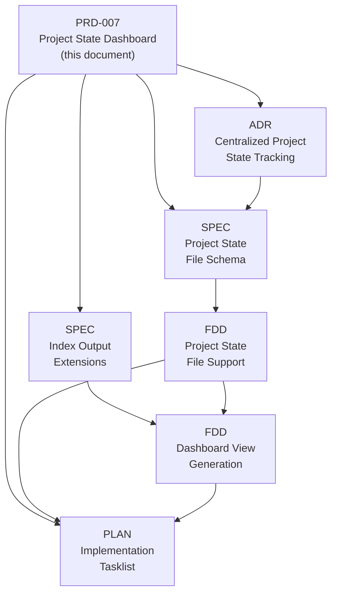

<!-- MEMINIT_METADATA_BLOCK -->

> **Document ID:** MEMINIT-PRD-007
> **Owner:** GitCmurf
> **Status:** Draft
> **Version:** 0.7
> **Last Updated:** 2026-04-23
> **Type:** PRD
> **Area:** CLI

# PRD: Project State Dashboard

## Table of Contents

1. [Executive Summary](#1-executive-summary)
2. [Problem Statement](#2-problem-statement)
3. [Design Constraints](#3-design-constraints)
4. [Goals and Non-Goals](#4-goals-and-non-goals)
5. [Proposed Solution](#5-proposed-solution)
6. [Requirements](#6-requirements)
7. [Alternatives Considered](#7-alternatives-considered)
8. [Implementation Epic — Proposed Document Set](#8-implementation-epic--proposed-document-set)
9. [Resolved Decisions](#9-resolved-decisions)
10. [Remaining Open Questions](#10-remaining-open-questions)
11. [Acceptance Criteria](#11-acceptance-criteria)
12. [Risks and Mitigations](#12-risks-and-mitigations)
13. [Related Documents](#13-related-documents)
14. [Version History](#14-version-history)

---

## 1. Executive Summary

A developer returns to a Meminit-governed repository after a disruption and
cannot quickly determine which PRDs are approved but unimplemented, which tasks
are in progress, or what to work on next. Today, answering "what's the state?"
requires opening every document and reading frontmatter — an unacceptable tax
for humans and a wasteful multi-file scan for agents.

This PRD introduces a **centralized project-state file** (`project-state.yaml`)
that tracks mutable implementation state _outside_ governed documents,
preserving their byte-invariance, and enhances `meminit index` to generate
**table and kanban dashboard views** from the merge of immutable frontmatter and
mutable project state.

---

## 2. Problem Statement

### 2.1 The Visibility Gap

Meminit currently tracks one status axis — **Document Governance** (`Draft`,
`In Review`, `Approved`, `Superseded`) — embedded in YAML frontmatter. This
tells you whether a _design_ has been reviewed, but nothing about whether the
_software_ has been built.

In a repository with 46+ governed documents, humans and agents face:

- **No at-a-glance project status.** You must open each file to read its
  governance status, and even then you learn nothing about implementation
  progress.
- **No "what's next?" surface.** After a crash, holiday, or context switch,
  there is no single view that answers "what work is active or done?"
- **No time-sorted activity view.** `last_updated` is in frontmatter but is
  never surfaced in a sortable, comparable format.

### 2.2 The Byte-Invariance Constraint

The obvious fix — add an `implementation_state` field to frontmatter — violates
Meminit's core guarantee: once a document is Approved, its content (including
frontmatter) must not change unless explicitly re-versioned. Changing
`implementation_state: Not Started` → `In Progress` on an Approved PRD would
silently mutate its file hash, breaking audit integrity.

**Design requirement:** mutable operational state must live _outside_ governed
document content.

### 2.3 Who Is Harmed

| Persona            | Pain                                                   |
| ------------------ | ------------------------------------------------------ |
| Solo developer     | Returns after a week, can't see what's in flight       |
| Agent orchestrator | Must parse every file to build a work queue            |
| Project reviewer   | Can't quickly audit "approved but not started" backlog |
| New contributor    | No onboarding view of what's active vs. done           |

---

## 3. Design Constraints

These constraints are non-negotiable and derive from Meminit's strategic design
center (MEMINIT-STRAT-001) and existing governance (MEMINIT-GOV-001):

1. **Governed documents must remain byte-invariant after approval.** No
   mutable operational state in governed frontmatter.
2. **Filenames are stable identifiers.** No status-in-filename patterns.
   Document references (`meminit resolve`, relative links, CI paths) must not
   break on state changes.
3. **Single source of truth for governance status.** Frontmatter `status:`
   remains the authoritative source for document governance. It is not
   duplicated or replaced.
4. **Deterministic, machine-readable outputs.** All `meminit` output contracts
   must conform to the v2 envelope shape (MEMINIT-SPEC-008).
5. **Gracefully optional.** Repositories that do not need implementation
   tracking must not be burdened by it.

---

## 4. Goals and Non-Goals

### 4.1 Goals

1. Introduce a centralized, mutable **project-state file** that tracks
   implementation progress per governed document, outside the documents
   themselves.
2. Enhance `meminit index` to merge frontmatter metadata with project state and
   generate **human-readable dashboard views** (table and kanban).
3. Produce **agent-readable JSON output** that includes both governance status
   and implementation state in a single query.
4. Support **time-sorted views** so the most recently active work appears first.
5. Make the dashboard **MkDocs-renderable** without requiring MkDocs plugins
   (plugins may enhance, but must not be required).

### 4.2 Non-Goals

1. Replacing or deprecating the existing `status:` frontmatter field.
2. Building a full project management system (gantt charts, burndown). Limited assignee and dependency tracking for queue selection (`state next`, `state blockers`) is in scope.
3. Enforcing implementation state transitions — this is advisory, not gated.
4. Tracking implementation state for every document type. Some types (e.g.,
   GOV, ADR) may permanently have no meaningful implementation state.
5. Requiring MkDocs to use the dashboard. The generated Markdown must be
   readable in any Markdown viewer (GitHub, IDE, `cat`).
6. Enforcing implementation state transition rules. Transitions are
   advisory — any state may move to any other state. Building a
   workflow engine with mandatory transition gates is out of scope.

---

## 5. Proposed Solution

### 5.1 Architecture

```
                    IMMUTABLE                           MUTABLE
              ┌─────────────────┐              ┌─────────────────────┐
              │  Governed Docs  │              │  project-state.yaml │
              │  (frontmatter)  │              │  (operational state)│
              │                 │              │                     │
              │  status: ...    │              │  impl_state: ...    │
              │  version: ...   │              │  updated: ...       │
              │  owner: ...     │              │  notes: ...         │
              └────────┬────────┘              └──────────┬──────────┘
                       │                                  │
                       └──────────┬───────────────────────┘
                                  │
                          meminit index
                                  │
                     ┌────────────┼────────────┐
                     ▼            ▼            ▼
               catalogue.md catalog.json   kanban.md
               (table view)  (agent API)   (board view)
```

### 5.2 The Two Orthogonal Axes

| Axis                     | Question                  | Source of Truth                                 | Values                                                         |
| ------------------------ | ------------------------- | ----------------------------------------------- | -------------------------------------------------------------- |
| **Doc Governance**       | Is the _design_ reviewed? | Frontmatter `status:` (immutable once approved) | `Draft`, `In Review`, `Approved`, `Superseded`                 |
| **Implementation State** | Is the _software_ built?  | `project-state.yaml` (mutable)                  | `Not Started`, `In Progress`, `Blocked`, `QA Required`, `Done` |

### 5.3 The State File

**`docs/01-indices/project-state.yaml`** — one central, mutable file:

```yaml
# Implementation state for governed documents.
# NOT governed by DocOps — this is mutable operational state.
# Updated by humans or agents as work progresses.
# Provenance is tracked via Git history on this file.
#
# IMPORTANT: Entries under 'documents' MUST be sorted alphabetically by
# document_id to minimize Git merge conflict radius in multi-contributor
# and multi-agent repositories.

documents:
  MEMINIT-ADR-010:
    impl_state: Done
    updated: "2026-02-15T10:00:00Z"
    updated_by: GitCmurf

  MEMINIT-FDD-002:
    impl_state: QA Required
    updated: "2026-03-03T16:45:00Z"
    updated_by: GitCmurf
    notes: "Code complete, needs test coverage review"

  MEMINIT-PRD-003:
    impl_state: In Progress
    updated: "2026-03-04T09:30:00Z"
    updated_by: GitCmurf
    notes: "Core endpoints done, auth layer next"

  MEMINIT-PRD-006:
    impl_state: Not Started
    updated: "2026-03-05T11:00:00Z"
    updated_by: GitCmurf
```

**Default semantics:** Governed documents without an entry in
`project-state.yaml` are treated as having no implementation concern. They
appear in the table view with an empty `Impl State` cell and are excluded
from the kanban board. This is the single, deterministic rule — there is no
implicit `Not Started`. Documents that have implementation concern MUST have
an explicit entry.

### 5.4 Generated Views

`meminit index` reads all governed frontmatter + merges `project-state.yaml`:

**Table View** (`catalogue.md` by default):

```markdown
---
document_id: MEMINIT-INDEX-001
type: INDEX
title: Project Dashboard
status: Draft
version: "1.0"
last_updated: 2026-03-05
owner: GitCmurf
docops_version: "2.0"
---

<!-- MEMINIT_GENERATED: catalog -->

# Project Dashboard

_Auto-generated by `meminit index`. Last built: 2026-03-05T14:30:00Z._

## Needs Attention

| ID              | Title              | Type | Doc Status | Impl State  | Last Active ▾ | Owner    |
| --------------- | ------------------ | ---- | ---------- | ----------- | ------------- | -------- |
| MEMINIT-PRD-006 | Document Templates | PRD  | In Review  | Not Started | 2026-03-05    | GitCmurf |
| MEMINIT-PRD-003 | Agent Interface v1 | PRD  | Approved   | In Progress | 2026-03-04    | GitCmurf |

## Completed

| ID              | Title          | Type | Doc Status | Impl State | Last Active | Owner    |
| --------------- | -------------- | ---- | ---------- | ---------- | ----------- | -------- |
| MEMINIT-ADR-010 | Use Apache 2.0 | ADR  | Approved   | Done       | 2026-02-15  | GitCmurf |
```

The generated table view is emitted as a governed Markdown artifact with
frontmatter so it remains DocOps-compliant when committed under
`docs/01-indices`. The kanban view is a generated Markdown/HTML board and does
not currently carry YAML frontmatter.

**Timestamp display policy:** The `updated` field is stored as a full
ISO 8601 datetime (e.g., `2026-03-05T14:30:00Z`) for precise sorting. In
Markdown table output, the "Last Active" column MUST display the
date-only portion (`YYYY-MM-DD`) for readability. The full datetime MUST
be preserved in JSON output for machine consumers.

**Kanban View** (`kanban.md`):

Columns correspond to `impl_state` values. Each card shows the document ID,
title, governance status badge, and optional notes. Rendered as HTML with CSS
grid, no JavaScript, MkDocs-compatible.

---

## 6. Requirements

### Functional Requirements

#### FR-1 Project State File Format

Requirement: [ ] Meminit MUST define and document a `project-state.yaml`
schema that tracks implementation state per document ID.

The schema MUST support:

- `impl_state` — enum: `Not Started`, `In Progress`, `Blocked`, `QA Required`,
  `Done` (extensible per-repo via `docops.config.yaml`; these are the
  shipped defaults)
- `updated` — ISO 8601 datetime with timezone (e.g., `2026-03-05T14:30:00Z`);
  day-level resolution is insufficient for activity-recency sorting when
  multiple updates occur on the same day
- `updated_by` — string identifying the actor (human username or agent ID);
  when using `meminit state`, this field SHOULD be auto-populated from the
  environment (e.g., `git config user.name` or `MEMINIT_ACTOR_ID` env var)
- `notes` — optional free-text string (max 500 characters, plain text only;
  no Markdown or HTML permitted)

The file MUST be excluded from `meminit check` governance validation.

**Merge conflict mitigation:** Entries under `documents` MUST be sorted
alphabetically by `document_id`. This minimizes Git merge conflict radius
when multiple contributors or agents update different documents' state
concurrently. `meminit state` (see FR-9) and `meminit doctor` MUST warn
if entries are out of order.

Implementation notes: Introduce an `excluded_files` list in
`docops.config.yaml` for exact-path exclusion (not prefix-based). This avoids
the overbroad `excluded_filename_prefixes` mechanism. Define a JSON Schema
for the file format. Schema enforcement MUST be performed by `meminit doctor`
(advisory warnings) and `meminit index` (reject malformed entries with
warnings in the envelope, but still produce output for valid entries).
`meminit check` MUST NOT process this file at all.

#### FR-2 Index Merge

Requirement: [ ] `meminit index` MUST, when `project-state.yaml` exists, merge
its data with frontmatter metadata to produce a unified view.

Documents listed in `project-state.yaml` MUST have their `impl_state`,
`updated`, `updated_by`, and `notes` fields included in index output.
Documents not listed MUST appear with `impl_state` omitted from the JSON
envelope and an empty cell in Markdown table output. This is the deterministic
default: absence means "no implementation concern tracked."

Implementation notes: The merge key is `document_id`. Index must handle
gracefully: missing `project-state.yaml` (produce index without impl columns),
document IDs in state file that don't match any governed doc (emit warning in
envelope `warnings` array), and governed docs not in state file (omit impl
fields).

#### FR-3 Table View Generation

Requirement: [ ] `meminit index` MUST generate a Markdown table view
(`catalogue.md` by default) that includes governance status and implementation state
columns.

The generated table filename MUST be configurable through the repository
`catalog_name` setting and the `--catalog-name` CLI option. This allows teams
to use `catalog.md` or another filename while preserving `catalogue.md` as the
default.

**Sort order:** The table MUST be sorted by _activity recency_ descending,
defined as `max(project-state.updated, frontmatter.last_updated)` per
document. This ensures that documents with recent implementation activity
(code progress without doc edits) sort above stale documents.

The table MUST be renderable in GitHub, any Markdown viewer, and MkDocs without
plugins.

**Filtered output header:** When filters are applied (via `--status` or
`--impl-state`), the generated catalogue header MUST reflect the active
filters. Example: `Auto-generated by meminit index. Filters: impl-state=In
Progress. Last built: 2026-03-05T14:30:00Z.` When no filters are applied,
the header MUST omit the filter line.

**Grouping rules:** The table MUST be grouped into sections using the
following composite rules:

- **Active Work** — documents with an explicit `impl_state` that is not `Done`
- **Governance Pending** — documents with `status` of `Draft` or `In Review`
  and no `impl_state` entry (design not yet approved; no implementation
  tracking)
- **Completed** — documents with `impl_state: Done`
- **Superseded** — documents with `status: Superseded` (regardless of
  `impl_state`; a superseded design is not implementation-complete work)
- **Reference** — documents with no `impl_state` entry and `status: Approved`
  (approved docs without implementation concern, e.g., GOV, ADR)

Include relative links to each document.

#### FR-4 Kanban View Generation

Requirement: [ ] `meminit index` MUST generate a kanban-style board view
(`kanban.md`) where columns correspond to `impl_state` values and cards
represent governed documents.

Each card MUST include: document ID (linked), title, governance status badge,
and notes (if present). The kanban MUST render correctly in MkDocs and degrade
gracefully in plain Markdown viewers (visible as structured HTML or fallback
lists).

**Accessibility requirements:**

- Each column MUST use a semantic `<section>` with an `<h3>` heading
- Cards MUST use `<article>` elements with `aria-label` set to the document
  title
- Status badges MUST use both color and a text/icon indicator (no color-only
  cues)
- The layout MUST reflow to a single-column stack on viewports below 768px

**Fallback strategy:** The generated `kanban.md` MUST contain a **pure
Markdown fallback** (level-3 headings per column, bulleted list items per
card) that is readable by any viewer, including those that strip all HTML
(e.g., `cat`, plain-text renderers). The enhanced HTML kanban board MUST
appear _after_ the Markdown fallback.

**No duplicate content in rich renderers:** The companion `kanban.css`
MUST include a rule that hides the Markdown fallback section (e.g., via
a wrapping `<div class="kanban-fallback">` with `display: none` in
`kanban.css`). In rich renderers (MkDocs, GitHub), users see only the
HTML board. In viewers that strip HTML and CSS, the Markdown fallback
remains visible. This prevents duplicate content without sacrificing
plain-text accessibility.

Implementation notes: Generate as HTML elements with CSS class hooks. Provide
a companion `kanban.css` stylesheet. Columns: `Not Started` | `In Progress` |
`Blocked` | `QA Required` | `Done`.

#### FR-5 JSON Output

Requirement: [ ] `meminit index --format json` MUST include both governance
metadata and implementation state in the envelope payload.

The JSON output MUST conform to the v2 envelope shape (MEMINIT-SPEC-008) and
include per-document records with at minimum: `document_id`, `type`, `title`,
`status` (governance), `impl_state` (present only if tracked), `updated`,
`updated_by`, `owner`, and `path`. Queue-oriented consumers MUST also receive
the derived fields required by Phase 4 (`ready`, `open_blockers`, `unblocks`)
when the merged state view contains them.

**Schema nullability:** The SPEC-008 amendment MUST mark `impl_state`,
`updated`, `updated_by`, and `notes` as optional fields in the JSON Schema
(not required). Downstream agent consumers MUST NOT assume these fields are
present — they appear only when a `project-state.yaml` entry exists for the
document. This prevents agent crashes when fields are omitted due to absence
or sanitization failure.

Implementation notes: This is the primary agent-consumption surface. The same
v2 envelope profile also applies to `state next` and `state blockers`, which
expose queue-selection data under `data`.

#### FR-6 Filtering

Requirement: [ ] `meminit index` MUST support filtering by governance status
and/or implementation state.

Minimum flags: `--status <value>` and `--impl-state <value>`. Both MUST
accept comma-separated lists for multi-value filtering.

**Deterministic filter grammar:**

- Values are **case-insensitive** on input: `in progress`, `In Progress`,
  and `IN_PROGRESS` all resolve to the canonical form `In Progress`
- Output MUST always use the canonical enum casing regardless of input
- Leading/trailing whitespace in comma-separated values MUST be stripped
- Unknown values (after canonicalization) MUST produce a structured error
  (exit code 2, error code `E_INVALID_FILTER_VALUE` in envelope) listing
  the invalid value and the valid enum
- Duplicate values MUST be silently deduplicated
- Output order MUST be deterministic: sorted by activity recency descending
  (same as FR-3), then by `document_id` ascending as tiebreaker
- When both `--status` and `--impl-state` are provided, they are combined
  with AND semantics

Example: `meminit index --status Approved --impl-state "In Progress,Not Started" --format json`

#### FR-7 State File Validation

Requirement: [ ] `meminit doctor` MUST validate `project-state.yaml` when
present, reporting: malformed YAML, unknown `impl_state` values, document IDs
that don't resolve to any governed document, and schema violations.

Implementation notes: Validation is advisory (warning severity), not blocking,
to maintain the gracefully-optional property. `meminit doctor` is the
authoritative schema enforcement point for this file. `meminit check` MUST NOT
process it. `meminit index` MUST validate entries it consumes and emit
per-entry warnings for invalid records (but still produce output for valid
ones).

**Structured warning/error codes:** All validation and filtering paths MUST
emit machine-readable codes (not free-text messages) so agents can react
deterministically. Required codes:

| Code                          | Source        | Meaning                                                                 |
| ----------------------------- | ------------- | ----------------------------------------------------------------------- |
| `E_STATE_YAML_MALFORMED`      | doctor, index | `project-state.yaml` is not valid YAML                                  |
| `E_STATE_SCHEMA_VIOLATION`    | doctor, index | Entry violates the JSON Schema                                          |
| `W_STATE_UNKNOWN_DOC_ID`      | doctor, index | `document_id` in state file has no governed document                    |
| `W_STATE_UNKNOWN_IMPL_STATE`  | doctor, index | `impl_state` value not in enum                                          |
| `W_FIELD_SANITIZATION_FAILED` | index         | A rendered field failed sanitization; omitted from output               |
| `W_STATE_UNSORTED_KEYS`       | doctor, state | `documents` entries are not in alphabetical order                       |
| `E_INVALID_FILTER_VALUE`      | index         | `--status` or `--impl-state` value not in enum (after canonicalization) |

Codes prefixed `E_` are errors (exit code ≠ 0); codes prefixed `W_` are
warnings (exit code 0, reported in envelope `warnings` array).

#### FR-8 Output Sanitization

Requirement: [ ] All user-controlled fields rendered into generated HTML
output MUST be sanitized. This includes fields from **both** sources:

- **From `project-state.yaml`:** `notes`, `updated_by`
- **From governed frontmatter:** `title`, `description`, `owner`

**Sanitization rules:**

- `notes`: max 500 characters; stripped to plain text (no HTML tags, no
  Markdown rendering); HTML-entity-escaped in all generated output
- `updated_by`: max 100 characters; must match `^[a-zA-Z0-9._-]+$`;
  rejected with warning code `W_FIELD_SANITIZATION_FAILED` otherwise
- `title`, `description`, `owner`: HTML-entity-escaped in all generated
  output (no length restriction, as these are governed fields)

**Cross-channel consistency:** When a field fails validation, it MUST be
omitted from **all** output channels (both HTML and JSON). The omission
MUST be reported in the envelope `warnings` array with code
`W_FIELD_SANITIZATION_FAILED`. This prevents human and agent views from
silently diverging.

#### FR-9 State Management CLI

Requirement: [ ] Meminit MUST provide a `meminit state` command for
programmatic and human-friendly management of `project-state.yaml`.

**Required subcommands:**

- `meminit state set <document_id> [--impl-state <value>] [--notes <text>] [--clear]` — set, update
  or clear a document's implementation state and/or its notes. At least one of `--impl-state`, `--notes`, or `--clear` must be provided.
- `meminit state get <document_id>` — display current state for a document
- `meminit state list` — display all tracked documents and their states
- `meminit state next` — deterministically select the next ready work item
- `meminit state blockers` — list blocked work items and their open blockers

**Automatic field population:**

- `updated` MUST be set to the current UTC datetime automatically
- `updated_by` MUST be auto-populated from the environment, using (in
  priority order): `MEMINIT_ACTOR_ID` env var → `git config user.name` →
  system username. Manual override via `--actor <value>` flag.

**Key ordering:** After any mutation, `meminit state` MUST re-sort entries
alphabetically by `document_id` to minimize merge conflict radius (see FR-1).

**Output:** MUST conform to the v2 envelope shape. JSON output for `set` and
`get` includes the updated entry; `list` returns the full merged entry array;
`next` returns the selected queue item plus selection metadata; `blockers`
returns blocked entries plus a summary. Human output shows the change summary
or queue explanation.

Implementation notes: This command is the recommended interface for both
humans and agents. Direct YAML editing is permitted but not encouraged, as it
bypasses automatic `updated`/`updated_by` population and sort-order
enforcement. Queue consumers should prefer `state next` (uses assignee and dependency data for queue selection) as the deterministic
work item selector and `state blockers` (identifies dependency-based blocks) when they need to understand why a
ready item is not available.

Plain English: User-supplied text must never be rendered as executable HTML.
This prevents content injection in MkDocs-hosted dashboards.

### Non-Functional Requirements

#### NFR-1 Performance

Requirement: [ ] `meminit index` with project-state merge MUST complete within
5 seconds for repositories with up to 500 governed documents.

#### NFR-2 Zero Required Dependencies

Requirement: [ ] The generated dashboard views MUST render correctly without
any MkDocs plugins. MkDocs macros plugin integration is OPTIONAL and
enhancing, not required.

#### NFR-3 Backward Compatibility

Requirement: [ ] Repositories without `project-state.yaml` MUST experience
no change in `meminit index` behavior. The implementation state columns
MUST be omitted from generated views when no state file exists.

---

## 7. Alternatives Considered

### 7.1 Status-in-Filename

Pattern: `prd-003-approved-agent-interface-v1.md`

Rejected because: every status change is a file rename, breaking all incoming
links, cross-references, `meminit resolve` lookups, CI paths, and MkDocs
nav entries. Filenames become a second source of truth that must stay in sync
with frontmatter. Byte-consistency of approved docs is violated.

### 7.2 Implementation State in Frontmatter

Pattern: add `implementation_state:` to governed frontmatter.

Rejected because: mutating an Approved document's frontmatter to change
implementation state from `Not Started` → `In Progress` silently changes the
file hash, violating byte-invariance. This is the exact class of problem
Meminit exists to prevent.

### 7.3 Collapsed Single Status (`Draft → Working → Completed`)

Pattern: merge governance and implementation into one lifecycle.

Rejected because: loses the governance audit trail. "When was this PRD
approved?" becomes VCS archaeology rather than a document-level assertion.
Conflates two concerns with different owners and timelines.

### 7.4 Metadata Sidecar Files

Pattern: parallel `<filename>.meta.yaml` alongside each governed doc.

Rejected because: doubles file count, creates pairing fragility (renames must
keep pairs together), invisible to MkDocs/GitHub, and requires `meminit check`
to learn sidecar-pairing logic.

### 7.5 External Issue Tracker

Pattern: track implementation state in GitHub Issues / project boards only.

Rejected because: breaks single-source-of-truth, requires agents to
cross-reference two systems, and links between docs and issues are fragile.

### 7.6 Sealed vs. Operational Frontmatter Split

Pattern: define some frontmatter fields as "operational" (excluded from
content-hash/integrity checks) and allow them to be mutable post-approval.

Considered as credible alternative but deferred because: it redefines what
"byte-invariant" means (the file changes but you claim the governed content
hasn't), requires `meminit check` to implement field-level hash exclusion, and
every new optional field must be classified as sealed or operational. May be
revisited if the centralized state file proves insufficient.

---

## 8. Implementation Epic — Proposed Document Set

This section proposes the full document set needed to implement this PRD as a
governed epic within Meminit's DocOps structure. All documents would be created
via `meminit new` and tracked through the normal governance lifecycle.

> **Note:** These are proposals within this draft PRD. On approval, each would
> be broken out into its own governed document. **Document IDs are not
> pre-allocated here** — they will be assigned by `meminit new` at creation
> time to avoid collisions with existing or in-flight documents.

---

### 8.1 ADR: Centralized Project State Tracking

**Type:** ADR · **ID:** Allocated by `meminit new`

**Purpose:** Record the architectural decision to separate governance status
(immutable, in frontmatter) from implementation state (mutable, in
`project-state.yaml`).

**Key decisions to document:**

- Why implementation state cannot live in governed frontmatter
  (byte-invariance constraint)
- Why a single centralized YAML file was chosen over sidecars, external
  trackers, or sealed/operational field splits
- The "gracefully optional" design principle — repos opt in by creating
  the file
- How `project-state.yaml` relates to `meminit check` (excluded) vs.
  `meminit doctor` (validated)

**Status:** Draft. Records the foundational design decision.

---

### 8.2 SPEC: Project State File Schema

**Type:** SPEC · **ID:** Allocated by `meminit new`

**Purpose:** Define the normative schema and semantics of
`project-state.yaml`.

**Key content:**

- JSON Schema for the file format
- Enum definition: `impl_state` values (`Not Started`, `In Progress`,
  `Blocked`, `QA Required`, `Done`) with semantics for each
- Schema for optional fields: `notes` (with sanitization constraints),
  `updated`, `updated_by`, extensibility rules
- Merge semantics: how `meminit index` joins state data with frontmatter
- Error handling: unknown document IDs, malformed YAML, missing fields
- Versioning: how the schema evolves without breaking existing state files

**Status:** Draft. Normative reference for FR-1 and FR-2.

---

### 8.3 Extension of MEMINIT-SPEC-008 (Agent Output Contract v2)

**Type:** SPEC amendment · **Target:** MEMINIT-SPEC-008

**Decision:** This work **amends MEMINIT-SPEC-008** rather than creating a
new companion spec. SPEC-008 is the normative agent output contract; adding
index output fields and dashboard generation rules belongs in the same
document to avoid contract fragmentation. The amendment will be tracked as
a version bump to SPEC-008 (e.g., v2.1).

**Scope of amendment:**

- JSON envelope additions: per-document `impl_state`, `updated`,
  `updated_by`, `notes` fields in `meminit index --format json`
- New structured warning/error codes (see FR-7 code table)
- Markdown generation contract: required columns, sort order, composite
  grouping rules for `catalogue.md`; timestamp display policy (see FR-3)
- HTML generation contract: element structure, CSS class hooks,
  accessibility requirements, sanitization rules, fallback/hiding
  strategy for `kanban.md` (see FR-4, FR-8)
- Filter flag semantics: deterministic grammar, case-insensitive
  canonicalization, error behavior (see FR-6)
- `meminit state` command payload profile: normative JSON envelope
  schema for `set`, `get`, and `list` subcommand responses (see FR-9)
- Backward compatibility: behavior when `project-state.yaml` is absent

**Status:** Amendment scope defined. Will be implemented as a version bump
to SPEC-008 during Phase 2.

---

### 8.4 FDD: Project State File Support

**Type:** FDD · **ID:** Allocated by `meminit new`

**Purpose:** Feature design for reading, validating, and merging
`project-state.yaml`.

**Scope:**

- YAML parsing and schema validation logic
- Integration with `meminit doctor` for advisory validation (FR-7)
- Integration with `docops.config.yaml`: introduce `excluded_files` list
  for exact-path exclusion from governance checks
- Merge logic in `meminit index`: join on `document_id`, handle missing
  entries, warn on orphaned state entries
- Sanitization pipeline for all rendered fields (FR-8)

**Implementation area:** `src/meminit/core/services/` and
`src/meminit/core/use_cases/`

---

### 8.5 FDD: Dashboard View Generation

**Type:** FDD · **ID:** Allocated by `meminit new`

> **Note:** MEMINIT-FDD-010 already exists (Template Migration, created for
> PRD-006). This FDD needs a new sequence number.

**Purpose:** Feature design for generating table and kanban dashboard views
from merged index data.

**Scope:**

- Table view generator: Markdown table with governance + impl columns,
  activity-recency-sorted (FR-3), composite grouping rules
- Kanban view generator: semantic HTML (`<section>`, `<article>`) with
  CSS class hooks, card rendering, badge formatting, accessibility
  (FR-4 requirements)
- CSS stylesheet: `kanban.css` with Material-compatible theming, responsive
  reflow at 768px
- Plain-Markdown fallback: headings + bulleted lists, hidden via CSS in
  rich renderers (no duplicate content; see FR-4)
- Output path conventions: `docs/01-indices/catalogue.md` by default,
  `docs/01-indices/kanban.md`
- Configurable catalogue output: `catalog_name` / `--catalog-name` may set
  the table view filename to `catalog.md` or any other safe filename.
- CLI flag additions to `meminit index`: `--output-catalog`, `--output-kanban`
- Degradation behavior in non-MkDocs viewers

**Implementation area:** `src/meminit/core/services/` and
`src/meminit/adapters/`

---

### 8.6 PLAN: Implementation Tasklist

**Type:** PLAN · **ID:** Allocated by `meminit new`

**Purpose:** Phased implementation plan with task breakdown and dependencies.

**Proposed phases:**

| Phase | Milestone          | Key deliverables                                  |
| ----- | ------------------ | ------------------------------------------------- |
| 1     | State file support | Schema definition, YAML parser, doctor validation |
| 2     | Index merge        | Merge logic, JSON output extensions, filter flags |
| 3     | Table view         | `catalogue.md` generation, sorting, grouping      |
| 4     | Kanban view        | `kanban.md` generation, CSS, MkDocs theming       |
| 5     | Integration        | Pre-commit hook, CI wiring, runbook updates       |

**Dependencies:**

- Phase 1 must complete before Phase 2
- Phases 3 and 4 can run in parallel after Phase 2
- Phase 5 requires Phases 3 and 4

---

### 8.7 Supporting Document Updates

The following existing documents would need updates (not new docs):

| Document                                    | Update needed                                                                                |
| ------------------------------------------- | -------------------------------------------------------------------------------------------- |
| MEMINIT-GOV-001 (Document Standards)        | Add `project-state.yaml` to recognized file types; document exclusion from governance checks |
| MEMINIT-SPEC-008 (Agent Output Contract v2) | Reference new index output fields; coordinate index extensions with existing v2 contract     |
| Runbook-005 (Brownfield Migration)          | Add guidance on creating initial `project-state.yaml` during migration                       |
| `docops.config.yaml`                        | Add `project-state.yaml` to exclusion list or introduce `excluded_files`                     |
| SKILL.md (Meminit DocOps skill)             | Add `project-state.yaml` awareness and index commands                                        |

---

### 8.8 Epic Document Dependency Graph



> IDs omitted from graph — will be allocated by `meminit new` at creation.

---

## 9. Resolved Decisions

The following items were originally open questions. Decisions have been
recorded and incorporated into the requirements above.

1. **`impl_state` extensibility.** Yes — repos may define additional states
   in `docops.config.yaml`. The shipped defaults are `Not Started`,
   `In Progress`, `Blocked`, `QA Required`, `Done`. _(Reflected in FR-1.)_

2. **Auto-regeneration on `meminit fix` / `meminit new`.** No — `index`
   regeneration requires an explicit `meminit index` call. Neither `fix`
   nor `new` is read-only, but adding a write side-effect to index is
   out of scope.

3. **`meminit state` CLI command.** Yes — promoted to FR-9. Human-usable
   but focused on agentic workflows. Auto-populates `updated` and
   `updated_by`, enforces alphabetical key ordering.

4. **Kanban column ordering.** Fixed order for MVP (`Not Started` →
   `In Progress` → `Blocked` → `QA Required` → `Done`). Build in a way
   that facilitates future config-driven ordering.

5. **MkDocs macros integration.** Facilitate for v2 roadmap but HTML
   generation covers MVP.

6. **Relationship to task files.** Co-exist. Task `status` is governance;
   `impl_state` is engineering progress. Roll-ups are strictly manual for
   v1. _(Reflected in non-goal #6 and FR-9.)_

---

## 10. Remaining Open Questions

_(No open questions remain at v0.5. New questions may be added during
implementation.)_

---

## 11. Acceptance Criteria

This PRD is considered implemented when:

1. `docs/01-indices/project-state.yaml` is a documented, schema-validated file
   format that `meminit doctor` validates and `meminit check` excludes.
2. `meminit index` merges frontmatter metadata with project state and produces
   a JSON envelope containing both governance status and implementation state.
3. `meminit index` generates a `catalogue.md` table view sorted by activity
   recency, renderable in GitHub/MkDocs without plugins. Filtered views
   include applied filters in the header.
4. `meminit index` generates a `kanban.md` board view with accessible,
   semantically structured implementation state columns, renderable in
   MkDocs and degrading gracefully elsewhere via pure Markdown fallback.
5. `meminit index --status X --impl-state Y --format json` filtering works
   with deterministic grammar (case-insensitive input, canonical output,
   AND semantics, stable sort).
6. All user-controlled fields in generated output are sanitized consistently
   across HTML and JSON channels.
7. All validation and filtering paths emit structured, machine-readable
   warning/error codes (not free-text messages).
8. `meminit state set` / `get` / `list` / `next` / `blockers` commands work, auto-populating
   `updated` and `updated_by` and maintaining alphabetical key order.
9. Repos without `project-state.yaml` experience no change in behavior.
10. `state next` is deterministic for identical inputs and uses the documented
    queue selection rule without hidden heuristics.

---

## 12. Risks and Mitigations

| Risk                                                        | Impact | Likelihood | Mitigation                                                                                                                     |
| ----------------------------------------------------------- | ------ | ---------- | ------------------------------------------------------------------------------------------------------------------------------ |
| `project-state.yaml` drifts from reality (never updated)    | High   | Medium     | Provide `meminit state` CLI for easy updates; consider pre-commit reminder if state file is stale (>30 days since last update) |
| Kanban HTML breaks in non-MkDocs viewers                    | Low    | Medium     | Fallback to plain Markdown lists when HTML rendering is unavailable; test in GitHub, VS Code, and `cat`                        |
| State file schema evolution breaks existing files           | Medium | Low        | Version the schema; `meminit doctor` warns on unknown fields but does not fail                                                 |
| Feature scope creep into project management                 | High   | Medium     | Limited assignee/dependency tracking for queue selection is in scope (v0.7); full project management (gantt, burndown) remains out of scope                                                                |
| `meminit index` performance degrades with large state files | Low    | Low        | State file grows linearly with governed docs; 500 entries is trivially fast YAML parsing                                       |

---

## 13. Related Documents

| Document ID                                                             | Title                    | Relationship                                                         |
| ----------------------------------------------------------------------- | ------------------------ | -------------------------------------------------------------------- |
| [MEMINIT-STRAT-001](../02-strategy/strat-001-project-meminit-vision.md) | Project Meminit Vision   | Strategic design center; byte-invariance and determinism constraints |
| [MEMINIT-GOV-001](../00-governance/gov-001-document-standards.md)       | Document Standards       | Governance rules for filenames, frontmatter, and directory structure |
| [MEMINIT-PRD-003](../10-prd/prd-003-agent-interface-v1.md)              | Agent Interface v1       | Baseline CLI contract; index output extensions build on this         |
| [MEMINIT-PRD-005](../10-prd/prd-005-agent-interface-v2.md)              | Agent Interface v2       | Queue surfaces share the v3 agent-output contract                    |
| [MEMINIT-PRD-004](../10-prd/prd-004-brownfield-adoption-hardening.md)   | Brownfield Adoption      | Scan/fix workflows that the dashboard complements                    |
| [MEMINIT-SPEC-008](../20-specs/spec-008-agent-output-contract-v2.md)    | Agent Output Contract v2 | Normative JSON envelope schema that index output must conform to     |
| [MEMINIT-PLAN-013](../05-planning/plan-013-phase-4-detailed-implementation-plan.md) | Phase 4 Detailed Implementation Plan | Detailed queue-work implementation plan and acceptance criteria |
| [MEMINIT-SPEC-004](../20-specs/spec-004-agent-output-contract.md)       | Agent Output Contract v1 | Historical: superseded by SPEC-008; context for envelope evolution   |
| [MEMINIT-PLAN-003](../05-planning/plan-003-roadmap.md)                  | Roadmap                  | Strategic roadmap context                                            |

---

## 14. Version History

| Version | Date       | Author   | Changes                                                                                                                                                                                                                                                                                                                                                                      |
| ------- | ---------- | -------- | ---------------------------------------------------------------------------------------------------------------------------------------------------------------------------------------------------------------------------------------------------------------------------------------------------------------------------------------------------------------------------- |
| 0.1     | 2026-03-05 | GitCmurf | Initial draft. Core problem statement, centralized state file architecture, table + kanban views, full requirements, proposed epic document set.                                                                                                                                                                                                                             |
| 0.2     | 2026-03-05 | GitCmurf | Quality pass: fix ID collisions (defer to `meminit new`), update SPEC-004→SPEC-008 refs, add `Blocked` state, fix sort key to activity recency, add FR-8 sanitization, fix grouping logic, add filter grammar, add accessibility reqs, add `updated_by` provenance, clarify task-file interop, deterministic default semantics.                                              |
| 0.3     | 2026-03-05 | GitCmurf | Round 2: pure Markdown kanban fallback (not `<details>`), expand sanitization to all rendered fields (frontmatter + state), hard decision to amend SPEC-008 (not new spec), structured error/warning code taxonomy, consistent cross-channel invalid-field handling, case-insensitive filter canonicalization, typo fix.                                                     |
| 0.4     | 2026-03-05 | GitCmurf | Round 3: date→datetime for sub-day sort resolution, merge conflict mitigation (alphabetical key ordering), promote `meminit state` CLI to FR-9 with auto `updated`/`updated_by`, nullable JSON schema fields, filtered catalog header, explicit advisory transitions (no gating), manual-only task→PRD rollups, `W_STATE_UNSORTED_KEYS` code. Integrate user's OQ decisions. |
| 0.5     | 2026-03-05 | GitCmurf | Round 4: fix `<details>` regression in FDD scope, add CSS-based duplicate-content hiding for kanban fallback, extend SPEC-008 amendment to include `meminit state` payload profile, clarify timestamp display policy (date in Markdown, full datetime in JSON), split section 9 into resolved decisions and remaining open questions, renumber sections.                     |
| 0.6     | 2026-03-07 | Codex    | Update FR-9 to reflect that `meminit state set` supports optional `--impl-state` when `--notes` or `--clear` are provided.                                                                                                                                                                                                                                                   |
| 0.7     | 2026-04-23 | Codex    | Added Phase 4 queue surfaces (`state next`, `state blockers`), enriched merged state payload fields, and deterministic queue-selection acceptance criteria. |
